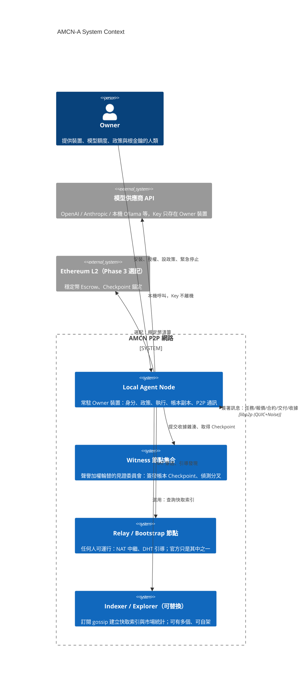
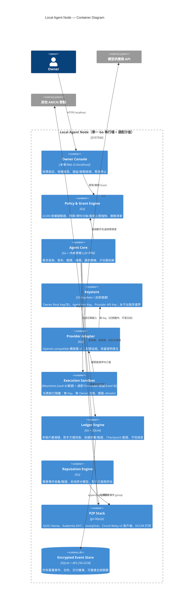
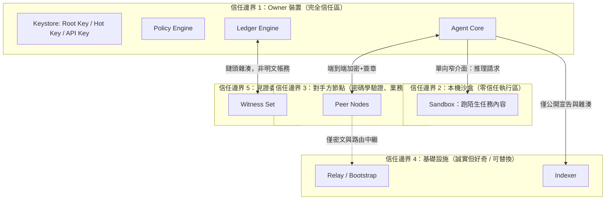
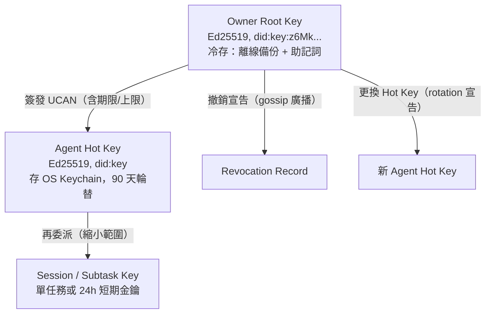
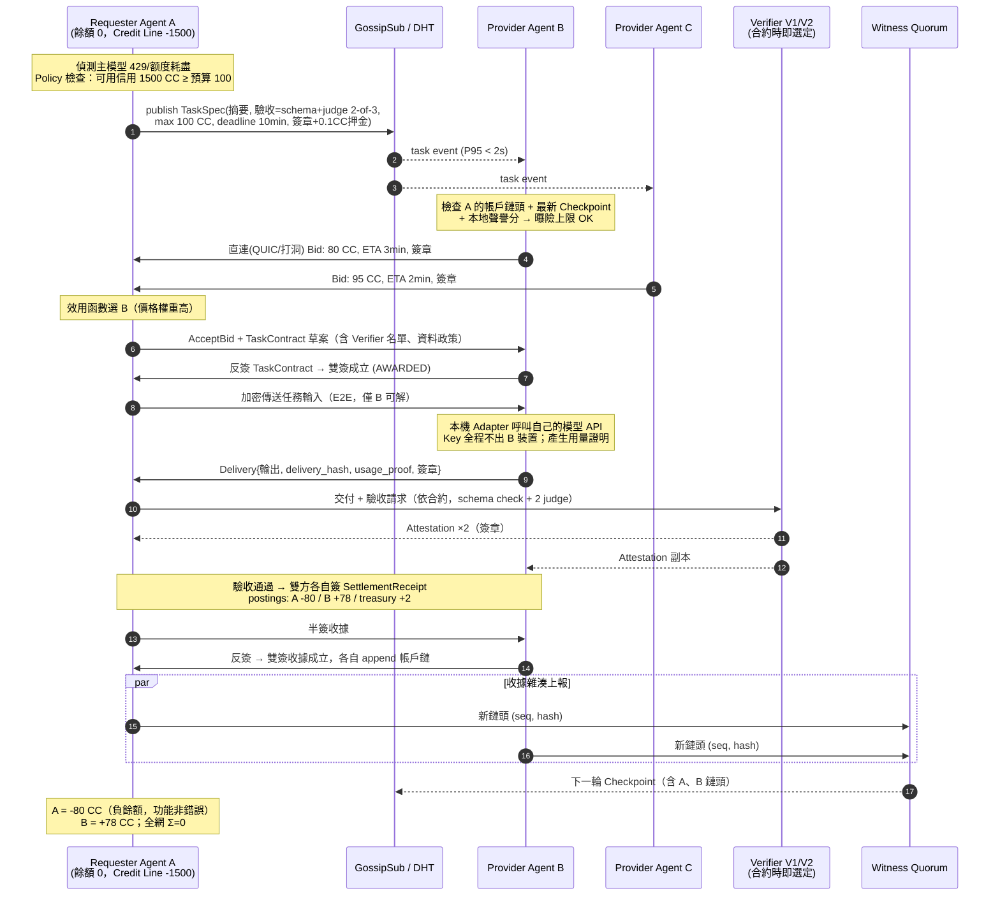
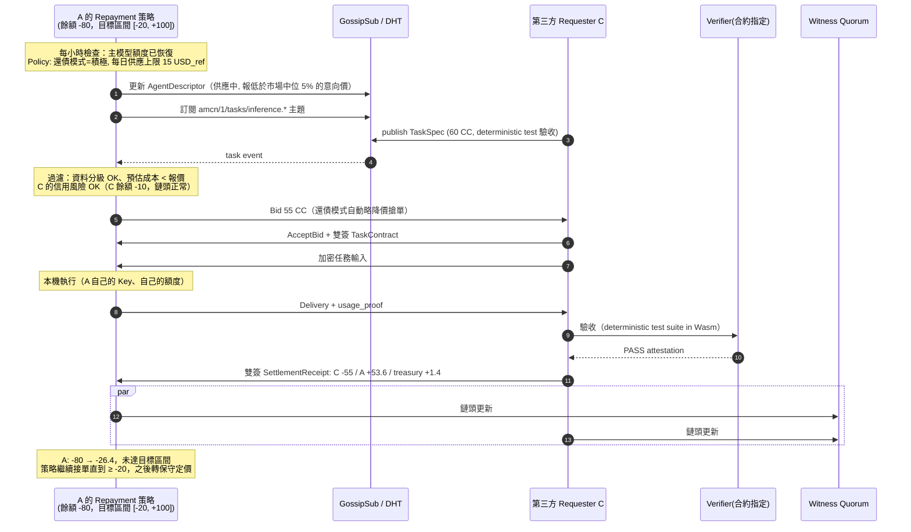
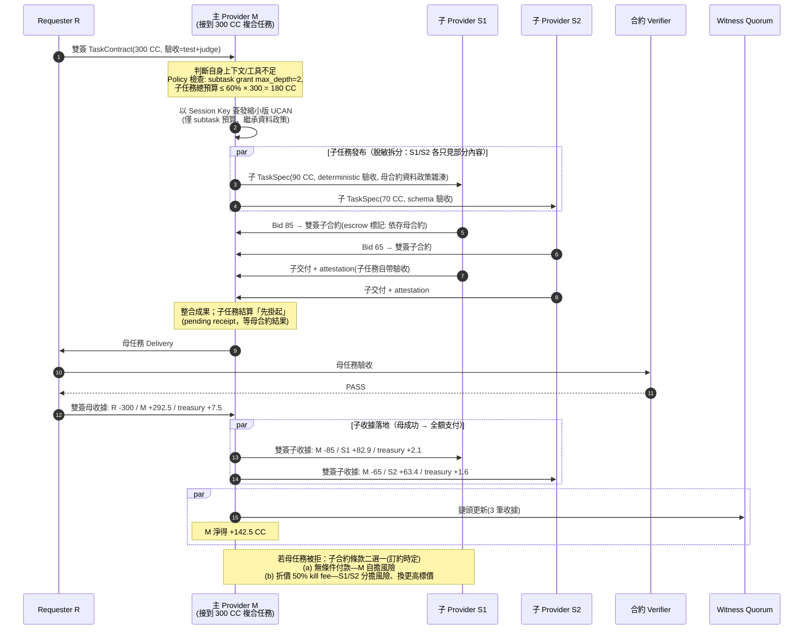
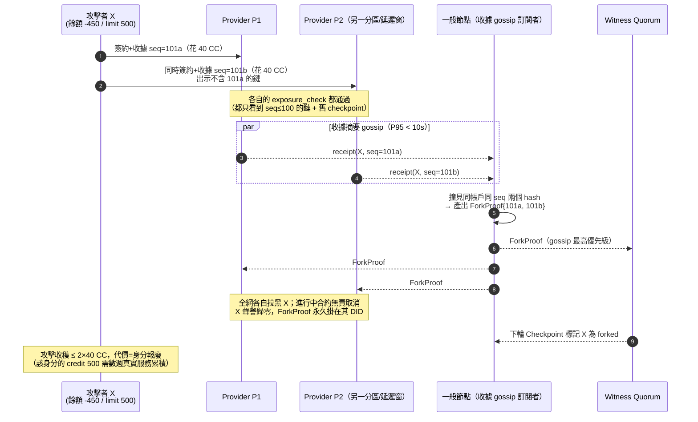
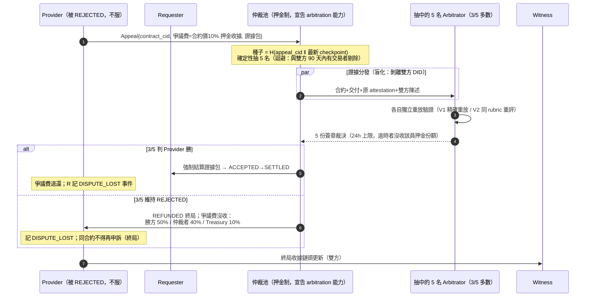

# AMCN 架構提案 A：Decentralization-first

| 欄位 | 內容 |
|---|---|
| 提案代號 | Proposal-A（Decentralization-first） |
| 對應 SDD | AMCN-SDD-v0.1（2026-09-05） |
| 作者 | 架構 Agent A |
| 日期 | 2026-09-05 |
| 狀態 | 完整提案，供三案比較 |
| 優化目標 | 最小化中央信任與不可替換元件；誠實量化去中心化的延遲、複雜度與成本 |

---

## 目錄

1. [Executive Summary](#1-executive-summary)
2. [假設](#2-假設)
3. [C4 System Context 與 Container Diagram](#3-c4-架構圖)
4. [核心元件責任與信任邊界](#4-核心元件責任與信任邊界)
5. [Identity 與 Capability 設計](#5-identity-與-capability-設計)
6. [P2P Transport 與 Discovery 設計](#6-p2p-transport-與-discovery-設計)
7. [核心使用情境 Sequence Diagram（UC-01／UC-02／UC-04）](#7-核心使用情境-sequence-diagram)
8. [Task State Machine](#8-task-state-machine)
9. [去中心化 Mutual Credit Ledger](#9-去中心化-mutual-credit-ledger)
10. [Credit Line 演算法（可模擬）](#10-credit-line-演算法)
11. [可攜聲譽系統](#11-可攜聲譽系統)
12. [Verification 與 Dispute 設計](#12-verification-與-dispute-設計)
13. [治理（Governance）](#13-治理)
14. [資料模型與 P2P Message Schema](#14-資料模型與-p2p-message-schema)
15. [威脅模型：§16 全部 15 項威脅的具體控制](#15-威脅模型)
16. [故障模式與恢復策略](#16-故障模式與恢復策略)
17. [技術選型表（含被拒絕方案）](#17-技術選型表)
18. [去中心化程度逐層分析（§17）](#18-去中心化程度逐層分析)
19. [去中心化的誠實成本：延遲、複雜度與金錢](#19-去中心化的誠實成本)
20. [MVP 里程碑、團隊角色與 12 週實作計畫](#20-mvp-里程碑與-12-週實作計畫)
21. [基礎設施成本估算與成本爆點](#21-基礎設施成本估算與成本爆點)
22. [風險清單（≥10 項）與降低方式](#22-風險清單)
23. [Architecture Decision Records](#23-architecture-decision-records)
24. [Prototype／Simulation 測試計畫](#24-prototypesimulation-測試計畫)
25. [SDD §21 十五個必答問題](#25-sdd-21-十五個必答問題)
26. [§24 評選量表自評](#26-24-評選量表自評)
27. [現在不知道的事項](#27-現在不知道的事項)

附錄 A：協議參數總表 ｜ 附錄 B：需求追溯（SDD → 章節） ｜ 附錄 C：Stablecoin/L2 Escrow 擴充層 ｜ 附錄 D：Indexer／Explorer／Owner Console

---

## 1. Executive Summary

**一句話**：AMCN-A 是一個以 libp2p 為傳輸底座、以 DID（did:key，Ed25519）為身分、以「雙簽收據 + 每帳戶雜湊鏈 + 聲譽加權見證委員會」為帳本、以 UCAN 授權鏈為權限模型的純點對點互惠信用網路——沒有任何單一元件是不可替換的，官方只是「跑得比較好的其中一個節點」。

**核心設計立場**：AMCN 的價值主張是「Key 不離開本機」與「互惠信用不被單一機構凍結、竄改或抽走」。前者所有提案都會做到；後者只有把 Ledger、Discovery、Reputation 都設計成可分散驗證，才不會在網路成功後變成一個新的中心化平台。因此本提案的每一層（Identity／Discovery／Transport／Ledger／Reputation／Governance）都以「官方節點今天消失，網路明天還能結算」為驗收條件。

**帳本選擇**：比較 §17 的三種方案後，選擇 **「P2P 雙簽收據 + 每帳戶單調序號雜湊鏈（tamper-evident log）+ Gossip 複製 + 聲譽加權見證委員會（Witness Quorum）簽發週期性 Checkpoint」**。不用區塊鏈做日常結算：微交易上鏈成本（即使 L2，每筆 $0.001–0.01 加 1–15 秒最終性）會殺死 30 秒媒合目標；但保留 Ethereum L2 作為 Phase 3 的穩定幣 Escrow 與 Checkpoint 錨定擴充點。雙重支出不靠全域共識「阻止」，而是靠三道疊加控制「限損 + 快速偵測 + 經濟懲罰」：(1) 每個對手方在授信前檢查對方帳戶鏈頭與見證 Checkpoint；(2) 分叉（equivocation）在 gossip 傳播窗（P95 < 10 秒）內被見證節點偵測並全網廣播「分叉證據」，身分即刻報廢；(3) 單一身分可竊取上限被 Credit Line 總額壓在小額（新身分 ≤ 20 CC）。**這是本提案最誠實的一句話：我們不消滅雙重支出，我們讓它的期望收益低於建立身分的成本。**

**主要代價（誠實量化，詳見 §19）**：相對中央化方案，P95 媒合延遲從約 2–5 秒升到 8–25 秒（DHT 查詢 1–3 秒、gossip 傳播 0.3–2 秒、NAT 打洞 0–4 秒、報價收集窗 5–15 秒）；工程複雜度約 1.8–2.5 倍（12 週內需 5–6 名工程師而非 3–4 名）；每節點額外負擔約 50–150 MB RAM、每月 2–10 GB 頻寬；且 MVP 期間仍需官方補貼 Relay／Bootstrap／見證節點，每月估 $700–2,500。換得的是：SDD 驗收標準第 5 條（Indexer 停止後網路照常運作）在架構上「天然成立」而非事後補救，以及對「平台跑路／被收購／被封鎖」的長期抗性。

**MVP 路徑**：12 週做出 3–10 個真實節點的閉環——Go 單一執行檔 Local Node、libp2p（QUIC + Noise + Kademlia + GossipSub + Circuit Relay v2 + DCUtR）、did:key 身分、UCAN Capability、雙簽收據帳本（見證委員會在 Phase 1 由 3 個已知節點充當，Phase 3 改為聲譽加權輪替）、deterministic verification 優先。所有中央化的「臨時拐杖」（官方 bootstrap、官方見證節點）都以協議內建的替換機制（多 bootstrap 清單、見證集合輪替規則）綁定退場路線。

**最大的三個風險**（詳見 §22／§27）：(1) 全去中心化的報價收集在小網路（<50 節點）流動性不足，媒合率可能低到無法驗證產品假設；(2) 見證委員會在 MVP 期實質上仍是 3 個官方節點，去中心化是「架構承諾」而非「當下事實」；(3) 供應商 ToS 風險與需求側冷啟動不因去中心化而改善，反而因無中央運營者而更難做增長運營。

**與另外兩案的預期分歧點（供評選者對照）**：

| 議題 | 本提案（A） | 預期 Agent B（MVP-first）會主張 | 預期 Agent C（Adversarial）會主張 | 本提案的回應 |
|---|---|---|---|---|
| 帳本 | 收據+帳戶鏈+Witness，第一天分散 | 中央 Postgres + 簽署收據，後遷移 | 視經濟控制而定 | 帳本語義事後遷移=全網信任重置（§25 Q11），這是唯一不能晚做的層 |
| 撮合 | gossip/DHT，無中央撮合 | 中央撮合服務（快 5–10 倍） | 中立 | 承認延遲代價（§19.1）；以 Indexer 快取軌道吸收大半差距 |
| 雙花 | 限損式（顯式詐欺預算） | 中央帳本=0 | 會攻擊本案參數 | 已預先量化上限並排定紅隊模擬（E3）；歡迎 C 案攻擊 |
| 12 週風險 | 6 人、緊 | 3–4 人、鬆 | — | 自評 MVP 可實作性僅 6 分（§26），不粉飾 |
| 冷啟動 | 無中央運營優勢 | 運營靈活 | 會質疑需求真實性 | R-02/R-13 誠實列為本案最弱項 |

---

## 2. 假設

### 2.1 固定假設（繼承自 SDD，不可移除）

| 編號 | 假設 | 來源 |
|---|---|---|
| A-F1 | P-01～P-10 全部設計原則成立，特別是 P-02（Key 不離機）、P-04（不發投機幣）、P-07（無唯一信任根） | SDD §4 |
| A-F2 | MVP 非目標全部遵守：不出借帳號、不發可交易 Token、不開放高風險自主操作、不偽造交易量 | SDD §5.2 |
| A-F3 | CC 是封閉記帳單位，Σ 全網餘額 = 0，負餘額是功能不是錯誤 | SDD §14 |
| A-F4 | 每筆任務必須有事先定義的驗收方式（P-06、FR-011） | SDD §9.2 |
| A-F5 | 人類介入邊界依 §6.2：設政策、給授權、緊急停止，不逐筆操作 | SDD §6.2 |
| A-F6 | NFR-001 媒合 P95 < 30s、NFR-002 協議額外延遲 P95 < 2s（本提案將誠實說明哪些情境達不到） | SDD §10 |

### 2.2 本提案自行新增的假設（可被挑戰）

| 編號 | 假設 | 若假設錯誤的後果 |
|---|---|---|
| A-N1 | 目標使用者（開發者／進階 AI 使用者）願意跑一個常駐 daemon，並能完成一次性 NAT／防火牆容忍設定 | 若錯，Level A 任務也做不了，需轉向純託管方案（即 Agent B 路線） |
| A-N2 | MVP 期網路規模 10–500 節點，Phase 3 前 < 5,000 節點；DHT 與 gossip 參數按此調校 | 若爆量成長，gossip 風暴與 DHT 汙染需提前處理 |
| A-N3 | 單筆任務 CC 價值中位數 20–200 CC（約 $1–10 參考值）；「限損式」雙重支出防護在此金額下經濟上足夠 | 若出現高額任務（>2,000 CC），必須強制走 Escrow／見證預鎖流程 |
| A-N4 | 節點在線率呈雙峰：伺服器型節點 >95%，筆電型節點 30–60%；協議必須容忍後者 | 若多數是筆電型，媒合率與還債速度模型需重估 |
| A-N5 | Ed25519 簽章、SHA-256、Noise Protocol 在提案存續期內密碼學安全；不做後量子設計，但金鑰格式保留 multicodec 前綴以便輪替 | 若量子威脅提前，需全網金鑰遷移（已在身分設計預留 rotation） |
| A-N6 | 至少一家主要模型供應商的 ToS 容許「Owner 授權的本機 Agent 以自身額度服務第三方請求」的解讀，或存在明確允許轉售的 API 方案（如企業版／轉售條款） | 若全部禁止，網路只能用本機開源模型（Ollama／vLLM），品質層級下修 |
| A-N7 | 見證節點（Witness）願意為小額 CC 手續費提供服務；MVP 期由官方與 2 個社群夥伴補貼運行 | 若無人願跑，Checkpoint 頻率下降，分叉偵測窗拉長，需提高新身分授信門檻 |
| A-N8 | Gossip 傳播 P95 < 10 秒（500 節點、fanout 6、心跳 1s 的 GossipSub 實測範圍）成立 | 若網路分割頻繁，需下修 Credit Line 或引入更保守的收據確認等待 |

---

## 3. C4 架構圖

### 3.1 System Context（C4 Level 1）



### 3.2 Container Diagram（C4 Level 2）— Local Agent Node 內部



**關鍵佈局決策**：Sandbox 與 Keystore／Adapter 之間只有一條單向窄介面（「推理呼叫」），任務內容永遠不可能讀到 Key（威脅 T-01 的結構性控制，見 §15）。Ledger Engine 在每個節點都是完整的驗證者，不是任何遠端服務的客戶端。

---

## 4. 核心元件責任與信任邊界

### 4.1 責任矩陣

| 元件 | 責任 | 明確不負責 |
|---|---|---|
| Owner Console | 政策 CRUD、Grant 簽發/撤銷、觀察損益與應收應付、緊急停止 | 不參與日常交易決策 |
| Policy & Grant Engine | 在「每個對外動作」前強制檢查 UCAN 鏈、預算計數器、資料分級、對手黑名單 | 不做價格判斷（那是 Agent Core 的事） |
| Agent Core | 發布/競標/議價/選擇/還債/拆包等自主決策 | 不能繞過 Policy Engine；不能碰 Keystore |
| Provider Adapter | 統一推理介面、配額計量、產生用量證明（見 §12.4） | 不記錄 prompt 明文到日誌 |
| Execution Sandbox | Level A/B 隔離執行、資源限制、心跳 | 不含任何秘密；輸出只交回 Agent Core |
| Ledger Engine | 收據簽驗、帳戶鏈維護、Checkpoint 驗證、守恆自檢、分叉證據產生 | 不決定「值多少錢」；不保管對手方全史（只保鏈頭+摘要） |
| Reputation Engine | 事件驗證、本地評分、風險輸出給 Agent Core | 不輸出全網唯一分數（每節點可換評分模型） |
| P2P Stack | 傳輸、加密、發現、發布訂閱、中繼 | 不理解業務語義；Relay 看不到明文 |
| Witness 節點 | 收帳戶鏈頭雜湊、簽 Checkpoint、廣播分叉證據 | 不能凍結帳戶、不能改餘額、不保管資金 |
| Indexer | 快取索引、市場統計、Explorer | 不是任何交易的必經路徑；資料可由 gossip 重建 |

### 4.2 信任邊界



| 邊界 | 信任假設 | 若被突破的爆炸半徑 | 主要控制 |
|---|---|---|---|
| TB1 Owner 裝置 | 完全信任（這是 P-02 的前提） | 該 Owner 的 Key 與 CC；不影響他人 | OS Keychain、磁碟加密、Root Key 冷存 |
| TB2 沙盒 | 零信任：任務內容視為惡意 | 突破= 讀到裝置資料；設計上讀不到 Key（不在同程序） | Wasmtime 無 WASI 檔案權限 / Firecracker、無網路或 allowlist |
| TB3 對手節點 | 只信簽章與收據，不信行為 | 單筆任務損失 ≤ 該對手 Credit 曝險上限 | 雙簽收據、Credit Line、驗收後才結算 |
| TB4 Relay/Indexer | 誠實但好奇；可任意替換 | 服務降級（延遲↑），無資金/資料損失 | E2E 加密（Noise + 訊息層加密）、多供應者、gossip 可重建索引 |
| TB5 Witness | ≤ f 個惡意（n=3f+1 起步 n=4→7→13） | 最壞：Checkpoint 延遲、分叉偵測變慢；**不能**偽造餘額（需帳戶主簽章） | 聲譽加權輪替、Checkpoint 需 2f+1 簽章、錯誤 Checkpoint 本身即可攜證據 |

**設計不變式**：任何 TB4／TB5 元件的完全失效或惡意，最壞後果是「變慢、風險窗變大」，永遠不是「餘額被改、Key 洩漏、資金被凍結」。這是 Decentralization-first 的核心工程判準。

---

## 5. Identity 與 Capability 設計

### 5.1 金鑰階層



- **身分格式**：`did:key`（Ed25519，multicodec `0xed01`）。選 did:key 而非 did:web／did:ethr 的理由：零基礎設施依賴（did:web 依賴 DNS+HTTPS 即中心化域名；did:ethr 依賴鏈上註冊表）、離線可驗證、生成免費。Sybil 抗性不靠「建身分要花錢」而靠「新身分授信趨近零」（§10）。
- **Root／Hot 分離（FR-002）**：Root Key 只做三件事——簽發/撤銷 UCAN、宣告 Hot Key 輪替、簽署退出網路的最終清算意向。日常訊息一律 Hot Key。Root Key 洩漏 = 身分報廢重建；Hot Key 洩漏 = Root 簽撤銷 + 新 Hot Key，帳戶鏈與聲譽由 Root 簽的 rotation 記錄接續（**身分可恢復，FR-001 的「可輪替」**）。
- **帳戶識別**：帳本帳戶綁 Root DID，不綁 Hot Key，因此輪替不中斷信用史。

### 5.2 Capability Grant：UCAN

採用 **UCAN 0.10（JWT 形式，Ed25519 簽章）** 作為 Capability Grant（FR-003）。

範例（Owner 授權 Agent 的日常額度）：

```json
{
  "iss": "did:key:z6MkOwnerRoot...",
  "aud": "did:key:z6MkAgentHot...",
  "exp": 1789600000,
  "nbf": 1757000000,
  "att": [
    {"with": "amcn://self/credit",   "can": "spend",  "nb": {"max_per_task_cc": 200, "max_per_day_cc": 800, "min_balance_cc": -1500}},
    {"with": "amcn://self/provide",  "can": "serve",  "nb": {"models": ["anthropic/*"], "max_daily_usd_ref": 15, "data_class_max": "confidential", "level": "A"}},
    {"with": "amcn://self/subtask",  "can": "delegate","nb": {"max_depth": 2, "max_budget_ratio": 0.6}},
    {"with": "amcn://self/wallet",   "can": "none"}
  ],
  "fct": [{"policy_hash": "sha256:..."}],
  "prf": []
}
```

- **為何 UCAN 而非自訂 token 或 Biscuit**：UCAN 原生支援「委派鏈 + 逐層縮小（attenuation）」，正是 UC-04 子任務分帳需要的——主 Agent 把自己 Grant 的子集再委派給 Session Key，任何驗證者可離線驗整條鏈到 Owner Root。Biscuit 的 Datalog 能力更強但生態小、稽核者少；自訂格式則重造輪子且必然有洞。代價：UCAN 撤銷需要額外機制（見下）。
- **撤銷（FR-003）**：三層疊加。(1) 短效期：日常 Grant `exp` ≤ 7 天，自動續簽；(2) 撤銷 gossip：Root 簽署 `RevocationRecord{cid_of_ucan, reason, ts}` 廣播至 `amcn/revocations` topic，各節點快取 7 天（覆蓋最長 Grant 效期即可完備）；(3) 高額動作（>500 CC）要求對手方先向發行者做一次線上 revocation check（直連或經任一 Indexer），查不到就按政策降額或拒絕。
- **稽核（P-08）**：每個對外簽署訊息附上生效 UCAN 的 CID，事後可證明「此動作在授權內」。

### 5.3 Sybil 成本設計（FR-006）

did:key 免費，所以 Sybil 抗性完全轉移到經濟層與圖結構層：

1. **零初始信用**：新身分 Credit Line = 0，只能先當 Provider 賺 CC 或提供保證金（§10.4）。
2. **Vouch 連帶責任**：既有成員為新身分擔保，可給 10–20 CC 初始額度，但擔保人承擔 50% 壞帳連帶（記入擔保人帳戶），且每人同時生效的 Vouch 上限 5 個。
3. **對手多樣性折損**：聲譽與 Credit Line 計算對「同對手重複交易」做次線性折損（§10、§11），洗量的邊際收益遞減。
4. **可選裝置證明**：macOS Secure Enclave／TPM attestation 可作為「一裝置一加成」訊號（加成小、非必要，避免排除 Linux 使用者）。

**誠實聲明**：本設計不能阻止有耐心的攻擊者用真實勞動養多個身分。它保證的是：每個 Sybil 身分的可竊取上限 ≈ 該身分靠真實貢獻掙得的 Credit Line，攻擊近似於「先誠實工作再賴帳」，期望收益 ≤ 誠實收益（詳細推導見 §15 T-07）。

---

## 6. P2P Transport 與 Discovery 設計

### 6.1 協議棧

| 層 | 選型 | 理由 |
|---|---|---|
| 網路庫 | **go-libp2p v0.36+** | 最成熟的 P2P 全家桶（IPFS/Filecoin/ETH2 實戰驗證）；Go 交叉編譯單一執行檔符合 NFR-007 |
| 傳輸 | QUIC（UDP 443/隨機埠）+ TCP fallback | QUIC 0-RTT 重連、內建多工、打洞成功率高於 TCP |
| 加密/認證 | Noise（XX handshake），PeerID = Hot Key 公鑰 | 傳輸層即完成身分綁定；libp2p 原生 |
| NAT 穿透 | AutoNAT v2 + Circuit Relay v2 + DCUtR 打洞 | 實測（libp2p 2023 報告）打洞成功率約 70–80%（QUIC），失敗回退 Relay |
| 發現 | Kademlia DHT（provider records）+ GossipSub v1.2（主題廣播）+ 本地 mDNS | 見 6.2 |
| 訊息編碼 | DAG-CBOR + CIDv1（sha2-256） | 確定性編碼（簽章穩定）、內容尋址天然去重、IPLD 生態工具 |

### 6.2 Discovery：三軌並行（FR-013）

**軌 1：GossipSub 任務廣播（主要媒合路徑）**

主題分片：`amcn/1/tasks/{capability_class}/{shard}`，例如 `amcn/1/tasks/inference.frontier/0`。Provider 依自己能宣告的能力訂閱對應主題；Requester 發布 TaskSpec 摘要（不含 prompt，只有需求參數與驗收方式雜湊）。GossipSub 參數：D=6, D_lo=4, D_hi=12, heartbeat=1s；500 節點下訊息傳播 P50≈0.4s、P95≈2s（依 libp2p 官方模擬數據量級）。

**軌 2：Kademlia DHT 能力目錄（冷查詢路徑）**

Provider 每 30 分鐘在 DHT `provide(key = H("amcn/cap/" + capability_class))`，Requester 可 `findProviders` 拉取候選清單再直連詢價。DHT 查詢延遲 P50≈0.8s、P95≈3s（20-hop 上限、α=3 併發）。此路徑保證「gossip 沒人回」時仍找得到人，也是 Indexer 全滅後的兜底。

**軌 3：Indexer 快取（加速路徑，可全滅）**

任何人可跑 Indexer：訂閱全部 tasks/bids/receipts topics，建 SQLite/Postgres 索引，提供查詢 API 與 Explorer。節點設定檔可列多個 Indexer，輪詢+交叉比對（防單一 Indexer 排序操控，見 §15 T-11）。**協議層沒有任何一步「必須」經過 Indexer**——這是與中央化提案的本質差異。

**垃圾訊息成本（FR-014）**：(1) 每則 task/bid 訊息需附 **發布押金承諾**：訊息內含 `anti_spam: {deposit_cc: 0.1, escrow_receipt_cid}` ——發布者先對「見證委員會可裁決沒收」簽 0.1 CC 微押金收據，任務正常走完或過期即自動返還，被舉報為垃圾（如無效簽章、重複轟炸、幽靈任務不選標超過 20 次）由見證裁決沒收入 Treasury；(2) GossipSub peer scoring：對發布無效簽章／超率訊息的 peer 降分斷連；(3) 每 DID 每分鐘發布速率上限（各節點本地執行，超率直接丟棄不轉發）。新身分無 CC 怎麼發第一個任務？——允許以 PoW stamp（約 2 秒 CPU 的 Hashcash）替代前 10 則訊息的押金，之後必須用 CC 押金。

### 6.3 NAT、離線與重試（回答 §21 Q10 的一半）

- **可達性分級**：節點啟動時 AutoNAT 探測 → `public`（直連）／`private-holepunch`（DCUtR 可達）／`relay-only`。AgentDescriptor 的 endpoints 標注等級，Requester 選標時可把 `relay-only` 視為延遲風險因子。
- **Relay 供給**：Relay 是無狀態、看不到明文的商品化服務。MVP 官方跑 2 個 + 社群 1 個；協議內建 relay 探索（DHT `provide("amcn/relay")`），任何人加入即被使用。Relay 限流：每連線 128 KB/s、每 IP 併發 8 條，防被當免費 VPN。
- **離線與重試**：所有協議訊息 at-least-once + 冪等（以 CID 去重）。直傳失敗 → 指數退避重試（1s/2s/4s/8s，共 4 次）→ 改走 Relay → 仍失敗則把訊息存入「outbox」，並將摘要發到對方訂閱的 `amcn/1/inbox/{did_prefix}` gossip 主題（store-and-forward 由網路中自願的 mailbox 節點快取 ≤ 72h，密文）。長任務心跳斷線處理見 §8 狀態機 RUNNING 逾時。
- **網路分割**：帳本層的分割容忍見 §9.6；媒合層在分割下各自為政（同分區內仍可成交），癒合後收據 gossip 自動合流，衝突只可能發生在「同一帳戶在兩個分區同時花錢」——按分叉偵測流程處理（§9.4）。

---

## 7. 核心使用情境 Sequence Diagram

### 7.1 UC-01：緊急借用推理能力



延遲預算（誠實版）：任務廣播 2s + 報價等待窗 5–15s（可設）+ 合約往返 1–2s + 執行（模型本身）+ 驗收 2–20s + 收據往返 1s ≈ **協議開銷 P95 約 11–40s**（NFR-001 的 30s 在「報價窗設 10s、驗收為 schema check」時達標；judge quorum 驗收時會超標，見 §19）。

### 7.2 UC-02：額度恢復後自動還債



**重點**：A 欠的是「全網」，不是 B——A 服務 C 即可還債（多邊清算，SDD §8 的核心語義），帳面由收據自動滾動，無人工追討。

### 7.3 UC-04：Agent 拆解並外包子任務



**成本失控防護（回答 §21 Q9）**：(1) UCAN 委派鏈硬性限制深度（max_depth=2）與預算比例（≤60%），任何子合約簽章都帶委派鏈，超限的子合約對手方驗章即拒；(2) 子任務結算掛依存標記，母任務失敗時按預定 kill-fee 條款處理，不會出現「母任務賠錢、子任務全額付」的隱性槓桿；(3) 遞迴拆包的每層都扣 treasury 費，套娃無利可圖。

---

## 8. Task State Machine

### 8.1 狀態圖

```mermaid
stateDiagram-v2
    [*] --> DRAFT
    DRAFT --> ANNOUNCED: publish(Requester 簽)
    DRAFT --> CANCELLED: cancel(Requester 簽)
    ANNOUNCED --> BIDDING: 首個有效 Bid 到達
    ANNOUNCED --> EXPIRED: expires_at 到期(無人投標)
    ANNOUNCED --> CANCELLED: cancel(Requester 簽, 退押金)
    BIDDING --> AWARDED: AcceptBid+雙簽Contract<br/>(Requester+Provider 簽)
    BIDDING --> EXPIRED: expires_at 到期(未選標)
    BIDDING --> CANCELLED: cancel(Requester 簽,<br/>頻繁取消→spam 記點)
    AWARDED --> RESERVED: Provider ReadyAck(Provider 簽)<br/>逾時 60s → PROVIDER_FAILED
    RESERVED --> RUNNING: 輸入送達確認(雙方簽 InputAck)
    RESERVED --> PROVIDER_FAILED: 逾時 120s 未收輸入確認
    RUNNING --> SUBMITTED: Delivery(Provider 簽)
    RUNNING --> PROVIDER_FAILED: 心跳斷 > 3×interval<br/>或超 deadline
    RUNNING --> CANCELLED: Requester cancel<br/>(付已耗用量 kill fee)
    SUBMITTED --> VERIFYING: 驗收請求送出(Requester 簽,<br/>逾時 5min 自動送出)
    VERIFYING --> ACCEPTED: 驗收條件滿足(Verifier 簽 quorum)
    VERIFYING --> REJECTED: 驗收失敗(Verifier 簽 + 機器可讀原因)
    VERIFYING --> DISPUTED: 一方不服(押爭議費)
    VERIFYING --> ACCEPTED: Verifier 全體逾時 10min →<br/>備援 Verifier;再逾時→依合約預設<br/>(default-accept 或 default-reject)
    ACCEPTED --> SETTLED: 雙簽 SettlementReceipt<br/>Provider 可單方持證強制記帳(見 8.3)
    REJECTED --> DISPUTED: Provider 申訴(押 10% 爭議費, 限 1 次)
    REJECTED --> REFUNDED: Provider 接受拒絕<br/>(退還押金/預留, 記聲譽事件)
    DISPUTED --> ACCEPTED: 仲裁 quorum 判 Provider 勝
    DISPUTED --> REFUNDED: 仲裁 quorum 判 Requester 勝
    PROVIDER_FAILED --> ANNOUNCED: 備援重發(Requester 簽,<br/>沿用原 TaskSpec, deadline 未過)
    PROVIDER_FAILED --> REFUNDED: deadline 已過, 終局
    SETTLED --> [*]
    REFUNDED --> [*]
    EXPIRED --> [*]
    CANCELLED --> [*]
```

### 8.2 Transition 表（呼叫者／必要簽章／逾時）

| # | Transition | 呼叫者 | 必要簽章 | 逾時與逾時動作 |
|---|---|---|---|---|
| 1 | DRAFT→ANNOUNCED | Requester Agent | Requester Hot Key + anti-spam 押金收據 | `expires_at`（預設 5 min）到期→EXPIRED |
| 2 | ANNOUNCED→BIDDING | （事件）首個有效 Bid | Bid 需 Provider 簽 + `valid_until` | 同上 |
| 3 | BIDDING→AWARDED | Requester 選標 | 雙簽 TaskContract（R 簽草案、P 反簽） | Provider 反簽逾時 30s → 選次佳標 |
| 4 | AWARDED→RESERVED | Provider | ReadyAck（P 簽，宣告資源已鎖定） | 60s 未 Ack → PROVIDER_FAILED（P 記失約事件） |
| 5 | RESERVED→RUNNING | Requester 送輸入 | InputAck（雙簽輸入 CID） | 120s → PROVIDER_FAILED 或 R 未送輸入→CANCELLED（R 付 5% 空占費） |
| 6 | RUNNING→SUBMITTED | Provider | Delivery（P 簽 delivery_hash + usage_proof） | 心跳 interval 合約定（預設 30s），斷 3 次或過 deadline → PROVIDER_FAILED |
| 7 | SUBMITTED→VERIFYING | Requester（或自動） | 驗收請求（R 簽）；R 拖延 5 min 後 Provider 可持 Delivery 直接向合約 Verifier 發起 | 防 R 以拖待變：5 min 自動觸發 |
| 8 | VERIFYING→ACCEPTED | Verifier quorum | ≥ 合約定門檻（如 2-of-3）Verifier 簽 attestation | 單一 Verifier 10 min 無回應→啟用合約列名的備援 Verifier；全滅→合約預設分支（deterministic 任務 default-accept if test pass evidence 自帶；主觀任務 default-reject） |
| 9 | VERIFYING→REJECTED | Verifier quorum | 同上 + 機器可讀 reason code + 可再驗證證據（FR-044） | — |
| 10 | ACCEPTED→SETTLED | 雙方 | 雙簽 SettlementReceipt | P 半簽後 R 拖延 10 min → P 可將「合約+交付+attestation+R 的 AcceptBid」打包為**強制結算證據包**提交見證，見證驗證後計入 R 的應付；R 拒簽被記為 T-05 惡意拒付事件（見 8.3） |
| 11 | REJECTED→DISPUTED | Provider | 申訴（P 簽）+ 押合約價 10% 爭議費 | 申訴窗 30 min；限 1 次（FR-045 防無限 loop） |
| 12 | DISPUTED→終局 | Arbitrator quorum（VRF 從仲裁池抽 5 取 3 多數） | 3/5 Arbitrator 簽 | 仲裁 24h 上限；逾時 → 維持 Verifier 原判；敗方沒收爭議費（勝方 50%、仲裁者 40%、Treasury 10%） |
| 13 | PROVIDER_FAILED→ANNOUNCED | Requester（自動備援） | R 簽 re-announce（引用原 TaskSpec CID） | deadline 已過→REFUNDED（終局）；原 P 記 PROVIDER_FAILED 聲譽事件 |
| 14 | 任意前終局態→CANCELLED | Requester（RUNNING 前免費、RUNNING 中付 kill fee） | R 簽 cancel + （RUNNING 中）雙簽部分用量收據 | — |

### 8.3 分割下的雙重成交／雙重支出與單方結算

- **雙重成交（同一 TaskSpec 被兩個 Provider 執行）**：AWARDED 需要雙簽合約且合約含唯一 `task_cid`。R 若在分割下與兩個 P 都簽約，兩份合約都有效、R 都得付——這是 R 的錯誤而非協議漏洞；Agent Core 在本地以 task_cid 上鎖防止自己重簽。**協議規則：同一 task_cid 的第二份合約自動視為新任務副本，R 承擔雙倍成本**，因此理性 R 沒有動機。
- **Mutual Credit 模式 vs Stablecoin 模式的狀態機差異**：CC 模式下 SETTLED = 雙簽收據落鏈（樂觀結算，事後見證）；Stablecoin 模式（Phase 3）在 AWARDED 時多一個 `ESCROW_LOCKED` 子狀態（L2 合約鎖款，等待 1 個 L2 確認 ≈ 2–15s），ACCEPTED→SETTLED 由 escrow 合約按 attestation 放款，DISPUTED 由仲裁 quorum 簽章觸發合約分帳。CC 模式無資金鎖定，靠信用曝險上限限損；Stablecoin 模式有鎖定但增加延遲與 gas。
- **Provider 中途失敗的備援接管**：不做「熱接管」（checkpoint 移交會把部分任務內容暴露給第三方且複雜度爆炸）；MVP 做「冷備援」= transition 13 重發，原 P 已耗部分用量不獲補償（失約方承擔）。長任務（>10 min）鼓勵在 TaskSpec 拆為多個 checkpoint 子任務。

---

## 9. 去中心化 Mutual Credit Ledger

這是本提案的核心章節。

### 9.1 資料結構：每帳戶單調序號雜湊鏈（Account Chain）

每個帳戶（Root DID）維護一條 append-only 鏈，元素是 **LedgerEntry**：

```
LedgerEntry {
  account: did,             // 鏈的主人
  seq: u64,                 // 單調遞增，無空洞
  prev_hash: sha256,        // 前一 entry 雜湊（創世 = H(did)）
  receipt_cid: cid,         // 指向雙簽 SettlementReceipt
  delta_cc: i64,            // 本帳戶在該收據中的變動（×100 定點）
  balance_after: i64,       // 變動後餘額（宣告值，可驗證）
  ts: unixtime,
  sig: ed25519(account_hot_key, all_above)
}
```

- 一筆交易產生 N 條 entry（每個 posting 對應帳戶各一條），全部引用**同一個** receipt_cid；收據本身載明全部 postings 且 Σdelta = 0（守恆在收據層強制，見 9.3）。
- 帳戶鏈使任何人可以只憑「該帳戶的 entry 序列」重放出餘額（NFR-006 可稽核性），且**任何分叉（同 seq 兩個不同 entry）= 一對互相矛盾的自簽訊息 = 可攜帶、不可抵賴的作弊證據**。

### 9.2 複製與可見性

- 每節點必存：自己的全鏈、交易對手的鏈頭 + 最近 N 條（N=64）、全部與自己有關的收據全文。
- 收據**摘要**（cid、postings 金額、雙方 DID、時間）發布到 `amcn/1/receipts/{shard}` gossip 主題——金額與帳戶公開（P-09 誠實商業記錄、FR-082 市場可觀察），prompt／交付內容永不出現（NFR-005）。
- 願意的節點（Indexer、Witness、任何 archivist）可訂閱全量收據摘要，重建全網餘額表。**帳本狀態 = 純函數(全部收據摘要)**，因此索引永遠可由任何人重建（FR-005：不存在唯一資料庫）。
- 隱私權衡（誠實聲明）：金額級交易圖公開，類似 Bitcoin 的 pseudonymous 模型。緩解：一個 Owner 可運行多個受不同 DID 的 Agent 分離工作負載；Phase 3 研究盲化金額（Pedersen commitment）——**MVP 不做**，因為會使守恆稽核與信用評估複雜度倍增。

### 9.3 守恆機制（FR-051、§14.1）

三層強制：

1. **收據層（結構性）**：SettlementReceipt schema 要求 `Σ postings.amount_cc == 0`，且費用必須顯式列 `protocol:treasury` 科目（FR-057）。任何驗證者（對手、見證、Indexer）對不平收據直接拒收+丟棄+降 peer score。Treasury 是一個普通帳戶（多簽控制，見 §13），它的正餘額同樣對應全網負餘額義務——**沒有任何鑄造路徑**。
2. **簽章層**：entry 的 `balance_after` 必須 = 上一 entry 的 balance_after + delta。對手方在授信前抽驗（拉對方最近 64 條 entry 重放）。
3. **見證層（統計性）**：Witness 每輪 Checkpoint 對其視野內全部帳戶鏈頭的 `Σ balance_after` 做守恆自檢；若 ≠ 0，表示有收據缺漏或分叉，觸發全量比對告警。

### 9.4 雙重支出：限損—偵測—懲罰（回答 §21 Q1）

**攻擊定義**：帳戶 X（餘額接近 Credit Line 下限）在網路分割或 gossip 延遲窗內，同時與 P1、P2 各簽一筆會使餘額低於下限的收據，各給對方看「不含另一筆」的帳戶鏈（= 鏈分叉 equivocation）。

**控制 1：事前限損（授信檢查）**。Provider 在簽合約前執行：

```
exposure_check(X):
  head, checkpoint = fetch_chain_head(X), latest_witness_checkpoint(X)
  assert head 可從 checkpoint 延伸且簽章有效
  unconfirmed = head.seq - checkpoint.seq          // 未被見證的 entry 數
  risk_budget = credit_view(X) - |X.balance|        // 對方剩餘信用
  my_max_exposure = min(policy.per_counterparty_cap,
                        risk_budget × (1 - k × unconfirmed))   // k=0.15
  assert task_price ≤ my_max_exposure
```

未見證 entry 越多，允許的曝險越低——攻擊者「開很多並發窗」的能力被自動壓縮。

**控制 2：快速偵測**。(a) 收據摘要 gossip P95 < 10s 全網可見；(b) Witness 每輪（MVP 30s 一輪）收各帳戶鏈頭，同 seq 出現兩個不同 hash 即產出 **ForkProof{entry_a, entry_b}**（兩個都有 X 的簽章，數學上不可抵賴）廣播；(c) 任何普通節點撞見矛盾 entry 也可自行產出 ForkProof——偵測不依賴 Witness 存活。

**控制 3：懲罰**。收到 ForkProof 的所有節點：立即把 X 加入本地黑名單（拒新合約）、X 的全部聲譽歸零且 ForkProof 永久附在其 DID 的聲譽記錄、進行中合約可無責取消。X 的正餘額（若有）凍結於各對手的應付判斷中——實務上 X 的身分報廢。

**期望損失量化**：攻擊收益上限 ≈ 並發對手數 × 單對手曝險上限，而單對手曝險 ≤ min(對方 per-counterparty cap, X 剩餘信用 × 折損)。以預設參數（新–中等帳齡帳戶 credit 100–500 CC、per-counterparty cap = credit 的 30%、k=0.15）計，一次成功攻擊可竊 ≈ 1.3–2.0 × credit_line（約 130–1,000 CC ≈ $6–50 參考值），代價是報廢一個花了數週真實服務養出來的身分。**對照**：中央帳本可把此值壓到 0，代價是單點凍結權。這是本提案自覺選擇的 trade-off（ADR-002）。高額任務（>2,000 CC）強制改走 Phase 3 L2 Escrow 或見證預鎖（X 先向 Witness 提交「預留 entry」取得 2f+1 簽章再簽約，將該筆的雙花窗壓到 0，代價 +1 輪 Checkpoint 延遲 ≈ 30s）。

**分叉偵測時序（攻擊視角）**：



### 9.5 Witness Quorum（見證委員會）

- **職責**（刻意最小化）：每輪收集帳戶鏈頭 → 簽發 `Checkpoint{round, merkle_root(帳戶→鏈頭), Σ檢查, 2f+1 聚合簽章}` → 廣播；偵測與廣播 ForkProof；裁決 anti-spam 押金沒收。**沒有**凍結、改帳、審批交易的權力——它簽的每個 Checkpoint 都可被任何節點用公開收據流重新驗證，簽錯 = 自證作惡的可攜證據。
- **組成與輪替**：MVP（Phase 1–2）n=4（官方 2 + 社群夥伴 2，誠實標注：此時是聯邦制不是去中心化）；Phase 3 起 n=7→13，成員資格 = 聲譽分前 50 名節點中以「上一 Checkpoint 雜湊為種子的可驗證隨機抽選（RANDAO 式 commit-reveal）」每 24h 輪替 1/3，並要求押 500 CC 保證金（簽錯 Checkpoint 沒收）。
- **委員會失效的後果分析**：全滅 → 網路退化為「純雙邊收據 + gossip 偵測」模式，交易照常，只是控制 1 的 `unconfirmed` 折損係數使各方自動收緊授信（曝險上限自動下降約 40–60%）——**優雅降級而非停擺**。

### 9.6 最終一致性與分割癒合

- 帳本一致性模型：**每帳戶鏈是強一致（單簽名者串行）**，跨帳戶全局視圖是最終一致。這與銀行帳本不同、與 TrustLines／Offset 一類 P2P 信用網路同構。
- 分割癒合：收據摘要以 CID 去重合流；Witness 分區各自出 Checkpoint（round 號帶分區標記），癒合後以「合併兩邊全部收據、重放」得到唯一狀態；唯一衝突可能 = 分叉，走 9.4。
- **離線節點**：離線不影響其餘額（狀態在收據裡，不在「線上會話」裡）；回線後從任一 Indexer 或 gossip 補收據摘要、向 Witness 拉最新 Checkpoint 即恢復（NFR-003：Relay/Indexer 故障不丟帳，因為帳在雙方簽章的收據，且雙方各自有副本 + 摘要已 gossip 出去）。

---

## 10. Credit Line 演算法

### 10.1 公式（可直接進模擬器）

以 100 定點整數 CC 計。對帳戶 `x` 在時間 `t`：

```
credit_limit(x, t) = clamp(
    BASE(x) + EARNED(x, t) × M(x, t),
    0,
    L_MAX
)
```

**BASE（初始信用，四選多，可疊加，上限 50 CC）**：

```
BASE = min(50,
    deposit_cc                      // Owner 可退保證金 1:1
  + Σ vouch_i.amount               // 每個 vouch ≤ 20，擔保人連帶 50%
  + device_attest ? 5 : 0          // TPM/SE 裝置證明
  + starter_grants                  // Treasury 啟動額度 ≤ 10，全網月配額有上限
)
```

**EARNED（貢獻掙得的基礎額度）**：

```
EARNED = α × sqrt(V_earned_90d)     // α = 4.0
V_earned_90d = 近 90 天經驗收收據賺得的 CC 總額（指數半衰 45 天加權）
```

用 sqrt 而非線性：貢獻翻倍信用只增 41%，抑制「衝量刷信用」的規模經濟。

**M（信任乘數，區間 [0.1, 2.5]）**：

```
M = clamp( w1·f_age + w2·f_comp + w3·f_div + w4·f_vel − w5·f_disp − w6·f_sybil , 0.1, 2.5)

w = (0.4, 0.8, 0.5, 0.5, 1.0, 0.8)

f_age  = min(1, account_age_days / 90)
f_comp = WilsonLower95(accepted_tasks, total_awarded_tasks)
         // Wilson 下界：10 筆 100% ≈ 0.72，100 筆 100% ≈ 0.96，天然懲罰小樣本
f_div  = 1 − HHI(counterparty_volume_shares)
         // HHI=Σs_i²；只跟 1 個對手交易 → f_div=0
f_vel  = clamp(1 − median_days_to_recover / 30, 0, 1)
         // 從負餘額回到 −0.2×limit 的中位天數；沒欠過債 = 0.5 中性值
f_disp = min(1, 3 × dispute_loss_rate_180d)     // 敗訴爭議率
f_sybil= vouch_cluster_overlap                   // 與既知同簇帳戶的擔保/交易重疊度 [0,1]
```

**其他參數**：`L_MAX = 5000 CC`；**單一對手曝險上限** `per_counterparty_cap = 0.3 × credit_limit`（限制雙花與串謀半徑）；**未見證折損** `k = 0.15`（§9.4）。

**誰執行這個公式？** 每個授信方（Provider）在自己節點上用**公開收據流**獨立計算對手的 credit_limit——這是「風險視圖」不是全網共識值。協議發布參考實作與預設參數；Owner 可調嚴（不可調鬆超過協議上限 L_MAX，否則自傷）。去中心化含義：沒有中央信用局，正如沒有中央帳本。

### 10.2 數值走查（新帳戶 → 90 天）

| 時點 | 事件 | BASE | EARNED | M | credit_limit |
|---|---|---:|---:|---:|---:|
| Day 0 | 新身分 + 1 個 vouch(20) | 20 | 0 | 0.1 | **20 CC** |
| Day 7 | 完成 12 筆供應共賺 180 CC | 20 | 4×√180≈54 | ≈0.45 | **44 CC** |
| Day 30 | 累計賺 900 CC、8 個對手、無爭議 | 20 | 4×√900=120 | ≈0.95 | **134 CC** |
| Day 90 | 累計 90d 加權賺 3,000 CC、20 對手、還債中位 6 天 | 20 | 4×√3000≈219 | ≈1.7 | **392 CC** |
| — | 同上但只跟 2 個固定對手洗量 3,000 CC | 20 | 219 | ≈0.85（f_div≈0.4, f_sybil↑） | **206 CC**（且聲譽權重折損使實際成交難） |

### 10.3 目標餘額區間與自動行為（FR-055）

Owner 政策定義 `[target_low, target_high]`（預設 [−0.2×limit, +0.5×limit]）。Agent 策略：低於 target_low → 還債模式（降價 3–8% 搶單、暫停消費）；高於 target_high → 消費模式（放寬買價 +5%、或掛「願折價收購服務」意向），防囤積（§14.4）。系統層防囤積：**正餘額 demurrage**——超過 target_high 且 180 天未動用的正餘額，每 30 天衰減 2% 記入 Treasury 壞帳準備科目（守恆：正餘額減少 = Treasury 負債能力增加，Σ 仍為 0）。demurrage 參數由治理調整（§13），並在使用者條款明示「CC 非保值資產」（P-04 一致）。

### 10.4 壞帳處理（回答 §21 Q4）

負餘額 Owner 永久消失（T-13）時，損失承擔順序：

1. 該帳戶的保證金（若有）沒收沖銷。
2. Vouch 擔保人按連帶比例（50%）分攤，記為擔保人帳戶的負向 entry（雙簽由擔保人預簽的 vouch 合約授權，屬 FR-050 的「可驗證協議事件」）。
3. 剩餘壞帳由 **Treasury 壞帳準備**吸收：Treasury 靠每筆 2.5% 手續費累積正餘額，壞帳沖銷 = Treasury 簽發「沖銷收據」把消失帳戶的負餘額轉入 treasury:baddebt 科目（Σ 不變，義務由全網手續費歷史承擔）。
4. 若 Treasury 準備不足（系統性違約潮）：**全網信用緊縮**——協議參數 α 自動按（壞帳率/準備率）下調，新增信用變貴，屬顯式的、規則化的損失社會化（對照：沒有任何人可以被追加扣款）。

模擬目標（§24 測試計畫）：在 5% 月違約率下 Treasury 準備能否覆蓋——初步估算：全網月交易量 V 的 2.5% 進 Treasury，違約曝險 ≈ 違約帳戶平均負餘額 × 違約率 ≈ (0.2×平均limit) × 5% ≈ V 的 1–3%（依周轉率），**在周轉率 >1.2 時可覆蓋，低周轉時不可**——這是要用 Phase 0 模擬證偽的關鍵假設之一。

---

## 11. 可攜聲譽系統

### 11.1 原則：事件可攜，評分可換（FR-063）

聲譽被拆成兩層：

- **事件層（協議標準、全網一致）**：ReputationEvent 是簽章事實，例如 `TASK_ACCEPTED`、`PROVIDER_FAILED`、`DISPUTE_LOST`、`FORK_PROOF`、`VOUCH_ISSUED`。每個事件必須錨定收據或合約 CID（可驗證），由交易對手或 Verifier 簽署——**不能自己給自己發好評**，因為事件必然引用一份對手方也簽了的收據。事件隨收據摘要 gossip 傳播，任何人可收集全量。
- **評分層（多元、可替換）**：每個節點/Indexer 用自己的模型把事件流折成分數。協議提供**參考評分模型 v1**（開源），但 AgentDescriptor 查詢者可以指定任何評分器。不存在唯一不可質疑的分數（§17 Reputation 層的直接回答）。

### 11.2 參考評分模型 v1

按 FR-060 分六個維度，各自獨立輸出（不合成單一數字，避免「總分」被賽局化）：

| 維度 | 計算 | 反洗量設計 |
|---|---|---|
| 交付率 | WilsonLower95(accepted, awarded)，半衰 90 天 | 小樣本自動壓低 |
| 品質 | 驗收 attestation 中的評分中位數（judge 任務才有） | 僅計 Verifier 非關係人的任務 |
| 延遲 | 承諾 ETA vs 實際的達成率 | — |
| 爭議 | 敗訴率、ForkProof 有無（一票否決） | — |
| 服務量 | log10(1+V_earned)（FR-061：非交易筆數） | 對數壓縮 |
| 對手多樣性 | 1−HHI + 獨立對手數 | 同對手第 n 筆交易權重 ×0.85ⁿ⁻¹（FR-062） |

**串謀圖偵測（輔助）**：Indexer 可對交易圖跑社群偵測（Louvain），對「高密度互刷子圖」輸出 sybil_risk 訊號供 §10 的 f_sybil 使用。這是評分層功能，不同 Indexer 可有不同演算法——市場競爭決定誰的風險模型準。

### 11.3 可攜性

聲譽事件 = 自帶簽章的 DAG-CBOR 物件，錨定 DID 而非任何平台帳號。Owner 匯出自己的全部事件包（含對手簽章）即可在任何相容網路/新 Indexer 重建聲譽（滿足「官方前端下架後聲譽仍在」）。與 ERC-8004 類 Agent 身分/聲譽標準的橋接：Phase 3 可把事件 Merkle root 週期性錨定到 L2，讓鏈上合約可驗證 AMCN 聲譽——沿用標準的部分是「身分與 attestation 容器格式」，AMCN 自解的部分是「互惠信用語義」（SDD §25 的區分要求）。

---

## 12. Verification 與 Dispute 設計

### 12.1 驗收方式分級（FR-040，回答 §21 Q8）

| 級別 | 方法 | 適用 | 自動化 | MVP |
|---|---|---|---|---|
| V0 | Schema validation（JSON Schema/型別/長度/語言檢測） | 一切結構化輸出 | 完全 | ✅ |
| V1 | Deterministic test（Wasm 沙盒跑測試套件、hash 比對、编译通過） | 程式碼、資料轉換、可重算任務 | 完全 | ✅ |
| V2 | Judge quorum（2-of-3 LLM Verifier，評分 rubric 隨合約鎖定） | 摘要、翻譯、分析品質 | 完全（但機率性） | ✅ |
| V3 | 抽樣人審 + stake 加權（主觀創作） | 文案、設計 | 半自動 | ❌（SDD 非目標：不宣稱解決） |

**完全自動可結算**：V0、V1，以及 V2 中「rubric 明確、任務價 < 200 CC」者。V3 任務 MVP 拒絕自動結算（P-06：無法合理驗收 → 不得自動結算），只能走「高風險定價 + Requester 主觀簽收」通道且不計入交付率聲譽。

### 12.2 Verifier 的選定與更換（FR-041）

- Verifier 名單在 **TaskSpec 發布時**寫死候選池（如 5 個），成交時以 `H(contract_cid ‖ 最新checkpoint_hash)` 為種子從池中確定性抽出工作組（2-of-3）與備援（2 名）——雙方都無法在事後挑 Verifier，抽選種子含 checkpoint（雙方皆不可預測）。
- Verifier 是市場角色：任何節點可宣告 `verification.judge` 能力並掛費率（典型 0.5–2 CC/次），需押 100 CC 入池。Verifier 報酬從合約費中列支（收據顯式 posting）。
- 無回應→備援頂替（狀態機 #8）；意見分裂→按 quorum 門檻；全滅→合約預設分支。

### 12.3 串謀防護（FR-043、T-06）

1. **不可預測抽選**（上）——買通「特定」Verifier 需先買通抽選，等於買通 checkpoint。
2. **盲評**：V2 任務中 Verifier 收到的是「交付 + rubric」，預設不知道 Provider 身分（訊息剝離 DID，經 relay 匿名投遞）；金額 > 500 CC 任務強制盲評。
3. **抽查重放（audit trail）**：Verifier 的 attestation 必含輸入摘要與判分理由；任何第三方可付費重放驗證（V1 可精確重放；V2 重放同 rubric 之下的分數分布），與原判偏離過大 → 對 Verifier 發起爭議，敗訴沒收其押金。
4. **經濟上限**：Verifier 單日經手金額 ≤ 其押金 ×20，串謀一次可得利益被押金沒收 + 聲譽毀滅覆蓋。

**爭議仲裁時序（FR-045：有成本、有次數、有終局）**：



### 12.4 模型宣告的證明（回答 §21 Q6，T-03）

在「不暴露 API Key、供應商無 attestation API」的現實下，**無法密碼學證明** Provider 用了宣告模型——這點誠實承認。可行的疊加控制：

1. **能力探測（canary probes）**：協議維護公開的分級測題庫（動態輪換、部分保密），Requester／Indexer 可隨機以正常任務形式投遞 canary；宣告 frontier 卻答不出 frontier 級題 → 簽章化的降級證據 → 聲譽事件。
2. **統計指紋**：Indexer 對各 Provider 的輸出做風格/能力統計（logprob 不可得時用行為特徵：拒答模式、格式習慣、長上下文回憶測試），偏離其宣告 model_class 的分布 → 風險標記。
3. **用量證明（usage_proof）**：Adapter 保留供應商 API 回應的 `model` 欄位與 response id 的雜湊承諾；爭議時 Provider 可選擇性向仲裁 quorum 出示原始回應標頭（zk 化是研究項，§27）。這證明「呼叫過該 API」但可被有心者偽造代理層——所以只作輔助證據。
4. **市場定價內化**：驗收本來就按「輸出品質」而非「模型名」判定——V1/V2 過了就付錢；model_class 宣告的作用是媒合過濾與定價參考，冒名者長期會在 canary 與驗收分布上露餡。

### 12.5 Prompt 與成果的可見性（回答 §21 Q7）

| 對象 | 可見內容 |
|---|---|
| Provider | 任務輸入全文（必要，它要執行）；合約載明保留政策（FR-035），預設交付後 24h 刪除，違反屬可爭議事件（但**技術上無法強制遠端刪除**——誠實聲明；敏感資料靠 data_class 過濾 + 分拆脫敏 + 選擇高聲譽對手） |
| Verifier | 交付全文 + rubric + 必要的輸入片段（合約定義最小揭露集）；盲評時不見雙方身分 |
| Indexer / 公網 | 只有 TaskSpec 需求參數、金額、CID、狀態——**永無 prompt/交付明文**（NFR-005） |
| Relay | 僅密文（Noise + 訊息層對收件人公鑰加密） |
| Witness | 僅鏈頭雜湊與收據摘要（金額級） |

---

## 13. 治理

### 13.1 治理最小化立場

Decentralization-first 的治理觀：**能寫成協議規則的不投票，能本地選擇的不全網統一**。需要治理的只剩四件事：

| 事項 | 機制 |
|---|---|
| 協議升級 | 版本化 + 簽章發布（NFR-010）：規格與參考實作由「維護者委員會」（初始 5 人多簽 3/5，含 ≥2 名非官方成員）簽發；**節點自主採納**——升級是邀請不是命令；不相容變更走 90 天雙版本並行窗；任何人可 fork（協議與實作全 Apache-2.0/MIT） |
| 協議參數（α、demurrage、費率、L_MAX） | 參數提案 → 節點信號投票（按近 90 天 V_earned 加權，蓋帽前 1% 防巨鯨）→ 維護者按信號簽發參數更新；節點可拒絕跟進（代價：與主網參數不一致的節點互相授信時自動用兩者中較嚴者） |
| Treasury 支出（壞帳沖銷、啟動額度、見證補貼） | Treasury 帳戶 Hot Key 由 5/9 門檻簽章（FROST Ed25519 門檻簽名）控制，簽章人 = 維護者 3 + 見證代表 3 + 社群選任 3；每筆支出上鏈…不，**每筆支出是公開收據**（自動接受全網稽核，因為 Treasury 也只是一個帳戶鏈） |
| 漏洞應變 | 安全委員會（3 人）可簽發「建議性凍結公告」——注意：只是廣播建議，各節點政策預設跟進但可關閉；**協議上不存在強制凍結他人帳戶的機制**（這是特性不是缺陷：T-14 的結構性防禦） |
| 帳戶凍結 | 不存在全網凍結。個體節點永遠可以本地拉黑；ForkProof 造成的是「全網各自拉黑」的湧現效果 |

### 13.2 治理被少數人控制（T-14）的殘餘風險

誠實分析：MVP 期維護者委員會 + Treasury 多簽實質上是「小圈子聯邦」。防護是**退出權**而非投票權——因為身分、聲譽事件、收據都在使用者手裡且格式開放，不滿者可整包遷移到 fork 網路，Treasury 拿不走任何人的歷史。這是本提案對治理問題的核心答案：**讓 fork 便宜，讓挾持無利可圖**。

---

## 14. 資料模型與 P2P Message Schema

### 14.1 訊息信封（所有協議訊息共用）

```json
{
  "v": 1,
  "type": "amcn/task-spec",
  "from": "did:key:z6Mk...",
  "ucan": "cid:bafy...(生效授權)",
  "nonce": "16-byte-random",
  "iat": 1757050000,
  "exp": 1757050300,
  "body": { "...type-specific..." },
  "sig": "ed25519-over-dagcbor(v,type,from,ucan,nonce,iat,exp,body)"
}
```

- 防重放（T-08）：`(from, nonce)` 去重快取（保留至 exp）+ 所有可執行訊息必帶 `exp`（Bid 過期重放無效）+ 收據引用唯一 contract_cid（同合約二次結算 = 同 CID = 冪等去重）。
- 編碼 DAG-CBOR；identifier 一律 CIDv1(sha2-256)。Schema 以 IPLD Schema 定義並版本化（NFR-004），`type` 內含主版本號，minor 相容擴充走 optional 欄位。

### 14.2 AgentDescriptor（基於 §12.1 修改）

```json
{
  "agent_id": "did:key:z6MkHot...",
  "root_id": "did:key:z6MkRoot...",
  "rotation_proof": "cid:...(Root 簽的 Hot Key 綁定)",
  "owner_policy_hash": "sha256:...",
  "wallets": ["eip155:8453:0x...(選配)"],
  "capabilities": ["inference.text", "code.test", "verification.judge"],
  "reachability": "public | holepunch | relay-only",
  "endpoints": ["/ip4/..../quic-v1/p2p/12D3Koo...", "/p2p/RelayID/p2p-circuit/p2p/12D3Koo..."],
  "models": [{
      "model_class": "frontier-reasoning",
      "provider_disclosure": "blinded",
      "context_limit": 200000,
      "data_policy": "no-retention",
      "canary_tier_passed": 3
  }],
  "pricing_hint": {"inference.frontier": {"cc_per_1k_tokens_in": 0.4, "out": 1.6}},
  "supply_window": {"until": "2026-09-30T00:00:00Z", "expiry_pressure": 0.7},
  "grant_expiry": "2026-09-12T00:00:00Z",
  "checkpoint_ref": "cid:...(自己鏈頭最近被見證的 checkpoint)",
  "sig": "..."
}
```

新增欄位理由：`rotation_proof`（身分連續性）、`reachability`（媒合延遲風險定價）、`canary_tier_passed`（§12.4 探測結果的可驗證引用）、`supply_window.expiry_pressure`（UC-03 到期降價的公開訊號）、`checkpoint_ref`（授信檢查加速）。

### 14.3 TaskSpec／Bid／TaskContract

TaskSpec 保留 §12.2 全部欄位，新增：

```json
{
  "verifier_pool": ["did:...", "×5"],
  "verifier_quorum": "2-of-3",
  "anti_spam": {"deposit_cc": 0.1, "deposit_receipt": "cid:...", "pow_stamp": null},
  "input_delivery": "e2e-direct",
  "data_retention": {"provider_ttl_hours": 24, "verifier_ttl_hours": 4},
  "kill_fee_policy": {"cancel_running_pct": 20, "subtask_dependency": "kill-fee-50"},
  "heartbeat_interval_s": 30
}
```

Bid 保留 §12.3，新增 `chain_head_ref`（Provider 出示自己鏈頭供反向授信）與 `ucan_ref`。TaskContract = `{task_cid, bid_cid, 雙方 DID, verifier 抽選結果與種子, 最終價, 全部政策雜湊, 雙簽}`。

### 14.4 SettlementReceipt（基於 §12.4 修改）

```json
{
  "contract_cid": "cid:...",
  "delivery_hash": "sha256:...",
  "attestations": ["cid:att1", "cid:att2"],
  "postings": [
    {"account": "did:key:A", "amount_cc_x100": -8000, "seq": 1042},
    {"account": "did:key:B", "amount_cc_x100": 7750, "seq": 233},
    {"account": "did:key:V1", "amount_cc_x100": 50, "seq": 88},
    {"account": "amcn:treasury", "amount_cc_x100": 200, "seq": 90211}
  ],
  "conservation_check": 0,
  "reference_value": {"currency": "USD", "amount": "4.20", "disclaimer": "reference-only"},
  "mode": "mutual-credit",
  "tx_class": "market | test | subsidy | related-party",
  "signatures": {"requester": "...", "provider": "...", "verifier_quorum": ["..."]}
}
```

修改點：金額 ×100 定點整數（避免浮點）、postings 帶各帳戶 seq（把收據和帳戶鏈釘死，防重排）、Verifier 報酬顯式列支（FR-057）、`tx_class` 強制標示測試/補貼/關係人交易（FR-083、SDD §18 商業限制）。

### 14.5 訊息類型總表

| type | 傳播方式 | 簽章者 |
|---|---|---|
| amcn/agent-descriptor | DHT put + gossip | Agent |
| amcn/task-spec | GossipSub(topic 分片) | Requester |
| amcn/bid | 直連（或 relay） | Provider |
| amcn/counter-offer | 直連 | 任一方 |
| amcn/contract | 直連，雙簽 | 雙方 |
| amcn/input-transfer | 直連 E2E（chunked, ≤32MB） | Requester |
| amcn/heartbeat | 直連 | Provider |
| amcn/delivery | 直連 E2E | Provider |
| amcn/attestation | 直連 + 摘要 gossip | Verifier |
| amcn/receipt | 直連雙簽 + 摘要 gossip | 雙方(+V) |
| amcn/chain-head | 直連 Witness | 帳戶主 |
| amcn/checkpoint | gossip | Witness 2f+1 |
| amcn/fork-proof | gossip（優先級最高） | 任何偵測者 |
| amcn/revocation | gossip | Owner Root |
| amcn/reputation-event | gossip | 對手/Verifier |
| amcn/dispute-* | 直連 + 仲裁 quorum | 各按角色 |

### 14.6 互通性設計（NFR-008：MCP／A2A／x402／ACP／ERC-8004）

| 標準 | 關係 | 具體作法 |
|---|---|---|
| MCP | **沿用**：Agent 使用工具的介面 | Local Node 對 Owner 的其他 Agent 暴露一個 MCP Server（tools：`amcn.publish_task`、`amcn.get_balance`、`amcn.list_bids`、`amcn.emergency_stop`）——任何支援 MCP 的助理都能把 AMCN 當工具用；同時 Provider 側可把本機 MCP 工具包裝成 `capabilities` 供應（Level B 沙盒內執行） |
| A2A | **部分沿用**：Agent 發現與能力卡片格式 | AgentDescriptor 提供到 A2A AgentCard 的無損映射（欄位對照表列入協議附錄）；A2A 的 task 語義缺互惠信用結算，故 AMCN 任務協議自有，但保留 A2A endpoint 宣告欄位讓 A2A 客戶端可發現 AMCN 節點 |
| x402 | **擴充點**：機器對機器按次付款 | Phase 3 Stablecoin 模式的 HTTP 觸發面採 x402 語義（402 回應攜帶 AMCN 報價 + L2 付款指引）；CC 模式不用 x402（無鏈上支付） |
| ACP／ERC-8183 | **參考不採用（MVP）** | 其 Request/Negotiation/Transaction/Evaluation 四段與本狀態機同構，Phase 3 escrow 合約設計時對齊其 Evaluator attestation 介面，使 AMCN attestation 可被 8183 合約消費 |
| ERC-8004 | **橋接** | §11.3：聲譽事件 merkle root 選配錨定 L2，DID↔ERC-8004 身分登錄的單向映射（AMCN 為主、鏈上為鏡像）；**不**把鏈上登錄作為 AMCN 身分前提（違 ADR-003） |
| WIR／Sardex | **制度先例非技術依賴** | 封閉流通、不可兌現、正式帳務三原則直接繼承，作為 R-10 法律定性的援引先例 |

**隔離原則**：所有外部標準的整合點都在「邊緣轉接層」，核心協議（收據、帳戶鏈、狀態機）不 import 任何外部標準的語義——標準演進或棄用不觸及帳本。

### 14.7 執行環境分級（SDD §15）在本架構的落地

| Level | MVP 支援 | 落地機制 | 額外控制 |
|---|---|---|---|
| A 純推理 | ✅ W6 | Sandbox 僅作輸入淨化與輸出過濾，實際推理走 Adapter；無檔案/Shell/網路 | T-01 結構隔離；輸出憑證模式掃描 |
| B 隔離程式執行 | ✅ W8（Linux）/ 降級（macOS） | Firecracker microVM：512MB RAM、1 vCPU、5 min、無網路（或合約 allowlist）、rootfs 唯讀 | lockfile hash 入合約；產物僅以 artifact CID 交回 |
| C 公開網頁瀏覽 | ❌ Phase 3 | 預留 capability `browse.public`：無狀態瀏覽器容器 + 網域 allowlist + robots 遵循 | 不在 12 週範圍 |
| D Owner 已登入服務 | ❌ Phase 3+ | 預留動作級 capability 命名空間（如 `x.create_draft`）；只在 Owner 裝置獨立 profile 執行 | 高影響動作預設人工簽（UCAN `can:none`） |
| E 高風險不可逆 | ❌ 永不自動 | 協議層無此 capability 命名空間——結構性排除而非政策排除 | — |

### 14.8 UC-03 供給定價策略模組（參考實作公式）

Provider 的自動報價（Owner 可整組替換）：

```
bid_price_cc = base_cost_cc × (1 + margin) × R_risk × D_expiry × Q_queue

base_cost_cc = est_tokens × cc_rate(model_class)          // 依公開 API 參考成本折 CC
margin       = policy.min_margin .. 0.35                   // 還債模式時取下限再 ×0.95
R_risk       = 1 + 0.5×requester_default_risk + 0.3×data_class_risk
D_expiry     = max(0.55, 1 − expiry_pressure × waste_prob)
               // expiry_pressure = 1 − 剩餘天數/計費週期
               // waste_prob = P(額度用不完 | 歷史消耗速度)，本地估計
Q_queue      = 1 + 0.2 × queue_depth / capacity            // 忙時漲價
停供條件：Owner 保留額度觸線、延遲 SLA 無法達成、data_class 超政策
```

到期崩跌防護（§14.4）：D_expiry 下限 0.55 防止踩踏式降價；E6 模擬驗證脈衝情境下的價格軌跡。

---

## 15. 威脅模型

逐一回應 SDD §16 的 15 項威脅。每項給出具體控制與**殘餘風險**（不掩蓋）。

**T-01 惡意 Prompt 竊取 Provider API Key**
控制：(1) 結構性隔離——任務內容只進 Sandbox（Wasm/容器），Key 只在 Adapter 程序，兩者無共享記憶體、無共享檔案系統，Sandbox 對外只有一條「推理請求」RPC，該 RPC 的 schema 不含任何憑證欄位；(2) Adapter 出站僅允許供應商域名 allowlist；(3) 回應內容過濾器掃描輸出中的 `sk-`、`Bearer` 等憑證模式（縱深，非主防線）；(4) 日誌全程遮罩，Key 只以 OS Keychain 引用出現。殘餘風險：Owner 自己改壞設定；供應商 SDK 漏洞。

**T-02 Requester 發送敏感/非法內容使 Provider 承擔風險**
控制：(1) TaskSpec 必帶 `data_class`，Provider 政策可拒收 confidential 以上；(2) Provider 端入站內容過濾（本地小模型分類器 + 供應商 moderation endpoint）在送 API 前擋非法內容，擋下即以 reason code 拒絕（記 Requester 聲譽事件）；(3) 合約載明內容責任歸 Requester + Requester 簽章即存證；(4) Provider 的供應 Grant 可白名單任務類型。殘餘風險：分類器漏判；法域差異——Provider Owner 需自行設定風險偏好，協議無法代其承擔法律責任（誠實聲明）。

**T-03 Provider 偽造模型**：見 §12.4 四重控制（canary、統計指紋、usage_proof、驗收內化）。殘餘風險：短期、小額冒名不可根絕；定價層面把「新 Provider 未過 canary」自動折價。

**T-04 Provider 收 Credit 不做事**
控制：CC 模式是**後付**——SETTLED 前 Provider 拿不到任何 CC（狀態機 §8），「收錢跑路」結構上不存在；存在的是「浪費 Requester 時間」→ PROVIDER_FAILED 聲譽事件 + ReadyAck 後失約記錄；慣犯被媒合層自然淘汰。Stablecoin 模式用 escrow 鎖款。殘餘風險：時間損失（deadline 緊的任務應多播冗餘投放，Requester 策略層支援對 ≤20 CC 任務雙發容錯）。

**T-05 Requester 收成果後惡意拒付**
控制：(1) 驗收權不在 Requester——Verifier quorum 判定；ACCEPTED 後 Requester 拒簽收據 → Provider 走**強制結算證據包**（§8.2 #10）：合約+交付+attestation 齊備時，見證驗證後全網把該應付計入 R 餘額（R 的下一筆授信檢查會看到），R 的「拒簽」只傷自己聲譽；(2) 交付分段：>200 CC 任務可拆 milestone 分段交付分段結算。殘餘風險：V2 機率性驗收的邊界案例——由 dispute 流程吸收。

**T-06 Verifier 串謀**：見 §12.3（不可預測抽選、盲評、可重放審計、押金 + 經手上限）。殘餘風險：全池 <10 名 Verifier 的冷啟動期串謀空間大——MVP 期官方跑 3 個開源可審計的 deterministic Verifier 墊底。

**T-07 Sybil 洗交易/洗聲譽/多份初始信用**
控制與經濟推導：初始信用僅來自「保證金（1:1 無利可圖）、vouch（擔保人連帶、每人上限 5）、裝置證明（+5）、Treasury 啟動額（全網月配額 + 同 IP/裝置指紋去重）」。N 個 Sybil 的免費信用 ≈ N × 10（Treasury 額度），但月配額使 N 受限且啟動額發放要求完成 3 筆 canary 任務（有真實成本）。互刷提升 EARNED？——互刷收據要 Σ=0，A 刷給 B 的 CC 是 A 的負債，且 f_div/HHI + 次線性 sqrt + 圖偵測使「互刷 3,000 CC」只換到 206 CC 額度（§10.2 走查），低於誠實路徑，**互刷的資本效率 < 1**。殘餘風險：租用真實多樣對手（串謀環 >8 節點）——圖偵測的軍備競賽，列 §27 未知。

**T-08 Replay／雙花／過期 Bid 重放**：訊息層 nonce+exp 去重（§14.1）；Bid 綁 task_cid + valid_until；收據綁 contract_cid 冪等；雙花走 §9.4 三重控制。殘餘風險：§9.4 量化的 130–1,000 CC 單身分上限。

**T-09 P2P Metadata 洩露**
控制：(1) 傳輸層 Noise 加密——on-path 觀察者只見「跑 libp2p 的 IP」；(2) 任務內容 E2E，Relay/Indexer 只見密文或摘要；(3) 交易圖公開但 DID 與人類身分無強制綁定，Owner 可多 DID 分域；(4) DHT 查詢用「能力類別」不含具體需求。殘餘風險（誠實）：IP↔DID 可被長期觀測關聯；金額級交易圖公開；活躍時段洩露作息。緩解選項（成本另計）：經 relay 常態路由（延遲 +50–200ms）；Tor/混網整合不在 MVP。**本提案明確把「metadata 隱私」列為部分達成**。

**T-10 惡意 Artifact／依賴逃逸沙盒**
控制：Level A 任務輸出僅為文字/JSON，Requester 端以「資料」處理永不執行；Level B：Firecracker microVM（或 macOS 下 container + seccomp/沙盒 profile），無 Owner 目錄掛載、網路預設全禁或 allowlist、CPU/RAM/時間 cgroup 上限、rootfs 唯讀 + tmpfs；驗收測試同樣在 Requester 端沙盒跑（交付的程式碼是敵意輸入）；依賴鎖定（lockfile hash 進合約）。殘餘風險：VM escape 0-day——縱深：沙盒主機不放 Keystore（同機不同信任區，Adapter 程序隔離），高敏 Owner 可把 Sandbox 放獨立機器。

**T-11 惡意 Indexer 隱藏報價/操控排序/餵舊資料**
控制（本提案結構優勢）：(1) Indexer 非必經——gossip+DHT 是第一手來源，Indexer 只是快取；(2) 多 Indexer 交叉查詢，結果集差異過大即告警並降權；(3) 所有索引項自帶原始簽章與時間戳，「舊資料」可被 exp 與 checkpoint round 揭穿；(4) 排序在**本地**做——節點拉原始候選集自己排，Indexer 的排序只是建議。殘餘風險：eclipse 攻擊（節點的全部 peer 都是攻擊者）——libp2p peer 多樣性策略 + 多 bootstrap + 出廠內建 anchor peers。

**T-12 Prompt Injection 誘導 Agent 超額付款**
控制：(1) **政策引擎在 LLM 之外**——支出動作由 Go 寫死的 Policy Engine 驗 UCAN 上限（per-task/per-day/min_balance），LLM 只能在上限內出價，注入最多浪費上限內額度；(2) 高影響動作（改政策、發 vouch、stablecoin 支付）不在 Agent 可達能力內（UCAN `can: none`），必須 Owner Console 人工簽；(3) 議價 LLM 的輸入做注入剝離（任務內容與決策 prompt 分信道，內容僅以摘要+風險標籤進決策上下文）；(4) 異常率限：單小時支出超日均 3σ → 自動暫停 + 通知 Owner。殘餘風險：上限內的劣質決策（買貴了）——屬策略品質問題，用 A/B 與市場競爭改善。

**T-13 負餘額 Owner 永久離線**：§10.4 四層損失瀑布（保證金→擔保人→Treasury 準備→規則化信用緊縮）。殘餘風險：系統性違約潮超出準備——Phase 0 模擬要給出安全邊際參數。

**T-14 協議升級/治理/Treasury 被少數人控制**：§13——節點自主採納升級、參數投票、Treasury 門檻簽章且帳目全公開（Treasury 就是一條公開帳戶鏈）、fork 成本刻意壓低（資料可攜 + 開源）。殘餘風險：MVP 期實質聯邦制；社會層攻擊（收購維護者）——退出權是最終防線。

**T-15 模型供應商封鎖疑似轉售流量**
控制：(1) 流量特徵上，Provider 呼叫自己的 API、自己的 Key、自己的裝置、正常速率——與本人重度使用不可區分（協議不注入可識別標頭）；(2) 政策合規優先（P-10）：節點設定嚮導按供應商條款分級——明確允許共享/轉售的（自架 vLLM/Ollama、部分企業 API 條款）標綠、灰區標黃並要求 Owner 明示承擔、明確禁止的標紅預設關閉；(3) 速率整形：Provider Grant 的 `max_daily_usd_ref` 讓外供量遠低於帳戶額度，避免異常量測；(4) 網路層不依賴任何供應商——被封鎖的 Owner 退出不影響網路。殘餘風險（高，誠實標注）：**若主要供應商明確禁止且執法，網路品質層坍縮到開源模型**——這是產品級風險非架構可解，列 §26 風險 R-01 與 §27。

---

## 16. 故障模式與恢復策略

| 故障 | 偵測 | 影響 | 恢復策略 | 資料損失 |
|---|---|---|---|---|
| 官方全部基礎設施消失（末日測試） | bootstrap 連線失敗 | 新節點引導變慢；媒合照常（DHT/gossip 不依賴官方） | 內建多來源 bootstrap 清單（含社群節點 + DNS TXT + 硬編碼 anchor）；任何人補位 Relay/Indexer | 無（帳在各節點收據） |
| 單一 Relay 故障 | libp2p 連線監控 | relay-only 節點暫時不可達 | 自動換用 DHT 發現的其他 relay，<30s | 無 |
| 全部 Indexer 故障 | 查詢逾時 | 冷查詢變慢（3s→DHT 兜底） | gossip 重建索引；SDD 驗收標準 5 天然滿足 | 無 |
| Witness 委員會 ≤f 故障 | checkpoint 輪次監控 | 無影響（2f+1 仍可簽） | 下輪輪替補位 | 無 |
| Witness 委員會 >f 故障/全滅 | checkpoint 停止 | 授信自動收緊 40–60%（§9.5 優雅降級）；分叉偵測退化為 gossip 撞見 | 治理緊急重組委員會；期間網路仍可交易 | 無 |
| 節點磁碟毀損 | 本地 | 該節點私鑰/帳史丟失風險 | Root Key 助記詞離線備份必做（安裝嚮導強制）；帳戶鏈可從對手+gossip 存檔重建；Hot Key 由 Root 重簽 | Root 助記詞丟失 = 身分與正餘額永久損失（誠實：無客服可找回，這是自主權的代價；Console 反覆警示） |
| 網路分割（區域斷網） | checkpoint 分區標記 | 兩區各自交易；跨區授信停 | 癒合後收據合流重放（§9.6）；分叉走 ForkProof | 無 |
| 長任務中 Provider 斷電 | 心跳 3×miss | 任務失敗 | 冷備援重發（§8.2 #13）；Provider 記失約 | Requester 損失時間 |
| GossipSub 風暴/濫發 | peer scoring | 頻寬升高 | 速率上限 + 押金/PoW stamp + 降分斷連（§6.2） | 無 |
| 協議版本分裂 | 版本握手 | 新舊節點漸失互通 | 90 天雙版本窗 + 最低版本政策（NFR-010）；訊息 schema 向後相容規則 | 無 |
| 供應商大規模封 Key | Provider 端 429/封禁 | 供給坍縮 | 供給多樣化（開源模型 Provider 常駐佔比目標 ≥30%）；價格自動上浮吸引新供給 | 無帳務損失，市場深度受創 |
| Treasury 準備耗盡 | 準備率監控 | 壞帳無法沖銷 | α 自動下調（信用緊縮規則，§10.4）+ 治理提高費率 | 全網信用收縮（顯式、規則化） |

**恢復的統一原則**：狀態 = 簽章事件的純函數（NFR-006），因此一切基礎設施都是快取；唯一不可恢復的是 Owner 自己的 Root 助記詞。

---

## 17. 技術選型表

### 17.1 總表（含被拒方案）

| 領域 | 選擇 | 被拒方案 | 拒絕理由 |
|---|---|---|---|
| 節點語言 | **Go**（單一靜態執行檔） | Rust（rust-libp2p 也成熟）；TypeScript/Node | Rust：開發速度在 12 週約束下風險高、招聘面窄；Node：常駐 daemon 記憶體/打包體驗差、supply-chain 面大。Go 的 go-libp2p 是 libp2p 參考實作，跨平台交叉編譯滿足 NFR-007 |
| P2P 棧 | **go-libp2p**（QUIC+Noise+Kad+GossipSub+RelayV2+DCUtR） | 自研 TCP+TLS 網狀；iroh；Nostr relay 模型 | 自研：重造 NAT 穿透至少 8 人週且必有洞；iroh：優秀但生態/文件較新、Go 綁定弱；Nostr：relay 中心語義與 P-07 精神不符（relay 可審查）且無 DHT |
| 身分 | **did:key + Ed25519** | did:web；did:ethr/ENS；X.509 CA | did:web 依賴 DNS/HTTPS（中心化域名）；did:ethr 引入鏈依賴與 gas；CA 是單一信任根（違 P-07） |
| 授權 | **UCAN 0.10** | OAuth2/JWT scope；Biscuit；Macaroon | OAuth 需授權伺服器（中心化）；Biscuit 生態小；Macaroon 撤銷與離線驗證鏈不如 UCAN 貼合委派場景 |
| 訊息編碼 | **DAG-CBOR + CIDv1** | JSON + JCS 正規化；Protobuf | JSON 正規化易踩簽章不穩定坑；Protobuf 無內容尋址、跨語言 canonical 序列化需自訂 |
| 帳本 | **雙簽收據+帳戶鏈+Witness Checkpoint**（詳 17.2） | 見 17.2 | 見 17.2 |
| 本地儲存 | **SQLite（WAL）+ AES-256-GCM 檔案層** | Postgres；BadgerDB；純檔案 | Postgres 對桌面節點過重；SQLite 單檔備份/嵌入成熟；Badger 可作替代但 SQL 可查詢性利於 Console |
| 沙盒（驗證/Level A 周邊） | **Wasmtime（WASI 限權）** | Docker | 啟動 <10ms、記憶體隔離強、確定性執行利於 V1 重放；Docker 留作 Level B |
| 沙盒（Level B） | **Firecracker（Linux）/ 容器+沙盒 profile（macOS）** | gVisor；純 seccomp | Firecracker 面窄啟動快；macOS 無 KVM 故降級方案並標注較弱 |
| 門檻簽章（Treasury/Witness） | **FROST(Ed25519)** | 多把單簽湊 M-of-N；BLS | FROST 產單一 Ed25519 簽章可被所有節點原生驗證；BLS 引入新曲線依賴 |
| Verifier 判官模型 | 任務合約指定 model_class 的任意節點 + 官方開源 deterministic 墊底 | 中央判官服務 | 中央判官 = 不可替換元件（違 P-07） |
| 選配鏈 | **Base 或 OP 主流 L2 之一（Phase 3 決）** | L1、Solana、自建 appchain | L1 費用殺微交易；Solana 生態與 EVM escrow 標準（ERC-8004/8183 對接）不合；appchain 運維成本見 17.2 方案 3 |

### 17.2 三種帳本方案比較（SDD §17 必答）

| 維度 | 方案 1：Ethereum L2 智能合約 | 方案 2：P2P 雙簽收據 + 週期淨額結算（本提案，+Witness 強化） | 方案 3：Federated Credit Circles / Appchain / Rollup |
|---|---|---|---|
| 雙花防護 | 強（全局共識，=0） | 限損式（單身分上限 130–1,000 CC，§9.4） | 圈內強、跨圈弱（跨圈清算是新的雙花面） |
| 單筆結算延遲 | 2–15s（L2 軟確認）+ 錢包/RPC 依賴 | ~1s（雙簽往返）；見證確認 30s（非阻塞） | 圈內 <1s；跨圈分鐘級 |
| 單筆成本 | $0.001–0.01 gas + RPC 服務依賴；批次可壓但增延遲 | ≈0（訊息成本）；Witness 攤提每筆 <$0.0001 | 圈伺服器成本；appchain 需驗證者集 |
| 對 NFR-009（不得每 token 一筆 L1 tx） | 需 channel/批次工程 | 天然滿足 | 天然滿足 |
| 隱私 | 全鏈公開（金額+圖）且永久 | 金額級公開、可分 DID；不永久強制（節點可修剪老收據，摘要仍在存檔者手中） | 圈內私有、跨圈揭露 |
| 審查抗性 | 依 sequencer（L2 sequencer 是中心化單點！）| 無單點；任何雙方可離網簽收據 | 圈管理員可審查圈內 |
| 負餘額語義 | 合約需預鑄「信用代幣」或債務 NFT——**在鏈上表達「無抵押負餘額」會直接把 CC 變成可轉讓代幣，觸 P-04 紅線** | 原生支持（收據就是債務記錄） | 原生支持（Sardex/WIR 同構） |
| 供應商/監管觀感 | 「發幣」聯想強，即使技術上非 ERC-20 | 記帳系統，最接近 WIR/Sardex 判例 | 記帳系統 |
| 工程量（MVP） | 合約 + 審計 + 錢包整合 ≈ 10–14 人週，審計費 $30–80k | 收據引擎 + Witness ≈ 8–10 人週，無審計費（無資金托管） | 圈伺服器 + 跨圈協議 ≈ 12–16 人週 |
| 去中心化真實度 | 中（sequencer、橋、RPC 皆中心化） | 高（每層可替換，MVP 期 Witness 是誠實標注的弱點） | 低-中（每圈是小中心） |

**結論（MVP 與長期）**：MVP 選**方案 2**——負餘額原生、零 gas、無 sequencer 依賴、法律觀感最像既有互惠信用先例（WIR/Sardex），且是唯一在「官方消失」測試下不降級為停擺的方案。長期演化：方案 2 為主體，Phase 3 疊加方案 1 作**選配層**（穩定幣 escrow、Checkpoint merkle root 錨定 L2 以強化長程審計），企業場景疊加方案 3 的 Private Circle（企業自建 Witness 集 + 與主網的淨額清算閘道）。三案不是互斥而是分層：**收據是事實層，L2 是選配的價值橋，Circle 是政策域**。

---

## 18. 去中心化程度逐層分析

依 SDD §17 逐層回答，並給出「官方消失測試」結果與 MVP 期誠實現況：

| 層級 | 問題 | 本提案答案 | 官方消失後 | MVP 期誠實現況 |
|---|---|---|---|---|
| Identity | 誰能建立/撤銷/恢復身分？ | 任何人本地生成 did:key；撤銷=Root 自簽；恢復=Root 助記詞；無人能替他人撤銷 | 完全不受影響 | ✅ 第一天即去中心化 |
| Discovery | 官方 Indexer 掛掉還找得到 Provider？ | GossipSub + DHT 是第一手來源，Indexer 只是快取（§6.2 三軌） | 冷查詢 P95 由 0.5s 升到 3s，功能完整 | ⚠️ bootstrap 節點官方佔 2/4 |
| Transport | NAT/Relay/離線？ | AutoNAT+DCUtR 打洞 70–80%，relay 商品化任何人可跑，outbox+mailbox 容忍離線 | relay 容量下降、relay-only 節點受影響直到社群補位 | ⚠️ 官方 relay 佔大宗 |
| Execution | 工作真的在 Owner 環境？ | 是——結構性（Key/推理只在本機，協議只送請求與結果） | 完全不受影響 | ✅ 第一天即成立 |
| Verification | 誰選 Verifier？如何換？ | 合約時從公開池確定性抽選（雙方不可控種子）；池開放進入（押金制） | 官方 Verifier 下線→池變小，機制不變 | ⚠️ 冷啟動期官方 Verifier 佔多數 |
| Credit Ledger | 誰決定正確餘額？ | 沒有「決定者」——餘額=公開收據流的純函數，任何人可重算；Witness 只加速偵測不裁決 | 授信自動收緊，交易繼續（§9.5 降級） | ⚠️ Witness 4 席中官方 2 席 |
| Reputation | 唯一評分服務？ | 不存在——事件層全網一致、評分層任選（§11.1） | Indexer 評分消失→本地參考模型照跑 | ✅ 架構成立，評分市場未成形 |
| Governance | 誰能升級/凍結/處理漏洞？ | 升級=邀請制簽章發布；**無全網凍結機制**；漏洞=建議性公告；fork 成本刻意壓低 | fork 即延續 | ⚠️ 維護者委員會實質小圈子 |
| UI | 官方前端下架後？ | Console 隨節點本地運行；Explorer 任何人可架（開源）；協議無前端依賴 | 完全不受影響 | ✅ |

**總結**：9 層中 4 層（Identity/Execution/Reputation 架構/UI）第一天即真去中心化；4 層（Discovery/Transport/Verification/Ledger-Witness）是「機制去中心化、初期供給集中」——退場路線綁在協議機制裡（開放進入 + 輪替 + 商品化）；Governance 是最弱一層，以退出權兜底。

---

## 19. 去中心化的誠實成本

本節是 Agent A 任務的核心承諾：不迴避地量化。

### 19.1 延遲成本（vs 假想中央化基準）

| 環節 | 中央化基準 | 本提案 | 差額來源 |
|---|---|---|---|
| 找到候選 Provider | 0.1–0.3s（中央 DB 查詢） | gossip 熱路徑 0.4–2s；DHT 冷路徑 0.8–3s | 多跳查詢、傳播 |
| 建立連線 | 0.1s（都連中央伺服器） | 直連 0.2s；打洞 1–4s；relay 0.5–1s（+每包 20–100ms） | NAT 穿透 |
| 報價收集 | 0.5–2s（中央撮合可推播全體） | 5–15s 等待窗（無中央撮合，需給分散 Provider 反應時間） | **最大延遲項** |
| 合約+輸入傳輸 | 0.2s | 0.5–2s（雙簽往返 + E2E） | 多一輪簽章 |
| 結算 | 0.05s（DB write） | 雙簽 ~1s；見證確認 30s（非阻塞，不擋交付） | 分散確認 |
| **媒合 P95 合計** | **2–5s** | **8–25s**（NFR-001 的 30s 達標但無餘裕；judge 驗收另加 5–20s 可能破 NFR-002 的逐請求 2s——**逐 token streaming 的首包延遲可達標，整任務閉環不行**） | |

結論：**低風險、schema 驗收、暖連線**情境達標；**冷啟動 + relay-only + judge quorum** 情境 P95 可到 40–60s，超出 NFR-001。緩解：Session 化（同對手第二筆起免發現免打洞，協議開銷 <2s，滿足 NFR-002）——預期 70% 以上流量是回頭交易。

### 19.2 複雜度成本

| 項目 | 中央化估計 | 本提案估計 | 倍率 |
|---|---|---|---|
| MVP 代碼量 | ~25k LOC | ~45–55k LOC（+收據引擎、Witness、DHT/gossip 調校、UCAN、ForkProof） | ~2× |
| 12 週所需工程師 | 3–4 | 5–6 | 1.5× |
| 需要的稀缺技能 | 一般後端 | libp2p 實戰、分散式帳本、密碼學工程（FROST/UCAN） | 招聘風險↑ |
| 除錯難度 | 中央日誌 | 分散重現：需建 100 節點模擬網 + 訊息追蹤工具（本身 ~3 人週） | 2–3× |
| 測試面 | API 測試 | + 分割/亂序/重放/分叉注入的混沌測試 | 2× |

### 19.3 金錢成本

- 節點端外部性：每節點常駐 RAM +50–150MB（libp2p+DHT+gossip 緩衝）、頻寬 2–10GB/月（gossip 摘要 + relay 轉發配額）、磁碟年增 0.5–2GB（收據存檔，可修剪）。
- 官方補貼期成本見 §21（$700–2,500/月 vs 中央化方案約 $300–800/月——**去中心化在 MVP 期反而更貴**，因為要同時補貼「可替換的」基礎設施並維持冗餘）。
- 機會成本（最誠實的一條）：花在 P2P 正確性上的 6–10 人週，中央化方案可以花在需求增長與供應商關係上。**本提案值得的前提是「去中心化是核心需求」（SDD §26 假設 10）為真**；若該假設為假，Agent B 的方案更優。本提案的立場：至少 Ledger 與 Identity 的去中心化是不可事後補裝的（遷移成本 = 全網信任重置），所以必須第一天做對；Discovery/Indexer 的去中心化倒是可以後補。

---

## 20. MVP 里程碑與 12 週實作計畫

### 20.1 團隊（6 人）

| 角色 | 人數 | 職責 |
|---|---|---|
| Tech Lead / 協議設計 | 1 | Schema/狀態機/帳本規格、跨模組仲裁 |
| P2P 工程師 | 1 | go-libp2p 整合、NAT、gossip 調校、模擬網 |
| 帳本/密碼學工程師 | 1 | 收據引擎、帳戶鏈、Witness、FROST、UCAN |
| Agent/策略工程師 | 1 | Agent Core、定價/還債策略、Adapter、沙盒 |
| 全端 | 1 | Owner Console、Explorer、安裝體驗 |
| 經濟模擬/QA | 1 | Phase 0 模擬器、混沌測試、canary 題庫 |

### 20.2 12 週計畫

| 週 | 里程碑 | 驗收 |
|---|---|---|
| W1 | 規格凍結 v0.1：全部 message schema、狀態機、帳本規格 | schema 通過 IPLD 驗證；三案評審對照表 |
| W1–3 | **經濟模擬器**（與開發並行，見 §24）：1,000 agent 模擬跑通 UC-01/02 | 產出成交率/Gini/壞帳率基線；α、k、費率初調 |
| W2–4 | 身分+P2P 骨架：did:key、UCAN 簽驗、libp2p 網、DHT/gossip 收發、2 relay | 3 台不同 NAT 後的機器互發簽章訊息；打洞率實測報告 |
| W4–6 | 帳本引擎：收據雙簽、帳戶鏈、守恆驗證、ForkProof、Witness(n=4) Checkpoint | 混沌測試：注入分叉 100% 被偵測 <15s；重放全帳 Σ=0 |
| W5–7 | 任務協議：TaskSpec/Bid/Contract 全狀態機 + 逾時處理 + anti-spam | 狀態機模型檢查（TLA+ 或窮舉測試）覆蓋全部 transition |
| W6–8 | 執行層：Adapter（OpenAI-compatible）、Wasm 沙盒、Key 隔離、V0/V1 驗收 | 紅隊：50 條注入 prompt 無一取得 Key；deterministic 驗收自動結算 |
| W8–9 | Agent 策略：額度偵測、自動發布/投標/選擇、還債策略、Console v1 | 無人工介入跑通 UC-01+UC-02（測試網） |
| W9–10 | V2 judge quorum、Verifier 抽選、dispute 流程、聲譽事件 | 串謀模擬：買通 1 名 Verifier 無法翻案 |
| W10–11 | **真實小圈實驗**：6–10 個真人節點（團隊+夥伴），真 API Key，CC 不可兌現 | SDD §20 驗收標準 1–8 全過；含拔掉官方 Indexer 的第 5 條實測 |
| W12 | 硬化與報告：混沌週（分割/離線/風暴注入）、指標輸出、三案比較材料 | §20 標準 9–10；12 週報告含「哪些假設被證偽」 |

**最小可驗證閉環（回答 §21 Q15）**：W11 的實驗即 SDD §27 判準的全鏈路——A 耗盡→向陌生 B 借（B Key 不離機）→機器驗收→A 負 B 正→A 恢復後服務 C→負餘額清零；加上「關掉官方 Indexer 網路照跑」的去中心化附加驗證。**刻意排除**：穩定幣、Level C/D、主觀任務、公開註冊。

---

## 21. 基礎設施成本估算與成本爆點

### 21.1 MVP 期（Phase 1–2，≤500 節點）月成本

| 項目 | 規格 | 月成本（USD） |
|---|---|---:|
| Bootstrap + Relay ×2（官方） | 2×(4 vCPU/8GB/4TB 流量) | 80–160 |
| Witness ×2（官方席次） | 2×(2 vCPU/4GB) | 40–80 |
| Indexer + Explorer ×1 | 4 vCPU/16GB/500GB | 60–120 |
| 模擬網/CI（100 節點容器網） | spot 叢集 | 150–400 |
| 官方 Verifier ×3 的 LLM 費用 | judge 呼叫（假設月 5k 次×~$0.01） | 50–200 |
| canary 題庫維護的 LLM 費用 | | 30–100 |
| Treasury 啟動額度補貼（記帳非現金，但對應官方節點供應真實算力） | ~2,000 CC/月 ≈ | 100–300（機會成本） |
| 監控/日誌/雜項 | | 60–150 |
| 社群夥伴節點補貼（relay+witness ×2） | | 100–200 |
| **合計** | | **≈ 670–1,710**（上限抓 2,500 含突發） |

對照：等功能中央化方案約 $300–800/月。差額 = 冗餘與補貼「本應由社群跑」的節點。

### 21.2 最可能的成本爆點（按可能性排序）

1. **議價與 judge 的 LLM Token 消耗**（SDD §26 假設 7 的實體化）：若每次媒合平均觸發 8 個 Provider 各跑一次定價推理 + 2 個 judge 驗收，單任務隱性 LLM 成本可達 $0.02–0.15；當任務均值僅 $1–5 時，**摩擦成本佔 2–10%**，且由參與者分攤（不出現在官方帳單但殺死經濟性）。控制：定價用本地小模型/規則引擎優先、judge 只抽樣非全量、bid 前先用規則過濾。這是最需要 Phase 0 模擬量化的爆點。
2. **Relay 頻寬被薅**：relay-only 節點比例若 >40%（企業網路/嚴格 NAT），官方 relay 流量費隨交易量線性爆炸（4TB 檔位 → 每月每 TB 加 $5–10）。控制：relay 限流已設；中期讓 relay 收微量 CC 過路費（協議已預留 posting 科目）。
3. **模擬網 CI 成本蔓延**：分散式除錯依賴大模擬網，容易從 $400 漂到 $2k+。控制：模擬網用時間分片排程。
4. **Explorer 遭爬蟲/DoS**：公開統計端點被刷。控制：CDN 快取 + 只服務摘要。
5. **審計/法務**（一次性）：互惠信用的法律意見書（多法域）$10–30k；若 Phase 3 上 escrow 合約，審計 $30–80k。

---

## 22. 風險清單

| # | 風險 | 可能性 | 衝擊 | 降低方式 | 殘餘 |
|---|---|---|---|---|---|
| R-01 | 主要模型供應商 ToS 禁止並執法（SDD 假設 3） | 高 | 致命（品質層坍縮） | 合規分級嚮導（§15 T-15）；開源模型供給佔比目標 ≥30%；主動取得供應商書面意見；企業/轉售條款通道優先 | 高——非架構可解，需早期法務投入 |
| R-02 | 小網路流動性不足：任務發了沒人接（SDD 假設 4） | 高 | 高（核心閉環驗證失敗） | Phase 0 模擬先量化最小可行供需密度；MVP 招募策略鎖定「同時是供需雙方」的開發者社群；官方節點以標示補貼交易墊底流動性（tx_class=subsidy，FR-083） | 中 |
| R-03 | 議價/驗收摩擦成本 > 任務價值（假設 7、爆點 1） | 中-高 | 高 | 規則引擎優先於 LLM 議價；驗收抽樣化；session 化復用；模擬器量化每筆摩擦 CC | 中 |
| R-04 | 雙花限損模型參數失準（k、cap 太鬆） | 中 | 中（單事件 ≤1,000 CC） | Phase 0 對抗模擬（紅隊 agent 專跑雙花策略）；上線初期 L_MAX 砍半、高額強制見證預鎖 | 低-中 |
| R-05 | NAT 打洞率實測低於 70%（企業/CGNAT 環境） | 中 | 中（延遲與 relay 成本↑） | W2–4 即實測多 ISP 矩陣；relay 容量彈性擴充預案；文件引導開 UPnP/埠轉發 | 中 |
| R-06 | go-libp2p 深水區 bug（gossip 風暴、DHT 汙染） | 中 | 中 | 鎖定已被 IPFS 驗證的版本組合；peer scoring 保守調參；100 節點模擬網先行壓測 | 低-中 |
| R-07 | Witness 委員會冷啟動失敗（無人願跑，A-N7） | 中 | 中（降級模式常態化，授信緊縮） | 見證補貼列預算；見證收 CC 費（收據 posting 已預留）；降級模式本身可運作是兜底 | 低 |
| R-08 | Sybil 圖偵測軍備競賽失利（T-07 殘餘） | 中 | 中（信用系統性膨脹） | f_sybil 保守預設；Treasury 啟動額月配額硬上限；Phase 0 演化式攻擊模擬 | 中 |
| R-09 | 12 週計畫超支（複雜度 §19.2 低估） | 中-高 | 中（延期 2–4 週） | W1 規格凍結鐵律；砍 scope 順序預先排定：先砍 dispute→V2→DHT 冷路徑（保 gossip 熱路徑） | 中 |
| R-10 | 監管定性風險：CC 被認定為電子貨幣/支付工具 | 低-中 | 高 | 封閉圈記帳 + 不可兌現 + 不可轉售條款（WIR/Sardex 先例）；demurrage 強化「非保值資產」定性；早期法律意見書 | 中 |
| R-11 | Root 助記詞丟失/被盜的使用者災難 | 中 | 中（個體全損，口碑傷害） | 安裝強制備份儀式 + 可選 Shamir 2-of-3 分片；Hot Key 損失可恢復路徑清楚文件化 | 中 |
| R-12 | 交易圖公開洩露商業行為（T-09 殘餘） | 中 | 中 | 多 DID 分域指引；Phase 3 金額盲化研究；敏感客群引導私有 Circle | 中-高 |
| R-13 | 需求端冷啟動：只有等接案的 Agent 沒有需求（§21 Q12） | 高 | 高 | 見 §25 Q12 的具體策略 | 中-高 |

---

## 23. Architecture Decision Records

### ADR-001：帳本採用雙簽收據+帳戶鏈+Witness，而非 L2 智能合約

- **Context**：FR-050~057 要求守恆、負餘額、可稽核；NFR-001/002/009 要求秒級與近零成本；P-04 禁投機幣；P-07 禁單一信任根。§17 要求比較三方案。
- **Decision**：MVP 帳本 = P2P 雙簽收據 + 每帳戶雜湊鏈 + 聲譽輪替 Witness Checkpoint（§9）；L2 僅作 Phase 3 選配 escrow 與錨定。
- **Alternatives**：L2 合約（拒：gas+延遲殺微交易、sequencer 單點、鏈上負餘額必然代幣化觸 P-04、審計成本）；純雙邊收據無 Witness（拒：分叉偵測窗無上界，授信必須極度保守，市場起不來）；Federated Circles（拒為主體、收編為 Phase 3 企業場景）。
- **Consequences**：(+) 零 gas、秒級、負餘額原生、官方消失可存活。(−) 雙花只能限損不能消滅（單身分上限量化於 §9.4）；Witness 是新的半信任元件需治理輪替；金額級隱私公開。

### ADR-002：接受「限損式雙花防護」而非全局共識

- **Context**：全局共識（鏈或 BFT 全序）給雙花=0，但代價是延遲、成本與一個必然中心化的排序者；AMCN 單筆中位 $1–10。
- **Decision**：把雙花當信用風險管理（授信檢查+偵測+身分報廢），不當一致性問題。設計目標：攻擊期望收益 < 養出該身分的誠實收益。
- **Alternatives**：L2 全序（拒，同 ADR-001）；每筆交易見證預鎖（拒為預設：+30s 延遲；保留為 >2,000 CC 的強制通道）。
- **Consequences**：(+) 秒級結算、離線可簽。(−) 系統帶有顯式的小額詐欺預算——必須在條款與 Owner 風險說明中誠實揭露；參數（k、cap）錯誤時損失擴大，需模擬與灰度。

### ADR-003：身分用 did:key 而非 did:web／鏈上註冊

- **Context**：FR-001/002/005 要求可驗證、可輪替、不依賴單一資料庫；FR-006 要求 Sybil 對策。
- **Decision**：did:key(Ed25519) + Root/Hot 分層 + rotation 記錄綁帳戶連續性；Sybil 抗性全數移到經濟層（零初始信用+vouch 連帶+多樣性折損）。
- **Alternatives**：did:web（拒：DNS/HTTPS 中心依賴，域名沒收=身分死亡）；did:ethr/ENS（拒：gas、鏈依賴、與 P-04 觀感衝突）；KYC 身分（拒：中心化裁決者+隱私+全球可用性）。
- **Consequences**：(+) 零成本、離線驗證、無註冊機構。(−) 身分免費→Sybil 壓力全壓在信用演算法上（R-08）；助記詞自我保管的使用者風險（R-11）。

### ADR-004：Capability 採 UCAN 委派鏈

- **Context**：P-08 要求可撤銷/可過期/可稽核授權；UC-04 要求子任務再委派且範圍必須單調縮小。
- **Decision**:UCAN 0.10（JWT/Ed25519），三層撤銷（短效期+撤銷 gossip+高額線上覆核），每個對外訊息引用生效 UCAN CID。
- **Alternatives**：OAuth2（拒：需中心授權伺服器）；Biscuit（拒：生態與審計面小，Datalog 能力目前用不上）；自訂簽章欄位（拒：重造委派鏈語義必出錯）。
- **Consequences**：(+) 離線可驗整條授權鏈到 Root；子任務授權天然表達。(−) 撤銷是最終一致（最長 7 天效期窗 + gossip 延遲）；UCAN 規格仍在演進，鎖版本承擔遷移成本。

### ADR-005：Discovery 以 GossipSub 為熱路徑、DHT 為冷路徑、Indexer 僅快取

- **Context**：FR-013 多 Indexer 或純 P2P；NFR-001 30 秒媒合；SDD 驗收標準 5（Indexer 停止仍可用）。
- **Decision**：三軌並行（§6.2），協議語義上 Indexer 不是任何流程的必經節點。
- **Alternatives**：中央撮合引擎（拒：最快但違 P-07 核心）；純 DHT 無 gossip（拒：發布-訂閱語義用 DHT 輪詢延遲差）；純 gossip 無 DHT（拒：冷查詢與兜底缺失）。
- **Consequences**：(+) 官方消失測試通過；報價延遲可控。(−) 報價收集窗 5–15s 是媒合延遲主項；gossip 需要 anti-spam 經濟（押金/PoW）配套；topic 分片策略要隨規模調整。

### ADR-006：驗收權從 Requester 移到合約時確定性抽選的 Verifier quorum

- **Context**：FR-041（Verifier 事先確定）、FR-043（防串謀）、T-05（惡意拒付）、T-06。
- **Decision**：TaskSpec 帶 verifier 池，成交時以 contract_cid+checkpoint hash 種子抽選；ACCEPTED 後 Provider 可持證據包強制記帳（§8.2 #10）。
- **Alternatives**：Requester 自驗（拒：拒付風險結構化存在）；固定官方 Verifier（拒：單一信任根）；交付後協商 Verifier（拒：違 FR-041）。
- **Consequences**：(+) 拒付與串謀面大幅縮小。(−) Verifier 市場冷啟動依賴官方墊底（§15 T-06 殘餘）；V2 判官的機率性誤判需 dispute 兜底，仲裁又引入輪抽選複雜度。

### ADR-007：Go 單一執行檔節點

- **Context**：NFR-007 可攜性；12 週交付；使用者是「願意跑 daemon 的開發者」（A-N1）。
- **Decision**：go-libp2p + SQLite + 內嵌 Web Console，交叉編譯 macOS/Linux/容器單檔發行。
- **Alternatives**：Rust（拒：12 週風險與招聘）；Electron 桌面（拒：daemon 語義與資源占用）；Python（拒：發行與 libp2p 支援弱）。
- **Consequences**：(+) 安裝=下載一個檔；CI 簡單。(−) Wasm 執行 host（wasmtime-go）與 macOS 沙盒能力受限於 Go 生態；未來 mobile 端需另做。

---

## 24. Prototype／Simulation 測試計畫

### 24.1 Phase 0 經濟模擬器（W1–3 起持續運行）

- **實作**：Python（mesa 或自寫離散事件模擬），開源；Agent 行為策略可插拔（誠實/理性/對抗）。
- **規模**：100 → 1,000 → 10,000 agent；額度到期週期、時區分布、模型等級分布按 A-N4 雙峰設定。
- **必跑實驗**（對應 SDD §19 Phase 0 與 §26 假設）：

| 實驗 | 操縱變數 | 輸出指標 | 證偽目標 |
|---|---|---|---|
| E1 流動性下限 | 節點數、供需比、時區重疊 | 成交率、P95 等待 | 最小可行網路規模（R-02） |
| E2 信用參數掃描 | α、k、L_MAX、費率 | 壞帳率、credit velocity、Gini | §10 參數的安全區間 |
| E3 雙花紅隊 | 攻擊者比例、並發窗、Sybil 數 | 攻擊 ROI、偵測時間分布 | 攻擊期望收益 < 誠實收益（ADR-002） |
| E4 洗量紅隊 | 串謀環大小、洗量金額 | 換得的 credit/聲譽 vs 成本 | 互刷資本效率 <1（T-07） |
| E5 違約潮 | 月違約率 2–15% | Treasury 準備覆蓋率、信用緊縮幅度 | §10.4 的覆蓋條件 |
| E6 到期崩跌 | 月底到期供給脈衝 | 價格軌跡、供給空窗 | UC-03 定價策略有效性（§14.4） |
| E7 議價摩擦 | 每 bid 的 LLM 成本模型 | 摩擦/成交值比 | R-03：比值 <5% 的策略配置 |

- **通過線**：E1–E7 各有預註冊的量化假設（如 E3「ROI<0.8」），模擬報告必須標明未通過項與參數調整——**不允許只報通過的組合**。

### 24.2 協議正確性測試

- **狀態機模型檢查**：狀態機 §8 以 TLA+（或 Go 窮舉 harness）驗證：無死鎖、每路徑終局、逾時完備。
- **混沌網路測試**（100 容器節點 + toxiproxy）：注入分割/50% 丟包/亂序/時鐘偏移/重放，斷言：(a) 帳本重放 Σ=0 恆成立；(b) 注入的 100 次分叉 100% 產出 ForkProof 且 P95 <15s；(c) 分割癒合後無收據丟失。
- **紅隊安全測試**：50+ 條 prompt injection 攻擊語料打 Adapter/決策鏈（W6–8 驗收）；沙盒逃逸套件（已知 CVE 樣本）打 Wasm/容器層；惡意 Indexer（排序操控/舊資料）注入測試。
- **NAT 矩陣實測**：住宅/4G CGNAT/企業/大學網 ×（macOS/Linux）打洞成功率與延遲報告（W4 交付，校準 §19 數字）。

### 24.3 真人小圈實驗（W10–11）

6–10 節點、真 API Key、CC 不可兌現、每人負餘額上限 200 CC；每日自動輸出 SDD §20 標準 1–10 的核對表；實驗中段執行「官方基礎設施拔線 4 小時」演習並記錄降級行為。

---

## 25. SDD §21 十五個必答問題

**Q1 去中心化下如何避免雙重支出？** 不「避免」而是「限損-偵測-懲罰」三重控制：授信前鏈頭+Checkpoint 檢查與未見證折損（k=0.15）、gossip/Witness 雙路分叉偵測（P95<15s）、ForkProof 全網身分報廢；單身分攻擊上限 130–1,000 CC，期望收益設計為低於誠實經營（§9.4、ADR-002）。高額交易強制見證預鎖將窗壓到 0。

**Q2 為什麼不需要 Blockchain？哪些資料上鏈？** 日常結算不需要：全序共識解決的是「陌生人間可轉讓資產」，而 CC 是封閉、不可轉售的雙邊債務記錄，雙簽收據即完整法律與密碼學事實；鏈只會帶來 gas、延遲、sequencer 單點與「發幣」定性風險（§17.2）。上鏈的只有 Phase 3 選配：穩定幣 escrow 合約、與（可選）Witness Checkpoint merkle root 錨定（長程審計增強）。

**Q3 新 Agent 初始信用與 Sybil 成本？** BASE ≤ 50 CC，來源=保證金 1:1／vouch（擔保人 50% 連帶、每人 5 個上限）／裝置證明 +5／Treasury 啟動額 ≤10（月配額+需完成 canary 任務）。Sybil 成本=每個身分的免費額度趨近 0，養信用需真實服務（sqrt 次線性+多樣性折損使互刷資本效率 <1），詳 §5.3、§10、T-07。

**Q4 負餘額 Owner 消失誰承擔？** 四層瀑布：保證金→vouch 擔保人（預簽連帶合約）→Treasury 壞帳準備（2.5% 費率累積）→規則化全網信用緊縮（α 下調）。無人被追加扣款，損失社會化是顯式規則（§10.4）。

**Q5 CC 如何跨模型/Provider/任務定價？** 協議不定價，市場定價：TaskSpec 只規定 quality_floor 與驗收，Bid 自由報價；AgentDescriptor 的 pricing_hint、供給到期壓力（UC-03）、Indexer 發布的成交統計（FR-082）提供價格發現；參考 USD 價僅揭露不承諾（§14.2 遵守）。協議提供預設定價策略模組（成本+風險+到期折價），Owner 可換。

**Q6 如何證明 Provider 用了宣告模型而不暴露 Key？** 無法密碼學證明（誠實承認）；用四重疊加：輪換 canary 探測（簽章化降級證據）、輸出統計指紋、usage_proof 雜湊承諾（仲裁時選擇性出示）、以及驗收本就按輸出品質付錢使冒名長期無利（§12.4）。

**Q7 Prompt 與成果對誰可見？** Provider 見輸入全文（執行必需，保留政策合約化但遠端刪除不可技術強制——誠實標注）；Verifier 見最小揭露集、可盲評；Indexer/公網只見參數與雜湊；Relay 只見密文；Witness 只見金額摘要（§12.5 表）。

**Q8 哪些任務可全自動驗收？主觀任務？** V0 schema、V1 deterministic、以及 rubric 明確且 <200 CC 的 V2 judge quorum 可全自動；主觀創作（V3）MVP 拒絕自動結算，只走高風險定價+主觀簽收通道且不計入交付率（§12.1，遵守「不宣稱解決」非目標）。

**Q9 子任務與分帳如何防成本失控？** UCAN 委派鏈硬限 depth≤2、子預算 ≤60%，超限子合約驗章即拒；子結算掛母合約依存（kill-fee 條款預定）；每層抽 treasury 費使套娃無利（§7.3）。

**Q10 節點離線/NAT/重試/分割？** 可達性三級標注、AutoNAT+DCUtR+Relay（打洞 70–80% 實測預期）、at-least-once+CID 冪等+指數退避+mailbox 密文暫存 72h；分割下同區照常交易、癒合收據合流、唯一衝突=分叉走 ForkProof；離線不丟帳（狀態在收據不在會話）（§6.3、§9.6、§16）。

**Q11 哪些元件可先中央化？如何保證可替換？** 可先集中：bootstrap/relay（協議內建多源發現，任何人加入即用）、Indexer（純快取，gossip 可重建）、Witness 4 席中 2 席、官方 Verifier 墊底、canary 題庫。**不可先中央化**（事後補裝=信任重置）：身分、帳本語義、收據格式、驗收權分配。可替換性的保證=每個集中元件都有「協議內的發現與輪替機制+開源實作+資料可由公開事件重建」三件套（§18 表）。

**Q12 如何先有真實需求？** (a) 目標首批用戶=「額度週期性見底的重度開發者」，他們同時是供需兩側（自然雙邊）；(b) 產品鉤子=「額度耗盡自動接管」的本機 fallback 工具先單機有用（無網路也能排隊等額度恢復），網路是其增強；(c) 官方以 tx_class=subsidy 明標的補貼任務墊底流動性（不偽裝自然量，FR-083）；(d) 供給端 UC-03 到期折價製造「便宜到值得試」的需求誘因；(e) E1 模擬先算出最小可行密度再按密度招募（不撒網）。誠實標注：這是本提案相對弱項，去中心化不解決冷啟動（R-13）。

**Q13 平台現金收入不破壞互惠？** 收費的是「便利與保證」不是「交易許可」：Pro 會員（託管高可用節點、進階策略、自動還債排程）、企業私有 Circle（自建 Witness+稽核+SSO）、穩定幣任務低費率、仲裁與風險池服務、Hosted Indexer SLA。互惠核心（發任務、投標、結算、自架一切元件）永久免費且開源——收費項全部是「別人也能提供」的服務，官方靠品質競爭（P-07 一致，SDD §18 清單的子集，排除會形成守門權的項目）。

**Q14 供應商條款/隱私/稅務/消保？** 條款：合規分級嚮導+Owner 明示承擔+開源模型綠色通道（T-15）；隱私：NFR-005 落實於 §12.5 可見性矩陣+資料保留合約化，GDPR 刪除權以「協議層只存雜湊、內容在雙方本機」達成可行性；稅務：reference_value 記錄+Owner 匯出年度報表（互惠交換在多數法域屬應稅 barter——Console 明示，不提供稅務建議）；消保：CC 非投資非保值（demurrage+條款）、不可兌現、爭議機制內建；法律意見書列 R-10 預算。

**Q15 12 週最小閉環？** §20.2 W11 實驗：6–10 真實節點跑通 SDD §27 全鏈路+「官方拔線」演習，通過 §20 驗收標準全部 10 條；範圍外項目明列（穩定幣、Level C/D、主觀任務）。

---

## 26. §24 評選量表自評

| 面向 | 權重 | 自評 | 理由（含失分誠實說明） |
|---|---:|---:|---|
| 解決臨時額度耗盡的真實需求 | 20% | 7 | 閉環完整、媒合 8–25s 可用；失分：冷啟動流動性與需求端策略偏弱（R-02/R-13），去中心化對此無直接貢獻 |
| Key／帳密與本機環境安全 | 15% | 9 | 結構性隔離（Key 與任務內容不同程序）、UCAN 上限在 LLM 之外強制、沙盒縱深；失分：macOS Level B 沙盒較弱、遠端刪除不可強制 |
| Agent 自主閉環程度 | 15% | 8 | 發布/競標/選擇/執行/驗收/結算/還債全自動，人類僅設政策；失分：dispute 與高額路徑仍偏向保守人為政策介入點 |
| Mutual Credit 經濟可行性 | 15% | 7 | 守恆結構嚴密、Credit Line 公式可模擬、壞帳瀑布明確；失分：限損式雙花留有顯式詐欺預算、Treasury 覆蓋條件依賴周轉率假設未驗證 |
| MVP 可實作性 | 15% | 6 | 12 週計畫具體但緊：libp2p 深水區+帳本+Witness 同期交付，需 6 人且技能稀缺（§19.2），R-09 超支風險中高——這是 Decentralization-first 的固有代價，不掩飾 |
| 去中心化與可替換性 | 10% | 9 | 逐層分析 4 層第一天成立、其餘綁退場機制、無全網凍結權、官方拔線是排定演習；失分：MVP 期 Witness/治理實質聯邦制 |
| 驗收、反作弊與可稽核性 | 10% | 8 | 驗收權抽選化、ForkProof 不可抵賴、全帳可重放、tx_class 分類；失分：模型宣告無密碼學證明、V2 機率性、串謀圖偵測是軍備競賽 |
| **加權總分** | | **7.55** | = 7×.2+9×.15+8×.15+7×.15+6×.15+9×.1+8×.1 |

---

## 27. 現在不知道的事項

不得假裝已解決的開放問題：

1. **供應商 ToS 的真實執法立場**（R-01）：沒有任何供應商對「Owner 本機 Agent 以自身額度服務他人」給過明確可依賴的書面態度。需要在 W1–4 由法務/BD 實測詢問，架構無法替代。
2. **最小可行流動性密度**：E1 模擬會給模型值，但模擬 agent 的行為分布是否接近真人未知；可能需要 2–3 輪真人實驗迭代。
3. **限損參數的對抗穩健性**：k=0.15、cap=30%、L_MAX=5000 是工程直覺初值，E3/E4 紅隊模擬前不可信；且模擬紅隊 ≠ 真實攻擊者創造力。
4. **議價摩擦的真實 Token 成本**（假設 7）：規則引擎能替代多少 LLM 議價決策，未有數據；若替代率低，微任務經濟性存疑。
5. **serious 的 Sybil 圖偵測效果**：Louvain/HHI 對 >8 節點租借式串謀環的召回率未知，這是長期軍備競賽。
6. **UCAN 撤銷窗（≤7 天）在實務上是否夠短**：被盜 Hot Key 在撤銷 gossip 覆蓋前的損害分布需真實數據。
7. **金額級交易圖公開的商業接受度**：目標用戶是否在意「誰跟誰交易多少 CC」可被觀察——若在意，盲化金額（Pedersen commitment + 範圍證明）的複雜度是否值得，未評估完。
8. **需求供給的時區/語言/模型匹配度**（SDD 假設 4）：無資料；E1 只能假設分布。
9. **judge quorum（V2）的判決一致性**：不同 model_class 判官對同 rubric 的分數方差、以及被對抗性交付欺騙的比率，需 W9–10 實測建基線。
10. **demurrage 的行為效應**：2%/30 天是否足以促進流通、或反而嚇退供給方，經濟學上兩說，需 E6 變體實驗。
11. **正餘額的「無處可花」風險**（SDD §14.4、假設 6）：若高品質供給常態過剩，正餘額持有者找不到想買的服務——demurrage 只是壓力閥不是解法；最終是否必須開現金兌回通道（觸 P-04 邊界）是未解的產品哲學問題。
12. **Witness 的法律地位**：見證節點簽 Checkpoint 是否在某些法域構成「支付清算參與者」，未取得意見。

---

---

## 附錄 A：協議參數總表（可模擬初值）

| 參數 | 初值 | 出處 | 調整機制 |
|---|---|---|---|
| Credit 基礎係數 α | 4.0 | §10.1 | 治理參數投票；壞帳率觸發自動下調 |
| 未見證折損 k | 0.15 | §9.4 | E3 模擬校準 |
| 單一對手曝險上限 | 0.3 × credit_limit | §10.1 | 治理 |
| L_MAX | 5,000 CC | §10.1 | 治理；上線初期砍半（R-04） |
| BASE 上限 | 50 CC | §10.1 | 治理 |
| Vouch 上限 | 20 CC/筆、5 筆/人、連帶 50% | §5.3 | 治理 |
| Treasury 費率 | 2.5% | §10.4 | 治理 |
| Demurrage | 2% / 30 天（僅 target_high 以上且 180 天未動用） | §10.3 | 治理 |
| anti-spam 押金 | 0.1 CC（新身分前 10 則可用 ~2s PoW） | §6.2 | 治理 |
| Witness 規模 | n=4（MVP）→ 7 → 13 | §9.5 | 治理 + 輪替規則 |
| Checkpoint 週期 | 30s | §9.5 | Witness 集合共識 |
| 報價收集窗 | 5–15s（Requester 自設） | §7.1 | 本地策略 |
| Grant 預設效期 | ≤ 7 天自動續簽 | §5.2 | Owner 政策 |
| 心跳間隔 | 30s，miss ×3 判失敗 | §8.2 | 合約欄位 |
| 爭議費 | 合約價 10%，申訴限 1 次，仲裁 24h 上限 | §8.2 | 治理 |
| 高額強制預鎖門檻 | 2,000 CC | §9.4 | 治理 |
| Verifier 押金／經手上限 | 100 CC／押金 ×20 每日 | §12.2–12.3 | 治理 |
| 子任務限制 | depth ≤ 2、預算 ≤ 60% | §7.3 | UCAN 欄位 |
| mailbox 密文暫存 | ≤ 72h | §6.3 | 節點自願 |

## 附錄 B：需求追溯（SDD → 本提案章節）

| SDD 需求 | 章節 |
|---|---|
| P-01～P-10 | §1（立場）、§4、§5.2（P-08）、§9.2（P-09）、§15 T-15（P-10）、§17.2（P-04/P-07） |
| FR-001~006（身分） | §5 |
| FR-010~014（發現） | §6.2、§14.3 |
| FR-020~024（競標） | §7.1、§14.3、§14.8 |
| FR-030~035（執行） | §3.2、§14.7、§15 T-01/T-10、§8.2 #6 |
| FR-040~045（驗收爭議） | §12、§8.2 #8–12 |
| FR-050~057（帳本） | §9、§10.4 |
| FR-060~063（聲譽） | §11 |
| FR-070~073（穩定幣） | §8.3、§14.6（x402）、§17.2 |
| FR-080~083（可觀察性） | §9.2、§14.4（tx_class）、§20（指標輸出） |
| NFR-001/002（延遲） | §19.1（含未達標情境誠實標注） |
| NFR-003（可恢復） | §9.6、§16 |
| NFR-004（版本化 schema） | §14.1 |
| NFR-005（隱私） | §12.5、§15 T-09 |
| NFR-006（可稽核） | §9.1、§9.3 |
| NFR-007（可攜） | §17.1（Go 單檔）、ADR-007 |
| NFR-008（互通） | §14.6 |
| NFR-009（成本） | §17.2、§19.3 |
| NFR-010（安全更新） | §13.1、§16（版本分裂） |
| §13 狀態機需求 | §8（含分割、備援、Verifier 失效、兩模式差異） |
| §14 經濟需求 | §9.3、§10、§14.8 |
| §15 執行分級 | §14.7 |
| §16 十五威脅 | §15（逐項） |
| §17 去中心化與三帳本 | §17.2、§18 |
| §18 商業模式 | §25 Q13 |
| §19–20 MVP | §20、§24 |
| §21 十五問 | §25 |
| §22 十八交付物 | 全文（目錄對照） |
| §24 自評 | §26 |
| §26 高風險假設 | §2.2、§22、§24.1（證偽實驗）、§27 |
| §27 最終判準閉環 | §20.2 W11 |

## 附錄 C：Stablecoin／L2 Escrow 擴充層細部設計（Phase 3，對應 SDD §11 元件 7）

### C.1 設計原則

- **嚴格分帳（FR-054）**：CC 帳（互惠信用）與穩定幣資產帳是兩套帳，收據以 `mode` 區分，任何收據不得同時變動兩者（跨帳操作 = 兩張收據 + 顯式匯兌事件，且僅限「以穩定幣清償負餘額」與「保證金」兩種用途——不開放 CC↔穩定幣自由兌換，守住 P-04）。
- **選配性**：無錢包的節點功能完整；wallets 欄位為空即自動過濾 stablecoin 任務。

### C.2 Escrow 合約（單一極簡合約，L2 = Base 或同級）

```
contract AmcnEscrow:
  lock(contract_cid, amount, token, provider, verifier_quorum_root, timeout)
      // Requester 鎖款，綁 AMCN 合約 CID
  release(contract_cid, attestation_bundle)
      // 任何人可提交：驗 2-of-3 Verifier 簽章（Ed25519 → 合約內驗或
      //  由 attestation 聚合為一個 FROST 簽章後以單一 ecrecover 相容格式驗證）
  refund(contract_cid)          // timeout 後 Requester 取回
  dispute(contract_cid, arbitration_result)  // 仲裁 quorum 簽章分帳
```

- **費用控制（FR-073、NFR-009）**：單筆 lock+release 兩次 L2 tx ≈ $0.002–0.02；小額任務建議走 CC 或「Netting 通道」——同對手多筆任務只 lock 一次額度、期末一次 release 淨額（合約支援 nonce 遞增的階段性放款簽章，等同簡化版 payment channel）。
- **Agent Wallet 防護（FR-071、T-12）**：錢包私鑰在 Keystore 與 UCAN `amcn://self/wallet` 能力管制之下，MVP 預設 `can:none`；開放後強制 allowlist{合約位址、token、單筆、單日、對手}，且任何 lock 需 Owner 預簽的支出策略雜湊匹配。
- **與狀態機的接點**：AWARDED→ESCROW_LOCKED（等 1 個 L2 確認 2–15s）→ RESERVED；ACCEPTED 後 release 由 Provider 或任何 relayer 代提交（gas 由收款方承擔，計入報價）。

### C.3 Checkpoint 錨定（選配）

Witness 每 24h 將 Checkpoint merkle root 寫入同一合約的 `anchor(round, root)`——用途僅為長程審計（防止 Witness 集體改寫歷史的理論攻擊），主網日常運作不讀鏈。成本：每天 1 筆 tx ≈ $0.01–0.1，由 Treasury 支付。

## 附錄 D：Indexer／Explorer／Owner Console 細部設計（對應 SDD §11 元件 8）

### D.1 Indexer（任何人可架，官方實作開源）

- 輸入：訂閱全部 `amcn/1/{tasks,receipts,reputation,checkpoints,revocations}` 主題 + DHT 巡掃。
- 儲存：Postgres；全部索引列自帶原始簽章物件 CID（查詢者可驗）。
- API（HTTP+JSON，版本化）：`/v1/providers?capability=&min_rep=`、`/v1/tasks/open`、`/v1/market/stats`（成交價分位數、深度、成功率、P95 媒合——FR-082）、`/v1/account/{did}/chain`（公開鏈重建）、`/v1/revocations/{cid}`。
- 反操控（T-11）：回應附「涵蓋的 checkpoint round + 資料新鮮度證明」；客戶端多 Indexer 交叉比對內建於節點。
- 商業：官方 Hosted Indexer 收 SLA 費（§25 Q13），自架免費。

### D.2 Explorer（唯讀公開網站）

市場統計、帳戶鏈瀏覽（DID 級，無內容明文）、Treasury 帳目全公開、tx_class 分離顯示（market/test/subsidy/related-party 各自統計，FR-083）、ForkProof 公示欄。

### D.3 Owner Console（本機 localhost Web UI）

| 頁面 | 功能 | 對應需求 |
|---|---|---|
| 總覽 | 餘額、應收/應付服務、Credit Line、預估還債時間、損益曲線 | FR-081 |
| 政策 | Grant 簽發/撤銷（Root Key 儀式：需輸入通行短語解鎖冷鑰或以硬體金鑰簽）、預算上限、data_class、模型白名單、目標餘額區間 | P-08、§6.2 人類邊界 |
| 供應 | Adapter 狀態、額度餘量/到期倒數、定價策略參數、供應開關 | UC-03 |
| 交易 | 全部合約/收據時間線、每筆的簽章物件下載、爭議發起 | P-09、NFR-006 |
| 安全 | 緊急停止（殺掉 Agent Core、保留 P2P 以完成進行中收據）、Root 備份儀式、審計日誌匯出 | §6.2 |
| 網路 | 可達性診斷（NAT 等級、relay 使用）、bootstrap/Indexer 清單編輯 | §6.3 |

緊急停止語義：立即停止新合約與新支出；進行中任務按 CANCELLED（付 kill fee）收尾；帳本引擎與收據簽署保持在線 10 分鐘完成收尾後停機——避免「緊急停止」本身製造失約與帳務懸掛。

---

*本提案完。全部圖表為 Mermaid，schema 為可實作之 DAG-CBOR/JSON 表示；參數均為可模擬初值（附錄 A），以 Phase 0 實驗修正為準。*


