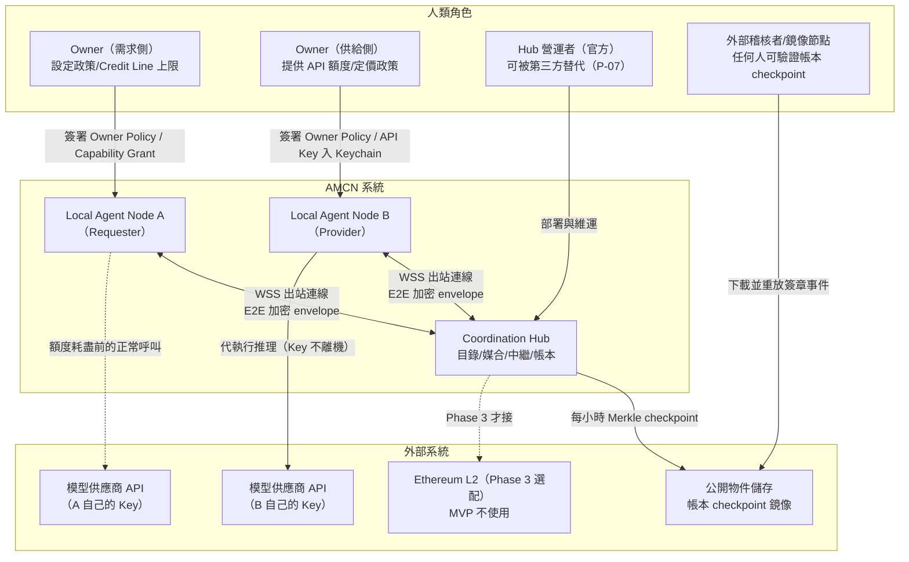
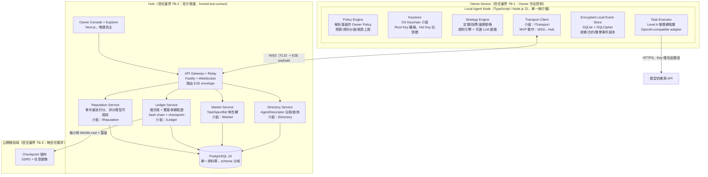
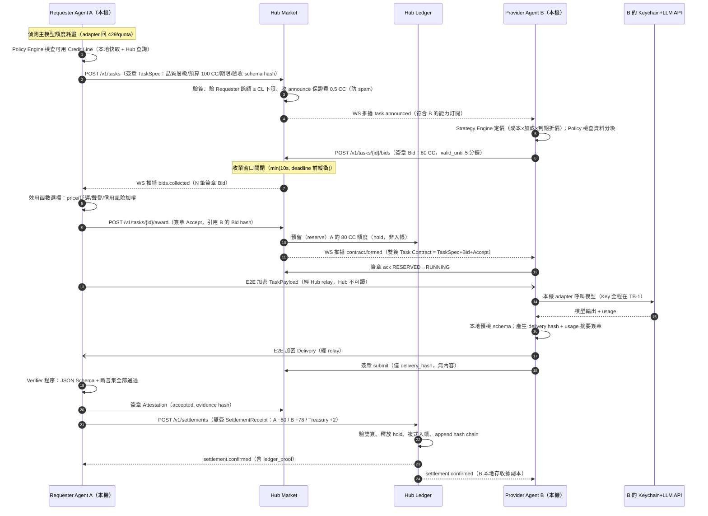
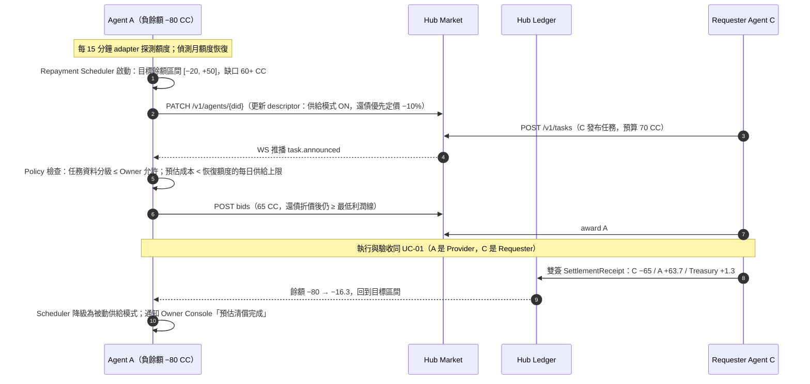
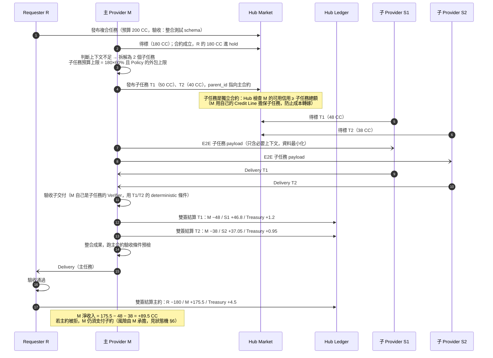
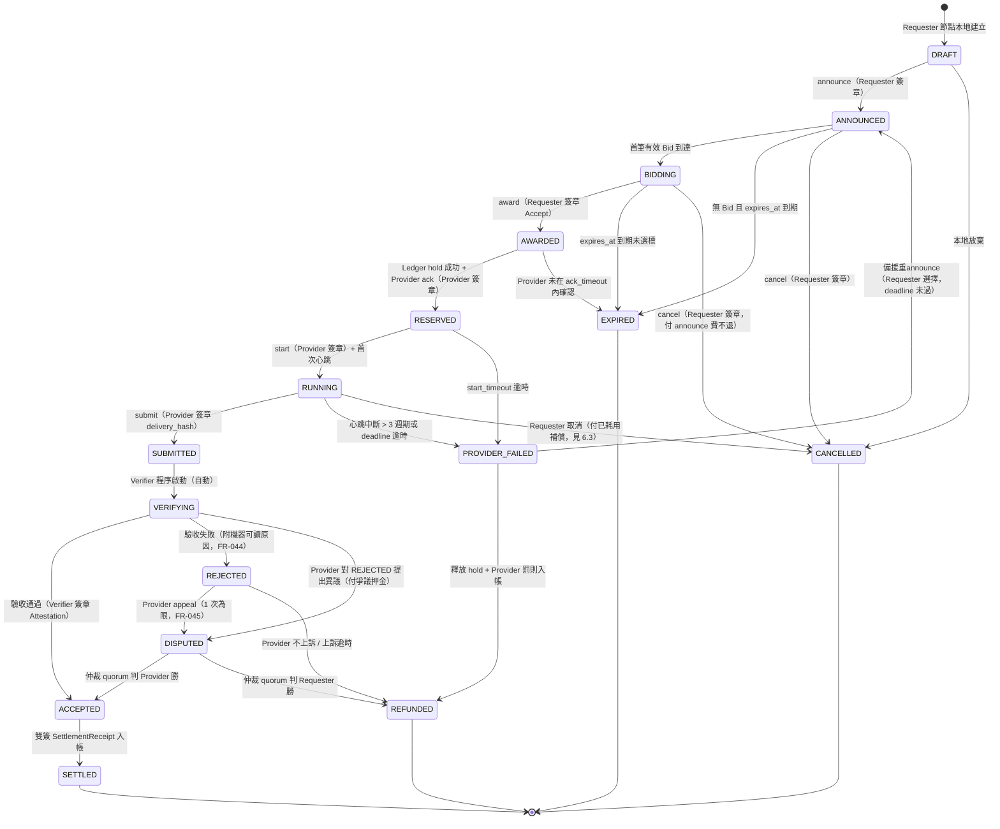

# AMCN 架構提案 B：MVP-first

| 欄位 | 內容 |
|---|---|
| 提案代號 | Proposal B（MVP-first） |
| 對應設計輸入 | AMCN-SDD-v0.1（/docs/AMCN-SDD-v0.1.md） |
| 日期 | 2026-09-05 |
| 優化目標 | 12 週內以真實 API 完成「互惠借用 → 自動還債」最小閉環（SDD §27） |
| 立場聲明 | 允許暫時中央化，但每個中央化元件都定義抽換介面與遷移路線（P-07 為硬需求） |
| 文件狀態 | 完整提案，供與 Proposal A / Proposal C 逐項比較 |

---

## 1. Executive Summary（一頁）

**核心主張：AMCN 的成敗判準是 SDD §27 的互惠信用閉環，不是去中心化程度。因此本提案把 12 週的全部工程預算押在閉環上，把去中心化做成「可驗證 + 可抽換」而非「立即分散」。**

### 1.1 一句話架構

> 本機 TypeScript 節點（保管 Key、執行推理、自主議價）+ 一個中央但**可驗證、可替換**的 Coordination Hub（目錄、媒合、E2E 加密訊息中繼、雙簽收據帳本），全部訊息與帳務事件由 Ed25519 簽章構成，Hub 只能「排序與轉發」，不能偽造、不能讀取 Prompt 明文。

### 1.2 五個關鍵決策

1. **傳輸層不做 P2P**：MVP 用節點對 Hub 的出站 WebSocket（天然穿透 NAT），節點間 payload 全程 X25519+XChaCha20-Poly1305 端到端加密，Hub 只見路由 metadata。抽換介面：`Transport` interface，Phase 2 換 libp2p 時本機節點程式碼不動。
2. **帳本不上鏈**：中央 PostgreSQL 複式帳，但**每筆 posting 必須附雙方 Ed25519 簽章的 SettlementReceipt**，事件串成 hash chain，每小時發布 Merkle checkpoint 到公開儲存（任何人可鏡像稽核）。Hub 若竄改帳務，任一節點可用本機保存的簽章收據舉證。這是 §17 方案二（P2P Signed Receipts）的「中央排序器」變體，遷移路線清楚。
3. **身分不上鏈**：did:key（Ed25519）本機產生，Owner Root Key 冷存、Agent Hot Key 由簽章 Capability Grant 授權，可撤銷可過期。Hub 只是目錄，不是身分發行者。
4. **驗收 deterministic-first**：MVP 只自動結算兩類任務——(a) JSON Schema + 程式化斷言可驗的結構化推理，(b) 測試套件可跑的程式任務。Judge Agent quorum 作為第二階段選配。主觀任務不允許自動結算（P-06）。
5. **不發幣、不做穩定幣結算**：CC 是封閉記帳單位，錨定「US$0.05 公開 API 參考價」僅作揭露。穩定幣層只保留 schema 擴充點與 L2 checkpoint anchoring 的預留欄位。

### 1.3 12 週交付的閉環

第 8 週結束時，三台互不信任的實體機器上演示：Agent A 額度歸零 → 在 −200 CC 額度內向陌生 Agent B 借推理 → B 的 Key 全程不離機 → schema+斷言自動驗收 → A=-80/B=+78/Treasury=+2、全網總和為 0 → A 額度恢復後自動接 C 的任務把負餘額補回。第 12 週擴大到 10–20 個真實節點的封閉試點，並輸出成交率、違約率、還債週期等市場指標。

### 1.4 誠實的代價聲明

- MVP 的 Discovery、媒合排序、帳本排序、聲譽計分**都是中央化的**（§17 逐層分析見第 20 章）。我們用「簽章可稽核 + 介面可抽換 + 資料可匯出」三道防線控制中央化風險，但 Hub 在 MVP 期間確實能審查交易、看到交易圖譜 metadata。
- 12 週內 Sybil 防禦只有邀請制 + 保證金 + 貢獻任務三招，對抗高強度經濟攻擊不足——這是刻意取捨，Phase 1 是封閉小圈，攻擊面有限。
- 模型供應商 ToS 風險（§16 威脅 15、§26 假設 3）無法用架構完全解決，只能降低與隔離，第 18 章列為「現在不知道」。

---

## 2. 假設

### 2.1 固定假設（承接 SDD，不得移除）

| # | 假設 | 來源 |
|---|---|---|
| A-01 | P-01～P-10 全部設計原則成立，其中 P-02（Key 不離機）與 P-07（可替換）為硬約束 | SDD §4 |
| A-02 | MVP 不發自有可交易 Token，CC 不可對外兌現 | P-04 |
| A-03 | 負餘額是功能不是漏洞，必須支援 | P-05 |
| A-04 | 每筆自動結算任務必須有事先定義的驗收方式 | P-06 |
| A-05 | 全網 CC 帳面總和恆為 0 | SDD §14.1 |
| A-06 | MVP 執行環境只開放 Level A（純推理），Level B（隔離程式執行）為延伸目標 | SDD §15 |
| A-07 | 人類介入邊界依 SDD §6.2：政策、金鑰、緊急停止；不逐筆操作 | SDD §6.2 |

### 2.2 本提案自行新增假設（可證偽，列入實驗）

| # | 新增假設 | 若為假的後果 | 驗證方式 |
|---|---|---|---|
| B-01 | Phase 1 參與者是 3–20 個彼此有一度或二度社交關係的早期用戶，Sybil 與惡意攻擊強度低 | Sybil 防禦不足，須提前引入保證金/質押 | 試點期監控多帳號行為指標 |
| B-02 | 「結構化文字推理 + schema 驗收」的任務型態足以承載 80% 的早期真實需求 | 閉環成立但無人使用；需提早做 Level B | 試點期任務型態統計 |
| B-03 | 單一 Hub（含備援）在 ≤1,000 節點、每日 ≤50,000 筆任務下不構成效能瓶頸 | 提前分片或引入多 Hub 聯邦 | 負載測試（第 9 週） |
| B-04 | 節點 Owner 願意在本機常駐一個能讀取其 API Key 的程式，只要程式開源、Key 只進 OS Keychain | 安裝率過低，MVP 無供給 | 試點招募轉換率 |
| B-05 | 議價開銷可控：限制每任務最多 1 輪 counter-offer，媒合用規則引擎而非 LLM，LLM 只用在定價建議 | 議價 Token 成本高於任務價值（§26 假設 7） | Phase 0 模擬 + 試點實測 |
| B-06 | 1 CC = US$0.05 參考價的粒度足夠為主流模型計價（誤差可由議價吸收） | 定價粒度爭議，需改為 milli-CC | Phase 0 模擬定價分佈 |
| B-07 | Hub 營運方（官方）在 MVP 期間是誠實但好奇（honest-but-curious）的威脅模型；惡意 Hub 由簽章稽核事後追責，而非即時防止 | 中央化風險被低估，需加速 Phase 2 去中心化 | 公開 checkpoint + 第三方鏡像稽核 |

---

## 3. C4 System Context 與 Container Diagram

### 3.1 System Context（C4 Level 1）



### 3.2 Container Diagram（C4 Level 2）



**圖說重點**：模型 API Key 唯一的流動路徑是 `Keystore → Executor → 模型供應商 HTTPS`，全部在 TB-1 內。Hub 的四個服務各自綁定一個介面（IDirectory / IMarket / ILedger / IReputation / ITransport），這五個介面就是 P-07 的抽換合約，定義於第 7 章與附錄。

---

## 4. 核心元件責任與信任邊界

### 4.1 元件責任表

| 元件 | 責任 | 明確不負責 | 信任邊界 |
|---|---|---|---|
| Policy Engine（節點） | 載入 Owner Root Key 簽章的 Policy；每個對外動作（投標、接受、付款、執行）前做預算/資料分級/對手方檢查；拒絕即中止 | 不做定價決策（Strategy 的事） | TB-1 |
| Keystore（節點） | API Key 存 OS Keychain（macOS Keychain / Linux secret-service），Hot Key 私鑰只存在記憶體，Root Key 建議冷存；提供簽章與解密原語 | 不輸出私鑰；日誌層有 redaction middleware 過濾任何 `sk-` 樣式字串 | TB-1 |
| Strategy Engine（節點） | 供給定價（含額度到期折價曲線 UC-03）、投標決策、還債排程（UC-02）、目標餘額區間維持 | 不繞過 Policy Engine | TB-1 |
| Task Executor（節點） | Level A 推理：收到解密後的 TaskPayload → 呼叫本機 adapter → 回傳結果 + usage 證明摘要；逾時/取消/心跳 | 不落地明文 Prompt（除非合約要求保留）；不執行任意程式碼（MVP） | TB-1 |
| Local Event Store（節點） | 保存本節點所有簽章事件（合約、交付 hash、收據）的第一手副本——這是對抗惡意 Hub 的證據基礎 | 不是全網帳本 | TB-1 |
| Transport Client（節點） | 實作 `ITransport`：connect / send(to, envelope) / subscribe；E2E 加密封裝 | 不理解業務語意 | TB-1↔TB-2 |
| Directory（Hub） | AgentDescriptor 的註冊、查詢、TTL 過期；驗簽後才收錄 | 不簽發身分；descriptor 可匯出、可被其他 Indexer 重建 | TB-2 |
| Market（Hub） | TaskSpec/Bid 佈告與投遞、狀態機推進的「排序者」；驗證每個 transition 附帶的簽章 | 不代替 Agent 做選擇；不能偽造簽章事件 | TB-2 |
| Ledger（Hub） | 驗證雙簽 SettlementReceipt → 寫入複式帳 → append hash chain → 定時 checkpoint；維持 Σ=0 的 DB 約束 | 不能無收據記帳；不能改寫歷史（改寫會使 chain 斷裂、被鏡像稽核抓到） | TB-2 |
| Reputation（Hub） | 從簽章事件流重算分數；公開計分公式版本 | 不是唯一真理：任何人可拉事件流自行計分（FR-063） | TB-2 |
| Owner Console / Explorer | 損益、餘額、應收應付、還債預估（FR-081）；市場統計（FR-082）；測試/補貼交易分離標示（FR-083） | 不是交易必經路徑（P-01） | TB-2 |
| Checkpoint 儲存 | 存放簽章的 Merkle root 與事件批次，供任何人鏡像 | 無信任要求 | TB-3 |

### 4.2 信任邊界的資料規則

| 資料 | TB-1（本機） | TB-2（Hub） | TB-3（公開） |
|---|---|---|---|
| API Key / 帳密 | 明文（Keychain） | **永不出現** | 永不出現 |
| Prompt / 交付內容 | 明文 | **僅密文 envelope**（E2E） | 僅 hash |
| TaskSpec 需求欄位（品質/預算/期限） | 明文 | 明文（媒合必需） | 聚合統計 |
| Bid 價格 | 明文 | 明文 | 聚合統計 |
| SettlementReceipt | 明文+簽章 | 明文+簽章（記帳必需） | Merkle 葉 hash；postings 金額進公開統計 |
| Owner 真實身分 | Owner 自知 | 只有 did 與連線 IP（可用 VPN/proxy 弱化） | 無 |
| 聲譽事件 | 副本 | 明文 | 可公開（僅 did 級） |

**已知洩漏面（誠實聲明）**：Hub 看得到「誰在什麼時候和誰交易、金額多少、什麼任務類型」的完整 metadata 圖譜（§16 威脅 9 只能部分緩解）。MVP 接受此風險，Phase 2 用多 Hub + onion-style relay 削減。

---

## 5. UC-01 / UC-02 / UC-04 Sequence Diagrams

### 5.1 UC-01：緊急借用推理能力



**要點**：(a) B 的 Key 只出現在步驟 17–18 的本機路徑；(b) Hub 在步驟 15、19 只經手密文；(c) 步驟 22 的收據需要 A、B 雙簽，Hub 無法單方面記帳；(d) 步驟 4 的 announce 費用回應 FR-014 spam 成本。

### 5.2 UC-02：額度恢復後自動還債



**要點**：還債是「A 對整個網路的義務」而非對 B（SDD §8），所以 A 替 C 工作即可清償；Scheduler 的目標區間與每日供給上限都來自 Owner Policy（P-08）。

### 5.3 UC-04：Agent 拆解並外包子任務



**要點（回應 §21 Q9 成本失控）**：(a) 子任務用 M 自己的 Credit Line 擔保，Hub 在子任務 announce 時就凍結 M 的額度，主約失敗不會把損失丟給 S1/S2；(b) Owner Policy 有 `max_subcontract_ratio`（預設 60%）與 `max_subcontract_depth`（預設 2 層），超過即被本機 Policy Engine 拒絕；(c) 子任務失敗時 M 可改自己做或申請主約展期，見狀態機。

---

## 6. Task State Machine

### 6.1 狀態圖



### 6.2 Transition 規格表（呼叫者／必要簽章／逾時）

| Transition | 呼叫者 | 必要簽章 | 逾時（預設，可在 TaskSpec 覆寫） | Hub 的角色 |
|---|---|---|---|---|
| DRAFT→ANNOUNCED | Requester 節點 | TaskSpec：Requester Hot Key；Hub 驗 Capability Grant 未過期 | `expires_at`（預設 announce 後 5 分鐘） | 驗簽、扣 0.5 CC announce 費、廣播 |
| ANNOUNCED→BIDDING | 自動（首筆 Bid） | Bid：Provider Hot Key | Bid `valid_until`（預設 5 分鐘） | 驗簽、驗 Provider 能力宣告、轉發 |
| BIDDING→AWARDED | Requester 節點 | Accept：Requester 簽章，內含被接受 Bid 的 hash（防替換） | 選標窗口 = min(10s, deadline−緩衝) | 組裝雙簽 Task Contract、時間戳排序（防雙重成交，見 6.4） |
| AWARDED→RESERVED | Hub Ledger + Provider | Provider ack 簽章 | ack_timeout = 15s | hold Requester 的成交額（信用預留） |
| RESERVED→RUNNING | Provider 節點 | start 事件簽章 + 心跳 | start_timeout = 30s（推理類） | 記錄狀態、開始心跳監測 |
| RUNNING→SUBMITTED | Provider 節點 | submit 簽章（含 delivery_hash、usage 摘要） | 任務 `deadline` | 記錄 hash；內容不經 Hub 明文 |
| RUNNING 心跳 | Provider 節點 | 心跳簽章 | 週期 = max(10s, 預估時長/10)；斷 3 週期→PROVIDER_FAILED | 監測 |
| SUBMITTED→VERIFYING | 自動 | — | 立即 | 通知 Verifier（MVP：Requester 節點內建 deterministic verifier） |
| VERIFYING→ACCEPTED | Verifier | Attestation 簽章（MVP=Requester 節點的 verifier 模組；quorum 模式=2-of-3 Verifier 簽章） | verify_timeout = 60s（deterministic）/ 10 分鐘（quorum） | 驗 Attestation 與合約中預先指定的 verifier 集合一致（FR-041） |
| VERIFYING→REJECTED | Verifier | Attestation（rejected + 機器可讀原因 + 證據 hash） | 同上 | 同上 |
| VERIFYING 逾時 | Hub（timer） | Hub 簽章的 timeout 事件 | verify_timeout | deterministic：視同 REJECTED 進入可上訴流程；quorum：替換無回應 Verifier（見 §7.5） |
| REJECTED→DISPUTED | Provider 節點 | appeal 簽章 + 爭議押金 hold（成交價 20%，敗訴沒收入 Treasury） | appeal 窗口 = 10 分鐘 | 啟動仲裁 quorum（3 名隨機 Verifier，見 §7.5） |
| DISPUTED→ACCEPTED/REFUNDED | 仲裁 quorum | 2-of-3 Arbitrator 簽章 | arbitration_timeout = 30 分鐘 | 執行判決、分配押金 |
| ACCEPTED→SETTLED | Requester 節點（發起）+ Provider（會簽） | SettlementReceipt：**雙簽必要**；Requester 拒簽逾時視為惡意拒付，Hub 依合約與 Attestation 代位結算並記聲譽事件（見 6.3） | settle_timeout = 60s | 驗雙簽（或代位條件）、複式入帳、hash chain append |
| PROVIDER_FAILED→ANNOUNCED | Requester 節點 | 重 announce 簽章（免 announce 費一次） | deadline 未過才允許 | 釋放原 hold、重新廣播（備援接管） |
| PROVIDER_FAILED→REFUNDED | 自動 | Hub 簽章 failure 事件 + Provider 罰則 posting（見 6.3） | 立即 | 釋放 hold |
| ANY→CANCELLED / EXPIRED | 見上表各列 | 對應簽章或 Hub timer 簽章 | — | 所有終態事件都進 hash chain，可稽核 |

### 6.3 例外處理的經濟後果（防止「狀態機正確但誘因錯誤」）

| 情況 | 經濟後果 | 對應威脅 |
|---|---|---|
| Provider 得標後失聯（PROVIDER_FAILED） | Provider 被記 `provider_fail` 聲譽事件；罰款 = 成交價 5%（自其餘額扣，可為負）入 Treasury 壞帳池 | §16 威脅 4 |
| Requester RUNNING 中取消 | 付 Provider 已耗用比例補償（按心跳回報的 usage 摘要，上限 = 成交價 50%） | 公平性 |
| Requester 收貨後拒簽收據（惡意拒付） | ACCEPTED 後 settle_timeout 逾時 → Hub 依「合約 + 有效 Attestation」**代位結算**（合約中雙方已預簽授權此路徑）；Requester 記 `settlement_evasion` 事件，Credit Line 即時砍 50% | §16 威脅 5 |
| Provider 敗訴的 DISPUTED | 沒收 20% 爭議押金；`dispute_loss` 事件 | FR-045 |
| 子任務主約失敗 | 主 Provider 自行吸收已結算子約成本（其 Credit Line 已預先擔保） | §21 Q9 |

### 6.4 Network partition 與雙重成交／雙重支出

- **MVP 答案（誠實）**：Hub 是唯一排序者（single sequencer），award 與 settlement 由 Hub 的 PostgreSQL 交易序列化（`SERIALIZABLE` + 帳戶列鎖），**因此 MVP 不存在分散式雙重支出問題，存在的是 Hub 單點問題**（可用性風險，見第 11 章故障模式）。
- 節點與 Hub 斷線時：節點本地把未確認事件放入 outbox（含單調 nonce），重連後重放；Hub 以 `(agent_did, nonce)` 唯一鍵去重，過期 Bid 由 `valid_until` + 伺服器時間窗拒絕（§16 威脅 8）。
- 同一 TaskSpec 若被重複 award（Requester 節點 bug 或重放）：Hub 以 `task_id` 上的狀態機約束拒絕第二次 award。
- **遷移路線**：Phase 2 把「排序」職責抽成 `ISequencer`；P2P 化時改為「Requester 簽章的 award 即最終選擇 + Provider 端冪等」模型，雙重支出改由收據淨額結算與信用額度硬上限控制（詳見 ADR-002 的遷移段）。

### 6.5 Mutual Credit 模式與 Stablecoin 模式的狀態機差異（SDD §13 要求）

MVP 只實作 Mutual Credit 模式；Stablecoin 模式（Phase 3）的狀態機差異**現在就定義**，避免日後破壞性改版：

| 狀態機環節 | Mutual Credit 模式（MVP） | Stablecoin 模式（Phase 3 擴充） |
|---|---|---|
| AWARDED→RESERVED | Ledger 對 Requester 做**信用 hold**（無資產移動，只凍結可借空間） | L2 escrow 合約 `deposit(contract_id, amount)`；RESERVED 需等鏈上確認（+2–10s），此為兩模式唯一的延遲差異點 |
| RESERVED 失敗 | hold 釋放，零成本 | escrow refund（gas 由 Requester 承擔） |
| ACCEPTED→SETTLED | 雙簽收據 → Hub 複式入帳 | 雙簽收據 → 任何一方持收據呼叫 escrow `release()`；Hub 帳本同步記一筆 `stablecoin_settled` 事件（金額 0 CC，僅留痕，**兩帳分離**，FR-054） |
| REFUNDED | 釋放 hold + 罰則 posting | escrow refund + 罰則走保證金扣抵 |
| DISPUTED | 仲裁 quorum 簽章即生效 | 仲裁 quorum 的 2-of-3 簽章作為 escrow 合約的 release 條件（合約驗多簽） |
| 逾時兜底 | Hub timer | escrow 內建 `timeout_refund`（鏈上自動，不依賴 Hub 存活） |
| 混合模式（FR-023） | — | 同一合約可宣告 `settlement.mode: "credit+stablecoin"`：CC 部分走 hold、現金部分走 escrow，兩者各自獨立完成才進 SETTLED；任一失敗全案 REFUNDED（原子性由狀態機序列保證：先 escrow 確認、後 CC hold，退回順序相反） |

設計約束：TaskSpec 的 `settlement.mode` 在 ANNOUNCED 時即固定，狀態機 transition 集合兩模式完全相同（只有 RESERVED/SETTLED 的副作用不同），因此 Provider/Requester 的策略碼與驗收碼零改動——這是「現在不上鏈、日後可上鏈」的結構性保證。

---

## 7. 五大子系統設計

### 7.1 Identity（身分、授權、撤銷）

**身分**
- `agent_id = did:key:z6Mk...`（Ed25519），本機生成，無需任何中央註冊即可存在（FR-005 部分滿足：身分不依賴 Hub，但 MVP 的「發現」依賴 Hub）。
- 兩層金鑰（FR-002）：
  - **Owner Root Key**：安裝時生成，提示 Owner 抄寫 BIP-39 助憶詞離線保存；只用來簽 Owner Policy、Capability Grant、金鑰輪替與撤銷。
  - **Agent Hot Key**：節點日常簽章用，落盤時以 OS Keychain 保護；建議 90 天輪替（Root 簽新 Grant 即完成）。

**Capability Grant（FR-003，UCAN 風格但自訂精簡格式）**

```json
{
  "typ": "amcn/grant@1",
  "iss": "did:key:zRoot...",
  "aud": "did:key:zHot...",
  "caps": ["market.announce", "market.bid", "task.execute:inference.text", "ledger.settle"],
  "limits": {
    "max_negative_cc": 200,
    "max_task_cc": 100,
    "daily_spend_cc": 300,
    "daily_provide_usd_ref": 20,
    "data_class_max": "internal",
    "max_subcontract_ratio": 0.6,
    "max_subcontract_depth": 2
  },
  "not_before": "2026-09-05T00:00:00Z",
  "expires_at": "2026-10-05T00:00:00Z",
  "revocation_hint": "https://hub.amcn.dev/v1/revocations",
  "sig": "ed25519:..."
}
```

- 每個對外簽章訊息都附 grant hash；對手方與 Hub 都驗證 grant 未過期、能力涵蓋該動作、限額未超。
- **撤銷**：Root Key 簽 revocation 物件 → 發到 Hub 的 revocation list（另發 checkpoint 供離線驗證）。對手方在成約前必查 revocation list；已成約任務不受中途撤銷影響（保護對手方），但新約立即停止。Hub 掛掉時 revocation 無法傳播是已知風險——緩解：grant 效期短（≤30 天）作為兜底過期。
- **恢復**：Hot Key 遺失 → Root 簽新 grant；Root 遺失 → 助憶詞恢復；兩者皆失 → 身分報廢，餘額按第 11 章「Owner 退出」流程處理。

**Sybil 抑制（FR-006）**：身分免費，但**初始信用不免費**——見 §8.3。MVP 疊加：邀請制（Phase 1 白名單）、每邀請人承擔被邀者壞帳連帶（inviter exposure）、可選保證金。

### 7.2 P2P 的 MVP 替代方案：Hub Relay + ITransport 抽換合約

**MVP 實作**
- 節點啟動 → 對 Hub 建立單一出站 WSS 長連線（解決 NAT/防火牆，零 STUN/TURN 成本）→ 以 Hot Key 做 challenge-response 認證。
- 節點間所有業務 payload 走 **E2E 加密 envelope**：
  - 金鑰協商：X25519（各 agent 的 encryption key 發布於 AgentDescriptor，與簽章 key 分離）；
  - 加密：XChaCha20-Poly1305，每 envelope 隨機 nonce；
  - Hub 可見欄位僅：`msg_id, from_did, to_did, msg_type, size, timestamp`。
- 離線投遞：Hub 為每個 did 維持 72 小時的加密 mailbox（超過即丟棄並通知寄件方）。

**ITransport 介面（抽換合約，P-07 硬需求）**

```typescript
interface ITransport {
  connect(identity: AgentIdentity): Promise<void>;
  send(to: Did, envelope: SealedEnvelope): Promise<DeliveryStatus>; // at-least-once
  onMessage(handler: (envelope: SealedEnvelope) => void): void;
  presence(did: Did): Promise<"online" | "offline" | "unknown">;
  close(): Promise<void>;
}
// SealedEnvelope 的加密格式與 wire format 分離：
// 換傳輸層（libp2p / WebRTC / 多 Relay 聯邦）不需改動任何業務碼與加密碼
```

**遷移路線**：Phase 2 第一步不是全 P2P，而是「多 Relay 聯邦」：任何人可跑開源 Relay，AgentDescriptor 的 `endpoints[]` 列多個 relay，節點多宿主連線。第二步才評估 libp2p（gossipsub 做任務廣播、直連做 payload）。判斷準則：當單 Hub 的審查風險或流量成本超過 P2P 的營運複雜度時切換。

### 7.3 Mutual Credit Ledger

**資料結構（中央但可驗證）**
1. `ledger_events`：append-only，每列 = 一個簽章事件（receipt / hold / release / penalty / writeoff / treasury 操作），含 `prev_hash` 與 `event_hash = sha256(prev_hash || canonical_json)` —— hash chain。
2. `postings`：複式分錄，每 receipt 展開為 N 筆 posting，DB 約束：`SUM(amount_cc) OVER receipt = 0`；全表總和恆 0（每日 job 驗證 + 對外公布）。
3. `accounts`：物化餘額（可從 events 全量重建，NFR-006）。
4. **Checkpoint**：每小時把該小時事件的 Merkle root、事件數、全網餘額雜湊，以 Hub 營運 key 簽章後發布到 S3/R2 + 任意鏡像。節點每次結算後核對自己的收據確實在 Merkle tree 內（inclusion proof 由 Hub API 提供）。
5. **手續費與壞帳（FR-057）**：每筆成交收 2.5%（付款方價金中扣，Provider 實收 97.5%），全額入 `protocol:treasury`；treasury 是壞帳準備的唯一對手科目，所有 writeoff 都是 `debtor → treasury` 的顯式 posting，治理規則寫在公開的 treasury policy 文件並隨版本簽章。

**ILedger 介面（抽換合約）**

```typescript
interface ILedger {
  hold(account: Did, amountCc: number, contractId: string): Promise<HoldId>;
  releaseHold(holdId: HoldId): Promise<void>;
  settle(receipt: SignedSettlementReceipt): Promise<LedgerProof>; // 冪等：以 contract_id 去重
  balance(account: Did): Promise<{ balanceCc: number; heldCc: number; creditLimitCc: number }>;
  events(since: Cursor): AsyncIterable<SignedLedgerEvent>;      // 全量匯出，重建用
  inclusionProof(eventHash: string): Promise<MerkleProof>;
}
```

**為何這不是「純中央帳本」**：Hub 不能偽造任何一筆 settle（缺雙簽）、不能無聲改寫歷史（chain 斷裂 + 鏡像比對）、不能扣留節點資料（events 全量可匯出、節點本地有第一手收據）。Hub 能做的惡是：**拒絕服務、審查特定交易、洩漏 metadata**——這三項在第 20 章誠實列為 MVP 中央化殘留。

### 7.4 Reputation

- **事件優先，分數其次（FR-063）**：聲譽的 ground truth 是簽章事件流（settled / provider_fail / rejected / dispute_loss / settlement_evasion / verified_attestation），任何 Indexer 可重放事件自行計分。Hub 提供「參考計分模型 v1」，公式公開：

```text
raw_score = Σ_e w(type_e) · decay(t_e) · diversity_weight(counterparty_e)
decay(t) = 0.5^(Δdays / 45)                    # 45 天半衰
diversity_weight = 1 / sqrt(pair_tx_count)      # 同對手重複交易降權（FR-062）
w: settled_as_provider=+1, settled_as_requester=+0.3, provider_fail=−4,
   dispute_loss=−6, settlement_evasion=−10, rejected_no_appeal=−2
展示分數 = 分維度呈現（FR-060）：交付率 / 驗收品質 / 延遲中位數 / 爭議率 / 90天服務量 / 對手多樣性（HHI）
```

- 不用單一總分排序市場（FR-061）；Requester 的選標效用函數自行加權各維度。
- 洗量抑制：diversity_weight + 成交需真實 Treasury 費（自成交也要付 2.5%，洗量有現金等價成本 CC 消耗）+ 關係人交易標記（同 IP/同邀請樹交易在統計中降權並標示，FR-083）。

### 7.5 Verification 與爭議

**MVP 自動結算白名單（P-06）**
1. `schema+assert`：交付必須通過 (a) JSON Schema（hash 在 TaskSpec 內）、(b) 一組宣告式斷言（長度界線、必含欄位、正則、禁止字樣、引用來源數量等，DSL 見 §9.4）。在 Requester 節點本地執行，60 秒內完成。
2. `test-suite`：程式任務，交付附 patch，Requester 節點在一次性 Docker 容器（無網路、唯讀掛載、512MB/60s 上限）跑指定測試——**這是 MVP 唯一的 Level B 元素，第 10 週才開**，屬延伸目標。

**Judge quorum（Phase 2 內建設計、MVP 末段實驗）**
- TaskSpec 宣告 `verifier_policy: "2-of-3"`；Verifier 集合在**成交時**由合約鎖定（FR-041）：從 Hub 的 Verifier 註冊池按「聲譽加權隨機 + 排除同邀請樹/近 30 天有交易的關係人」抽 3 名（FR-043 抗串謀第一道）。
- Verifier 收到的是交付內容 + 驗收 rubric，**看不到 Requester 身分與出價**（盲評，降低串謀協調面）。
- Verifier 報酬：成交價 3%/名，由 Requester 價金承擔；無回應 → 逾時替補重抽，原 Verifier 記 `verifier_timeout` 事件；意見 1:1:1 分裂 → 視為 REJECTED 可上訴。
- 主觀任務（創作、開放式研究）：MVP **不允許自動結算**，只能走「Requester 手動確認」模式且明確標示，不進自動閉環統計。

---

## 8. Mutual Credit 守恆與 Credit Line 演算法

### 8.1 守恆機制（FR-050/051、§14.1）

1. **唯一入帳路徑**：`ILedger.settle(receipt)`，receipt 內 postings 總和必為 0，否則 DB CHECK 直接拒絕。
2. **無鑄造**：系統沒有任何「發行 CC」的操作。新 Agent 的初始信用是**負餘額容許度（Credit Line）**，不是入金；Treasury 的正餘額全部來自手續費 posting。
3. **啟動額度（§14.3 Treasury 啟動信用）**：若採用，實作為 Treasury 對新 Agent 的一筆「補貼任務」真實成交（標記 subsidy，FR-083），仍守恆。
4. **每日守恆審計**：`SELECT SUM(balance) = 0` + 事件流重放比對物化餘額，結果簽章公布。

### 8.2 CC 計價（§14.2、§21 Q5）

- **參考單位**：1 CC = US$0.05 的「公開 API 牌價參考值」。僅用於揭露與跨模型換算，不構成兌現承諾（FR-054）。
- Provider 節點的**建議報價公式**（Strategy Engine 內建，Owner 可覆寫參數）：

```text
cost_ref_usd = Σ_token_type (est_tokens × provider_list_price)     # 以供應商公開牌價估
base_cc      = cost_ref_usd / 0.05
quote_cc     = base_cc × margin × urgency × expiry_discount × risk_premium

margin           ∈ [1.2, 2.5]   Owner 設定，預設 1.5
urgency          = 1 + 0.5 × clamp((30s − max_latency_ms/1000)/30, 0, 1)   # 越急越貴
expiry_discount  = 1 − 0.6 × waste_prob                                     # UC-03
  waste_prob     = clamp(1 − burn_rate_needed/observed_burn_rate, 0, 1)
  （burn_rate_needed = 剩餘額度/剩餘時間；observed = 近 7 天實際消耗速率）
risk_premium     = 1 + 0.1×requester_dispute_rate + 0.15×(1 if requester_balance < −0.5×CL else 0)
                   + data_class_premium(confidential=+20%)
```

- 成交價仍由市場議價決定（最多 1 輪 counter-offer，控制議價開銷，假設 B-05）。

### 8.3 Credit Line 演算法（可模擬，FR-052/053、§14.3）

```text
CL(a) = clamp( CL_base(a) + k_c × C_net90(a), 0, CL_cap(tier_a) )
        × f_complete(a) × f_div(a) × f_dispute(a) × f_velocity(a)

參數（Phase 0 模擬的初始值，全部可調）：
  k_c = 0.5
  CL_cap: tier0（新戶）= 50 CC；tier1（30 天+10 筆驗收成交）= 200 CC；
          tier2（保證金戶）= min(2000, deposit_usd/0.05 × 4)

CL_base：入網途徑三選一以上疊加，上限 30 CC
  保證金：deposit_usd/0.05 × 0.8（可退，違約時扣抵）
  Vouch：每位擔保人 +min(10, 5% × 擔保人自身 CL)，最多 3 人；
         被擔保人壞帳時擔保人連帶承擔 50%（inviter exposure，Sybil 主防線）
  貢獻任務：完成 1 件 Treasury 標記的驗證型小任務 +2 CC，上限 20 CC

C_net90 = 過去 90 天「經驗收的淨貢獻」= earned_cc(去重：每對手日上限 20 CC 計入) − spent_cc×0.2
f_complete = clamp(completion_rate_90d, 0.5, 1.0)^2          # 交付率
f_div      = 1 − 0.5 × HHI(counterparty_volume_shares)        # 對手集中度懲罰
f_dispute  = max(0, 1 − 5 × dispute_loss_rate_90d)            # 敗訴爭議重罰
f_velocity = clamp(1.2 − 0.02 × median_repayment_days, 0.6, 1.2)
             # repayment_days = 餘額跌破 −0.5×CL 到回升至 −0.2×CL 的天數
```

**行為特性（Phase 0 模擬要驗證的性質）**
- 新 Sybil 身分：CL_base ≤ 30 且 tier0 cap=50，製造 N 個身分最多套走 50N CC，但需要 N 份保證金/擔保連帶/貢獻工時——Sybil 邊際成本 > 邊際收益是模擬驗收條件之一。
- 只借不還：餘額長期貼著 −CL → f_velocity 降到 0.6、無 C_net90 → CL 收縮 → 可再借空間趨近 0；同時觸發 Owner Console 的還債提醒與（超過 90 天）壞帳流程（§11）。
- 囤積正餘額（§14.4）：對 >+500 CC 的部分收 1%/30天 demurrage（posting 對手科目 = treasury，守恆），推動花用；搭配官方「Credit 可花清單」（Pro 功能折抵、優先媒合）增加正餘額效用——誠實標注：**正餘額最終效用是本系統最大未證實假設之一（§26 假設 6）**，列入第 18 章。
- 月底額度到期供給湧入：expiry_discount 造成價格下壓是**預期行為**（清出浪費額度），但 Phase 0 要模擬價格崩跌是否引發供給罷工；候選對策 = Treasury 逆週期收購（用補貼任務吸收過剩供給，明確標示）。
- 逆向選擇（好模型恆供給、差模型恆消耗）：靠分維度聲譽 + model_class 驗證抽查（§10 威脅 3 控制）+ 價格分層自然反映。

### 8.4 目標餘額區間（FR-055）

每個節點 Policy 內建 `target_band: [low, high]`（預設 [−0.3×CL, +100]）。Strategy Engine 的模式切換：低於 low → 還債優先（供給折價 10%、暫停非必要消費）；高於 high → 消費優先或降價出清。此參數進 Phase 0 模擬，觀察 Credit Velocity 與市場流動性。

---

## 9. 資料模型與外部 API／Message Schema

沿用 SDD §12 的四個核心物件並保留等價能力，以下列出修改點與完整 API。所有 schema 帶 `"v": 1` 版本欄（NFR-004），canonical JSON（RFC 8785）後簽章。

### 9.1 核心物件修改點

**AgentDescriptor（相對 §12.1 的變更）**

```json
{
  "v": 1,
  "agent_id": "did:key:z6Mk...",
  "enc_pubkey": "x25519:base64...",
  "owner_policy_hash": "sha256:...",
  "grant_hash": "sha256:...",
  "capabilities": ["inference.text", "verify.schema"],
  "relays": ["wss://hub.amcn.dev/v1/relay"],
  "models": [{
    "model_class": "frontier-reasoning",
    "provider_disclosure": "blinded",
    "context_limit": 200000,
    "data_policy": "no-retention",
    "availability_window": {"until": "2026-09-30T00:00:00Z", "est_remaining_usd_ref": 42.0}
  }],
  "pricing_hint": {"min_cc_per_1k_ref_tokens": 0.8, "mode": ["credit", "gift"]},
  "supply_state": "active",
  "descriptor_expires_at": "2026-09-06T00:00:00Z",
  "seq": 42,
  "signature": "ed25519:..."
}
```

變更理由：新增 `enc_pubkey`（E2E 加密）、`grant_hash`（授權驗證）、`seq`（防舊 descriptor 重放）、`availability_window`（UC-03 到期折價的輸入）；移除 `wallets`（MVP 無鏈上結算，保留為 Phase 3 選配欄位）。

**TaskSpec（相對 §12.2 的變更）**：新增 `payload_mode: "e2e-after-award"`（媒合階段只公開需求 metadata，payload 成交後才 E2E 傳給得標者——隱私最小化）、`verifier_set_policy`（成交時鎖定 Verifier，FR-041）、`announce_fee_cc: 0.5`、`parent_contract_id`（UC-04 子任務）、`is_test: false`（FR-083）。

**Bid**：新增 `grant_hash`、`usage_report_policy`（成交後心跳附 usage 摘要的粒度）、counter-offer 以 `counter_of: bid_hash` 表達，同 schema。

**SettlementReceipt**：同 §12.4，postings 保持零和；`signatures` 明確為 `[requester_sig, provider_sig]`，`ledger_proof` 由 Hub 回填（事件 hash + Merkle inclusion 待下次 checkpoint）。

### 9.2 Hub REST API（OpenAPI 3.1，全部要求 `Authorization: AMCN-Sig`——請求體 canonical hash 的 Ed25519 簽章 + grant hash）

| Method | Path | 用途 | 關鍵欄位 / 行為 |
|---|---|---|---|
| POST | `/v1/agents` | 註冊/更新 AgentDescriptor | body=descriptor；驗簽、驗 grant、seq 遞增 |
| GET | `/v1/agents?capability=&model_class=&max_price=&min_reputation=` | 發現 Provider（FR-012） | 回傳簽章 descriptor 陣列（客戶端再驗簽，不信任 Hub 轉述） |
| DELETE | `/v1/agents/{did}` | 下架（Root 或 Hot 簽章） | supply_state=retired |
| POST | `/v1/revocations` | 撤銷 grant / key | body=Root 簽章 revocation |
| GET | `/v1/revocations?since=` | 撤銷清單同步 | 增量 |
| POST | `/v1/tasks` | 發布 TaskSpec | 扣 announce 費；狀態→ANNOUNCED |
| GET | `/v1/tasks?capability=&data_class_max=&min_price=` | Provider 搜尋任務 | |
| POST | `/v1/tasks/{id}/bids` | 提交 Bid | 驗 valid_until、能力、grant 限額 |
| POST | `/v1/tasks/{id}/award` | 選標 | body={accepted_bid_hash, sig}；Hub 組雙簽合約、Ledger hold |
| POST | `/v1/tasks/{id}/events` | 狀態機事件（ack/start/heartbeat/submit/cancel/appeal） | body=簽章事件；Hub 依 §6.2 驗證合法 transition |
| POST | `/v1/tasks/{id}/attestations` | Verifier 提交驗收結果 | 驗 verifier ∈ 合約鎖定集合 |
| POST | `/v1/settlements` | 提交雙簽收據 | 冪等（contract_id）；回 ledger_proof |
| GET | `/v1/accounts/{did}` | 餘額/hold/CL 查詢 | 本人或公開摘要 |
| GET | `/v1/ledger/events?since=` | 全量事件匯出（NFR-006、抽換遷移用） | 分頁串流 |
| GET | `/v1/ledger/checkpoints/latest` | 最新簽章 checkpoint | 任何人可取 |
| GET | `/v1/ledger/proof/{event_hash}` | Merkle inclusion proof | |
| GET | `/v1/reputation/{did}` | 分維度聲譽 + 事件游標 | 附計分模型版本號 |
| GET | `/v1/market/stats` | 成交價/深度/成功率/違約率（FR-082，聚合去識別，排除 is_test/subsidy） | |

### 9.3 WebSocket Relay 訊息（`wss://hub.amcn.dev/v1/relay`）

```json
// 明文外層（Hub 可見，僅路由必需）
{
  "v": 1, "msg_id": "ulid", "type": "relay.envelope",
  "from": "did:key:zA", "to": "did:key:zB",
  "nonce_hint": "base64-24bytes", "sent_at": "...",
  "payload_enc": "base64(XChaCha20-Poly1305(...))",
  "sender_sig": "ed25519:..."
}
// payload 解密後（僅收件節點可見）
{ "kind": "task.payload" | "task.delivery" | "negotiation.counter" | "verify.material",
  "contract_id": "...", "body": { ... }, "body_hash": "sha256:..." }
```

Hub 推播事件（明文，因為本來就是公開市場資訊）：`task.announced`、`bids.collected`、`contract.formed`、`task.state_changed`、`settlement.confirmed`、`checkpoint.published`。

### 9.4 驗收 DSL（schema+assert 模式）

```json
{
  "acceptance": {
    "method": "schema+assert",
    "schema_hash": "sha256:...",
    "asserts": [
      {"op": "jsonpath_exists", "path": "$.summary"},
      {"op": "length_between", "path": "$.summary", "min": 200, "max": 2000},
      {"op": "regex_absent", "path": "$..*", "pattern": "(?i)as an ai language model"},
      {"op": "count_gte", "path": "$.citations[*]", "value": 3},
      {"op": "lang_is", "path": "$.summary", "value": "zh-TW"}
    ],
    "verifier_policy": "requester-local"
  }
}
```

斷言集在 TaskSpec 簽章時就固定（hash 進合約），Provider 投標前可自行預跑同一套斷言——**驗收條件對稱可見**是減少爭議的第一機制。

### 9.5 其餘協議物件 Schema

**TaskContract（成交時由 Hub 組裝，雙方各自驗證後本地留存）**

```json
{
  "v": 1,
  "contract_id": "sha256(task_spec_hash || bid_hash || accept_sig)",
  "task_spec": { "...": "完整 TaskSpec 原文" },
  "accepted_bid": { "...": "完整 Bid 原文" },
  "accept": {"bid_hash": "sha256:...", "requester_sig": "ed25519:..."},
  "provider_ack": {"sig": "ed25519:...", "acked_at": "..."},
  "verifier_set": ["did:key:zV1", "did:key:zV2", "did:key:zV3"],
  "verifier_lock_proof": "sha256(checkpoint_hash || contract_id)",
  "timeouts": {"ack_s": 15, "start_s": 30, "heartbeat_s": 10, "verify_s": 60, "settle_s": 60},
  "retention": "no-retention",
  "delegated_settlement_authority": true,
  "parent_contract_id": null,
  "is_test": false
}
```

`delegated_settlement_authority: true` 是 §6.3「惡意拒付代位結算」的雙方預簽授權依據；`verifier_lock_proof` 讓 Verifier 抽選可事後驗證（隨機種子 = 最近一次公開 checkpoint hash，Hub 無法挑選對自己有利的 Verifier 而不被發現）。

**Attestation（Verifier 簽章）**

```json
{
  "v": 1,
  "contract_id": "...",
  "verifier": "did:key:zV1",
  "verdict": "accepted" | "rejected",
  "reasons": [{"assert_index": 3, "op": "count_gte", "expected": 3, "actual": 1}],
  "evidence_hash": "sha256:...",
  "delivery_hash_confirmed": "sha256:...",
  "verified_at": "...",
  "signature": "ed25519:..."
}
```

`reasons` 是 FR-044 的機器可讀拒絕原因：直接指向驗收 DSL 的斷言索引與實際值，Provider 可據此重跑同一斷言複驗。

**Heartbeat + UsageReport（Provider 執行中週期上報）**

```json
{
  "v": 1, "contract_id": "...", "seq": 7,
  "state": "running",
  "usage_partial": {"input_tokens_est": 12000, "output_tokens_est": 3400, "elapsed_ms": 41000},
  "checkpoint_hash": "sha256:...",
  "signature": "ed25519:..."
}
```

用途：(a) 心跳存活監測；(b) Requester 中途取消時的補償計算基礎（§6.3）；(c) 威脅 3 的延遲-長度特徵樣本。`usage_partial` 只含彙總數字，不含 Provider 帳務明細（FR-034）。

**LedgerEvent 與 Checkpoint**

```json
// ledger_events 每列（對外匯出格式）
{
  "v": 1, "event_seq": 182734, "event_type": "settle",
  "payload": { "...": "SettlementReceipt 全文或 hold/penalty/writeoff 物件" },
  "prev_hash": "sha256:...", "event_hash": "sha256:...",
  "recorded_at": "...", "hub_sig": "ed25519:hub..."
}
// 每小時 checkpoint（發布到 R2 + 鏡像）
{
  "v": 1, "checkpoint_seq": 512,
  "range": {"from_event": 182000, "to_event": 183999},
  "merkle_root": "sha256:...",
  "global_balance_hash": "sha256(sorted (did, balance) list)",
  "sum_check": 0,
  "published_at": "...", "hub_sig": "ed25519:hub..."
}
```

### 9.6 錯誤碼與冪等規則

| 錯誤碼 | 場景 | 客戶端行為 |
|---|---|---|
| `SIG_INVALID` / `GRANT_EXPIRED` / `GRANT_SCOPE` | 簽章或授權失敗 | 不重試；檢查金鑰/grant |
| `NONCE_REPLAY` | (did, nonce) 已見 | 不重試（前次已生效，讀回結果） |
| `STATE_CONFLICT` | 狀態機不允許的 transition（如二次 award） | 不重試；重新同步任務狀態 |
| `CREDIT_INSUFFICIENT` | hold 超出 CL 可用空間 | 降低出價或等待還債 |
| `BID_EXPIRED` / `TASK_EXPIRED` | 超過 valid_until / expires_at | 重新報價/重新發布 |
| `RATE_LIMITED` | announce/bid 頻率超限（spam 防護第二層） | 指數退避 |
| `MAILBOX_FULL` | 收件方離線且配額滿 | 改走重新招標 |

冪等鍵一覽：settle→`contract_id`；hold→`(contract_id, "hold")`；狀態事件→`(contract_id, event_type, signer, nonce)`；descriptor→`(did, seq)`。所有 POST 皆可安全重放，這是 outbox 重試機制的前提。

---

## 10. 威脅模型：§16 全部 15 項的具體控制

| # | 威脅 | 具體控制（MVP 實作） | 殘餘風險（誠實標注） |
|---|---|---|---|
| 1 | 惡意 Prompt 竊取 Provider API Key | (a) Key 只在 Keystore→Executor→HTTPS 路徑，任務 Prompt 由獨立子行程處理，該行程環境變數/記憶體無 Key（IPC 只傳「已完成的模型回應」）；(b) 出站網路 allowlist＝僅模型供應商域名；(c) 回應出站前跑 secret-pattern scanner（`sk-`、`AKIA` 等正則 + entropy 檢查）攔截；(d) 日誌全域 redaction | 模型自身把 system prompt 外洩不涉 Key；scanner 可被編碼繞過——縱深防禦但非絕對 |
| 2 | Requester 發送敏感/非法內容 | (a) TaskSpec 必帶 `data_class`，Policy Engine 白名單過濾；(b) Provider 端本地前置分類器（關鍵字 + 可選小模型審查）可拒單且不罰；(c) 合約含內容責任條款 hash，Requester 簽章即承擔；(d) 交付與輸入按合約保留政策自動刪除（FR-035），Provider 預設 no-retention | 分類器誤判雙向存在；法律責任分配需律師意見（第 18 章） |
| 3 | Provider 假模型冒充 | (a) 統計抽查：Hub Treasury 定期發「金絲雀任務」（已知高難度題，答案分佈可鑑別 model_class），冒充者聲譽事件 `model_misrepresentation` 重罰 −8；(b) usage 摘要簽章（tokens/latency 特徵異常偵測：frontier 模型的延遲-長度曲線可統計區分）；(c) Requester 驗收斷言本身就過濾低品質 | 無密碼學證明（TEE/zkML 不進 MVP）；只能事後統計抓，抓到前有損失——由 risk_premium 定價吸收 |
| 4 | Provider 收 Credit 不做工 | 結算順序天然防護：**先交付、後驗收、才入帳**；得標即失聯 → PROVIDER_FAILED 罰 5% + 聲譽事件；hold 機制保證 Requester 額度不會先被劃走 | 無 |
| 5 | Requester 收貨拒付 | (a) ACCEPTED 後拒簽 → Hub 依雙方預簽授權**代位結算**（合約條款）；(b) `settlement_evasion` 事件 CL 砍半；(c) deterministic 驗收讓「已通過」有客觀證據 | 代位結算依賴 Hub 誠實——P2P 化後改為仲裁 quorum 代位 |
| 6 | Verifier 與一方串謀 | (a) Verifier 成交時鎖定 + 聲譽加權隨機抽選；(b) 排除同邀請樹/近期交易對手；(c) 盲評（不見 Requester 身分與價格）；(d) Verifier 判決與最終仲裁不一致率公開，異常者踢出池 | MVP 主力是 requester-local deterministic 驗收，quorum 路徑試點量少、串謀樣本不足以驗證控制有效性 |
| 7 | Sybil 洗量/洗聲譽/套初始信用 | (a) 初始信用需保證金/擔保連帶/貢獻工時（§8.3）；(b) 擔保人 50% 連帶壞帳；(c) diversity_weight 讓對敲不長聲譽；(d) 對敲仍付 2.5% Treasury 費（燒 CC）；(e) 同邀請樹交易標記降權；(f) Phase 1 白名單邀請制 | 公開網路階段（Phase 3）需更強機制（stake/身分證明），MVP 明確不解決開放環境 Sybil |
| 8 | Replay / 雙花 / 過期 Bid 重放 | (a) 所有簽章訊息含 `nonce`（單調）+ `expires_at`，Hub 以 (did, nonce) 去重；(b) award 引用 bid_hash，Bid 逾 valid_until 即拒；(c) 雙花由單一排序者 + SERIALIZABLE 交易 + hold 機制消除（§6.4）；(d) settle 以 contract_id 冪等 | 中央排序者本身是可用性單點（見第 11 章） |
| 9 | P2P metadata 洩漏 | (a) payload E2E，Hub 不見內容；(b) 公開統計聚合去識別（k≥5 才發布桶值）；(c) descriptor 的 `provider_disclosure: blinded` 允許不揭露具體供應商 | **Hub 看得到完整交易圖譜**——MVP 接受，Phase 2 多 Relay + 延遲混淆再削減；IP 洩漏建議 Owner 自行走 VPN |
| 10 | 惡意 Artifact / sandbox 逃逸 | MVP Level A 唯一開放：交付僅為資料（JSON/文字），節點以「解析、不執行」處理；第 10 週的 test-suite 驗收用一次性 Docker：`--network=none`、非 root、唯讀 rootfs、512MB/60s/128 pids 上限、seccomp 預設 profile、不掛 Owner 目錄（§20 驗收 6） | Docker 非 microVM，核心逃逸理論可能；Level B 正式開放前換 Firecracker/gVisor（Phase 2） |
| 11 | 惡意 Indexer 藏報價/操排序/餵舊資料 | (a) descriptor/bid 本身有簽章與 seq，Hub 竄改內容會驗簽失敗（客戶端驗）；(b) 「藏單」無法即時防——控制 = events 全量可匯出 + checkpoint 鏡像讓第三方能離線比對「被隱藏的簽章事件」，發現審查即公開舉證；(c) IDirectory/IMarket 可替換是最終防線 | 即時審查在單 Hub 期間無解，這是本提案最大的去中心化讓步（第 20 章） |
| 12 | Prompt Injection 誘導超額付款 | (a) 花錢動作不經 LLM：投標/接受/結算由**規則引擎**執行，LLM 只產生「建議」進入規則引擎過濾；(b) Grant 硬上限（max_task_cc/daily_spend_cc）在 Policy Engine 與 Hub 雙重執行；(c) 任務內容與策略決策的上下文隔離（任務 Prompt 永不進入策略 LLM 的 context） | Owner 若自行接入「LLM 全自動策略」超出預設，風險自負——文件明示 |
| 13 | 負餘額 Owner 永久離線 | 壞帳流程：90 天無心跳且餘額 < 0 → 標記 delinquent → 寬限 30 天 → writeoff posting（debtor→treasury 承接負額，守恆）；損失承擔順序：該戶保證金 → 擔保人連帶 50% → Treasury 準備金（手續費累積）；Treasury 見底 → 全網新增信用凍結（CL_cap 調降）直到準備金回補 | 若壞帳率 > 手續費收入（模擬要測的臨界值約 2.5%），系統收縮——這是 mutual credit 的本質風險，無法架構消除 |
| 14 | 升級/治理/Treasury 被少數人控制 | MVP 誠實答案：**官方控制**。控制措施：(a) treasury 全部 posting 公開可稽核；(b) 協議 schema 與客戶端開源（Apache-2.0）、版本簽章 + 最低版本政策（NFR-010）；(c) 節點對新版本有 14 天採納窗口，不強推；(d) 治理去中心化排入 Phase 3，MVP 只承諾透明 | 治理中央化是 MVP 特性不是 bug；提案不假裝有 DAO |
| 15 | 模型供應商封鎖疑似轉售流量 | (a) 流量特徵上，請求出自 Owner 本人裝置、本人 Key、正常速率——與 Owner 自用不可區分；(b) Policy 預設限速（≤ Owner 歷史峰值）避免異常爆量；(c) 條款分級清單：明確允許 reseller/程式化使用的供應商（多數 API 條款允許構建應用）標綠、消費者訂閱（ChatGPT/Claude 個人版）**直接禁止接入**（P-10，adapter 白名單只收 API Key 型）；(d) 供應商溝通與合規意見列入 12 週計畫（第 5 週） | 供應商政策可能改變或個案認定；**此風險無法由架構消除**，列入第 18 章與風險表 R-01 |

---

## 11. 故障模式與恢復策略

| 故障 | 影響 | 偵測 | 恢復策略 | 對應 NFR |
|---|---|---|---|---|
| Hub 完全停機 | 新媒合停止；**進行中任務不中斷**（payload 已交換的執行/驗收在本地完成），結算入 outbox 等重放 | 節點心跳失敗；狀態頁 | Hub 主備（同區 standby，PG 串流複寫，RTO 15 分鐘 / RPO ≈ 0）；節點指數退避重連；已簽事件不遺失（本地第一手副本），符合 NFR-003 | NFR-003 |
| PostgreSQL 資料損毀 | 帳本風險 | 每日守恆審計、chain 驗證 | PITR（WAL 歸檔）+ 從 `ledger_events` 全量重放重建 postings/accounts；極端情況：向全網節點徵集簽章收據重建（這正是收據本地副本的存在理由） | NFR-006 |
| 節點離線（Provider 執行中） | 任務失敗 | 心跳斷 3 週期 | PROVIDER_FAILED → Requester 免費重 announce（備援接管，§13 問題 3 的答案：MVP 用「重新招標」不做熱接管） | — |
| 節點離線（Requester 待驗收） | 交付懸置 | verify_timeout | Provider 的 delivery_hash 已上報；Requester 回線後仍可驗收；超過 24 小時 → Provider 可申請仲裁 quorum 代驗（合約預授權） | — |
| Hub↔節點網路分割 | 節點看似離線 | 同上 | outbox + (did,nonce) 冪等重放；Bid/award 過期時間讓分割期間的舊訊息自然失效，不會雙成交（§6.4） | — |
| Checkpoint 儲存故障 | 稽核延遲 | 發布 job 告警 | 多目的地發布（S3 + R2 + GitHub release）；本地佇列補發 | — |
| Owner 主動退出（正餘額） | CC 無處化現 | — | 選項：轉贈他戶（一次性、防洗量標記）、留存 12 個月後 demurrage 歸 Treasury；文件明示 CC 不可兌現（P-04） | FR-056 |
| Owner 主動退出（負餘額） | 壞帳 | — | 同威脅 13 流程；退出 API 會先要求清償或沒收保證金 | FR-056 |
| Key 洩漏（Hot Key） | 冒名交易 | Owner 發現異常 / 異地登入告警 | Root 簽 revocation → Hub 撤銷清單 + checkpoint；洩漏期間交易可由 Owner 申訴，仲裁按事件時間軸裁定 | FR-003 |
| 模型供應商大規模封鎖 | 供給塌縮 | 節點回報 401/403 突增 | 供給多樣化（多供應商 adapter + 本機 OSS 模型 adapter：Ollama/vLLM 介面在第 7 週交付）；事件級：暫停該供應商類任務媒合 | 風險 R-01 |
| 升級失敗 / 惡意版本 | 節點被劫持 | 版本簽章驗證 | 客戶端只接受簽章版本；回滾通道；最低版本政策漸進（14 天窗口） | NFR-010 |

---

## 12. 技術選型表（含被拒絕方案與理由）

### 12.1 選型總表

| 領域 | 選擇 | 理由（MVP-first：成熟/可招聘/可除錯） | 被拒絕方案與理由 |
|---|---|---|---|
| 本機節點語言 | **TypeScript / Node.js 22（單一二進位以 pkg/bun build 發行）** | AI 生態（各家官方 SDK 完備）、跨平台、招聘池最大、與 Hub 同語言共享 schema/簽章程式庫（monorepo 直接複用，省 2–3 週） | Rust：正確性佳但迭代慢、招聘難，12 週不划算；Python：發行單一執行檔體驗差、常駐服務資源管理弱；Go：可，但為省第二語言成本而捨 |
| Hub 框架 | **Fastify + TypeScript，模組化單體（modular monolith）** | 單體 = 最快交付與最易除錯；模組邊界即 IDirectory/IMarket/ILedger/IReputation 介面，日後可拆 | 微服務：12 週內純開銷；NestJS：抽象厚，Fastify 足夠 |
| 資料庫 | **PostgreSQL 16（單庫多 schema）** | 複式帳需要 ACID + SERIALIZABLE；LISTEN/NOTIFY 兼作事件推播；招聘/維運零風險 | MySQL：可但 PG 的 JSONB/約束更順手；CockroachDB：MVP 不需分散式；EventStoreDB：小眾、招聘難——事件溯源用 PG append-only 表實現即可 |
| 佇列/排程 | **PG 表 + graphile-worker** | 少一個基礎設施；交易性入隊（狀態機事件與帳務同交易） | Redis/BullMQ：多一件維運品；Kafka：規模殺雞牛刀 |
| 簽章/加密 | **libsodium（Ed25519 / X25519 / XChaCha20-Poly1305）+ RFC 8785 canonical JSON** | 經審計、各語言綁定齊全 | 自組 WebCrypto 拼裝：易錯；JOSE/JWT 全家桶：alg 混淆歷史問題，改用固定演算法 |
| 身分 | **did:key（Ed25519）+ 自訂精簡 Grant** | 零基礎設施、標準相容、Phase 3 可平移 ERC-8004 類註冊 | did:web：綁域名，Owner 門檻高；鏈上身分：MVP 不需要（ADR-004） |
| 傳輸 | **WSS 出站長連線 + E2E envelope（ITransport 抽換）** | NAT 零成本、除錯容易（可觀測明文外層） | libp2p：NAT 穿透/中繼調試成本高，12 週風險大（ADR-001）；WebRTC：信令仍需中央，複雜度不減 |
| 帳本 | **中央 PG 複式帳 + 雙簽收據 + hash chain + 公開 checkpoint** | 見 12.2 三方案比較（ADR-002） | 見 12.2 |
| 驗收沙盒（第 10 週） | Docker（--network=none 等硬化） | 到處可裝、團隊熟 | Firecracker/gVisor：更安全但 macOS 開發體驗差，Phase 2 才換 |
| 前端 Console/Explorer | Next.js 15 + Tailwind | 通用技能、SSR 便於公開 Explorer SEO | 自建 SPA：無必要 |
| 部署 | **Hetzner 專用機 ×2（主/備）+ Docker Compose；checkpoint 到 Cloudflare R2** | 成本可預測（見第 14 章）、無 K8s 維運稅 | K8s/EKS：3 人團隊的 12 週不值；Serverless：WS 長連線與 PG 事務模式不合 |
| 可觀測性 | Prometheus + Grafana + Loki（自架） | 便宜、夠用 | Datadog：成本爆點（每節點 agent 計價） |
| 節點內建推理 adapter | OpenAI-compatible 轉接層（FR-031）：OpenAI/Anthropic/Google/OpenRouter/Ollama 五個 adapter | 覆蓋主流 + 本機 OSS 兜底 | LiteLLM 依賴：Python 邊車不合單一執行檔目標，自寫薄 adapter（各 ~200 行） |

### 12.2 帳本三方案比較（§17 硬性要求）

| 面向 | 方案一：Ethereum L2 Smart Contract | 方案二：P2P Signed Receipts + 週期性淨額結算 | 方案三：Federated Credit Circles / Appchain | **本提案 MVP：方案二的「中央排序器」變體** |
|---|---|---|---|---|
| 雙花防護 | 鏈共識，最強 | 弱：需 CRDT/淨額 + 信用上限吸收衝突 | 圈內強、跨圈弱 | 單排序者 + ACID，封閉網內完備 |
| 負餘額支援 | 困難：鏈上原生資產無法為負，需信用合約包裝，複雜 | 天然支援（記帳單位任意） | 天然支援（WIR/Sardex 同構） | 天然支援 |
| 微交易成本 | L2 每筆 $0.001–0.01 + 批次工程；每 token 上鏈違反 NFR-009 | ~0 | ~0（圈內） | ~0 |
| 隱私 | 交易圖公開，與 NFR-005 衝突（需 ZK 追加成本） | 好 | 圈內可控 | Hub 可見（誠實標注），公眾不可見 |
| 12 週可行性 | 差：合約審計 + 錢包 UX + 法遵（發類代幣疑慮，P-04 邊緣） | 差：分散式正確性研究量大 | 中：需先有多圈才有意義 | **好：3 週可完成核心** |
| 可稽核性 | 最強 | 依實作 | 依實作 | 強（雙簽 + chain + 公開 checkpoint 可重建） |
| 審查抗性 | 強 | 強 | 中 | **弱（MVP 已知讓步）** |
| 結論 | Phase 3 作為「checkpoint anchoring + 穩定幣 escrow」選配，**不作主帳本** | **長期目標形態**：多 Hub 聯邦各自排序 + 跨 Hub 淨額結算 | 長期與方案二合流：每個 Hub 即一個 credit circle | MVP 採用；遷移路線：單排序器 → 多 Hub 聯邦（方案三）→ 跨圈簽章淨額（方案二），checkpoint 錨定 L2（方案一元素） |

**MVP 與長期選擇理由總結**：互惠信用（可負餘額、封閉、不可兌現）與公鏈資產模型天然不合；WIR/Sardex 七十年實務證明中央記帳的互惠信用可運作，AMCN 的增量是「簽章事件讓中央記帳者可被稽核與替換」。先用最便宜的形態驗證經濟閉環（§27），再為已被證明的需求付去中心化成本——順序不可反過來。

---

## 13. MVP 里程碑、團隊角色與 12 週逐週實作計畫

### 13.1 團隊配置（4.5 FTE，12 週）

| 角色 | 人數 | 職責 | 必要技能 |
|---|---|---|---|
| Tech Lead / 後端（Hub） | 1 | Hub 四服務、帳本正確性、狀態機、API | TS/Node、PostgreSQL、分散式基礎 |
| 節點工程師 | 1 | Local Node：Keystore、Executor、adapter、Transport、打包發行 | TS/Node、桌面/CLI 發行、OS Keychain |
| 協議與安全工程師 | 1 | 簽章/加密程式庫、Grant/撤銷、威脅控制實作、驗收 DSL、沙盒 | 應用密碼學、AppSec |
| 經濟模擬 / Agent 策略工程師 | 1 | Phase 0 模擬器、Credit Line 調參、Strategy Engine、市場指標 | Python 或 TS、簡單 ABM 模擬、資料分析 |
| PM / DevRel / 合規（兼任） | 0.5 | 試點招募、供應商條款盤點與法遵意見、週報 | — |

關鍵人力風險：帳本 + 狀態機集中在 Tech Lead；緩解 = 第 3 週起協議工程師互為 code reviewer，測試覆蓋率門檻 90%（帳本模組）。

### 13.2 里程碑

| 里程碑 | 週 | 判準（可驗證） |
|---|---|---|
| M1 經濟可行性初判 | W3 | Phase 0 模擬跑通 1,000 agent，壞帳率/流動性報告出爐，CL 參數 v1 定案 |
| M2 首次三節點閉環（內部） | W6 | §20 驗收 1、2、4、7 在三台開發機達成 |
| M3 §27 完整閉環（demo 品質） | W8 | 借用 + 自動還債全自動完成，錄影 + 可重跑腳本 |
| M4 安全與抽換驗證 | W10 | §20 驗收 5、6 通過；ITransport/ILedger 第二實作煙霧測試 |
| M5 封閉試點上線 | W12 | 10–20 真實節點、§20 十項全數通過、市場指標儀表板上線 |

### 13.3 12 週逐週計畫（每週列交付物與負責人）

**W1：地基**
- Monorepo（pnpm workspaces）：`packages/schema`（全部 JSON Schema + canonical JSON + 簽章）、`packages/crypto`、`apps/hub`、`apps/node`、`apps/sim`。CI（GitHub Actions：lint/test/build 三平台）。
- 交付：did:key 生成 + Grant 簽發/驗證 CLI 可跑；Hub 骨架（健康檢查、PG migration 框架）。模擬器骨架（agent 群體、時間步進迴圈）。
- 負責：全員。**風險守門**：W1 結束前 schema 套件凍結 v1 欄位，之後改動走版本化。

**W2：帳本核心 + 模擬器 v1**
- 交付：ILedger 完整實作（hold/settle/守恆約束/hash chain/events 匯出）+ 500 條屬性測試（隨機收據流總和恆 0、重放冪等）；模擬器 v1：額度到期、緊急需求、簡單報價（無 CL 動態）。
- 負責：Tech Lead（帳本）、模擬工程師（sim）、節點工程師（Keystore + OS Keychain 三平台 spike）。

**W3：媒合 + 模擬器 v2 →【M1】**
- 交付：IMarket（announce/bid/award/狀態機 §6.2 全 transition + timer）；WS relay + E2E envelope 打通兩個假節點；模擬器 v2 加入 §8.3 CL 公式與違約行為，輸出成交率/Gini/壞帳率/Credit Velocity/還債週期。
- M1 評審：若模擬顯示 2.5% 手續費 < 穩態壞帳率，本週調參（CL_cap、罰則、擔保連帶比例）並記錄於 ADR 附錄。

**W4：本機節點縱切**
- 交付：Node 可執行檔（macOS/Linux）：`amcn init`（生 Root/Hot Key、寫 Policy）、`amcn start`；Executor + OpenAI/Anthropic 兩個 adapter；Policy Engine v1（預算/資料分級硬檢查）；額度耗盡偵測（429/quota 解析）。
- 負責：節點工程師 + 協議工程師（redaction middleware、secret scanner）。

**W5：議價與驗收 + 合規盤點**
- 交付：Strategy Engine v1（§8.2 報價公式、效用選標、1 輪 counter-offer）；驗收 DSL 引擎（schema+assert 全運算子 + 單元測試）；Attestation/Settlement 端到端（假任務）。
- PM：主要模型供應商 ToS 盤點表 + 外部律師初步意見（威脅 15）；試點招募啟動（目標 30 報名）。

**W6：三節點真實閉環（借用半程）→【M2】**
- 交付：三台實體機、三組真實 API Key，跑通 UC-01 全程（真模型呼叫、真驗收、真結算）；Owner Console v0（餘額、收據列表）；§20 驗收 1/2/4/7 的自動化 e2e 腳本。
- 週五內部 demo；未達成則啟動預留的 W7 緩衝（見 13.4）。

**W7：自動還債 + 供給策略**
- 交付：Repayment Scheduler（額度恢復偵測、目標餘額區間、還債折價）；UC-03 到期折價曲線接入報價；Ollama + OpenRouter adapter（供給多樣化，抗供應商風險）；mailbox 離線投遞 + outbox 重放。

**W8：§27 完整閉環 →【M3】**
- 交付：A 借 → B 供 → A 還（替 C 工作）全自動 demo，人類只在開頭簽 Policy；錄影 + `make closed-loop` 一鍵重跑；聲譽事件流 + 參考計分 v1；市場統計 API（is_test 分離）。
- **本週是成敗週**：若閉環不成，W9–10 內容降級為修閉環（先砍 test-suite 沙盒與 quorum 實驗）。

**W9：加固與負載**
- 交付：威脅 1/2/8/12 的控制全數落地並附對抗測試（惡意 prompt 語料庫、重放 fuzzer、injection 紅隊腳本 50 案例）；負載測試（模擬 1,000 節點 WS、10k 任務/日，驗 B-03）；Hub 主備切換演練（RTO 實測）。

**W10：可抽換性證明 + 沙盒 →【M4】**
- 交付：**ITransport 第二實作**（裸 TCP+自簽 relay，證明介面完備）與 **ILedger 匯出→重建演練**（從 events 全量重建餘額並比對）——這是 P-07 的可執行證據，不是文件承諾；checkpoint 發布 + 第三方鏡像驗證腳本開源；test-suite Docker 驗收（§20 驗收 6 的逃逸測試：惡意任務嘗試讀 Key/掛目錄，須全數被擋）。

**W11：試點準備**
- 交付：安裝體驗打磨（brew tap + curl 安裝腳本、5 分鐘 onboarding）；Explorer 公開頁；文件（Owner 手冊、Policy 範本三檔：保守/平衡/積極）；邀請制發放（擔保連帶條款簽署流程）；金絲雀任務池 v1（威脅 3）。
- 全 §20 十項驗收預跑，缺口列表歸零。

**W12：封閉試點 →【M5】**
- 10–20 個真實節點上線，7 天觀察窗；每日指標：成交率、P95 媒合時間（目標 <30s，NFR-001）、違約率、平均還債時間、供需深度。
- 交付：試點報告（含 §26 十大風險假設的初步證據）、Phase 2 規劃輸入、§20 十項驗收的簽核紀錄。

### 13.4 進度風險控制

- **緩衝策略**：W7 與 W11 各含約 30% 鬆弛；任何里程碑落後 >1 週即砍延伸目標，砍單順序：test-suite 沙盒 → judge quorum 實驗 → Explorer 公開頁 → Ollama adapter。**永不砍**：帳本正確性、Key 安全、§27 閉環。
- **每週五 demo 制**：所有交付以可執行 demo 驗收，不接受「程式碼完成但沒跑過」。

---

## 14. 基礎設施成本估算與成本爆點

### 14.1 12 週開發期 + 試點（月成本，美元）

| 項目 | 規格 | 月成本 |
|---|---|---|
| Hub 主機 | Hetzner AX42（8 核/64GB/NVMe） | $55 |
| Hub 備機（standby + PG 複寫） | 同上 | $55 |
| 監控/CI runner | Hetzner CX32 | $15 |
| Cloudflare R2（checkpoint + 事件鏡像） | <100GB | $5 |
| 網域/憑證/信箱 | — | $10 |
| 開發與測試 LLM 呼叫 | e2e 測試、金絲雀任務、judge 實驗 | $300–800 |
| 試點補貼（貢獻任務、Treasury 啟動） | W11–12 | $200 |
| 法律意見（一次性） | 供應商 ToS + CC 定性 | $3,000–8,000（一次） |
| **月度小計（不含一次性與人力）** | | **約 $640–1,140/月** |

人力（4.5 FTE × 3 個月）另計，約 $135k–200k 視地區——是真正的主成本。

### 14.2 試點後 1,000 節點規模推估

| 項目 | 月成本 |
|---|---|
| Hub 3 台（加一台讀分離/Explorer） | $170 |
| R2 + 備份 | $20 |
| 金絲雀任務（威脅 3 抽查，約 2k 次/月 frontier 呼叫） | $400 |
| 監控告警 | $30 |
| **小計** | **約 $620/月**（每節點 <$1/月，商業模式可承受） |

### 14.3 最可能的成本爆點（按機率排序）

1. **驗證用 LLM Token**：若 deterministic 驗收覆蓋率低於預期、大量任務落到 judge quorum，每筆任務 3 名 Verifier 的推理成本可能達任務價值的 15–30%。爆點監測指標：`verify_cost / task_value` 週報，>10% 即收緊 quorum 適用範圍。
2. **議價 Token 開銷（§26 假設 7）**：若 Owner 普遍開啟 LLM 定價建議，每任務多 2–5 次小模型呼叫。控制：定價建議預設用規則引擎，LLM 建議為 opt-in 且限每小時次數。
3. **法遵**：若任一主要供應商發函，法律成本從一次性變成經常性（$5k–20k/事件）。
4. **WS 連線規模**：>10k 節點時單 Hub 記憶體與 fd 上限逼近，需前置 gateway 分片（工程 2–3 週，非採購成本）。
5. **儲存**：加密 mailbox 若被濫用為檔案傳輸，R2 出口費失控。控制：envelope ≤256KB、mailbox 配額 50MB/did。

---

## 15. 風險登記表（12 項）

| # | 風險 | 機率 | 衝擊 | 降低方式 | 殘餘 |
|---|---|---|---|---|---|
| R-01 | 模型供應商認定違反 ToS，封鎖或發函 | 中 | 致命 | API-only 白名單（禁消費者訂閱帳號）、Owner 本機本 Key 低速率、W5 法律意見、供應商溝通、OSS 模型兜底 | 高——架構無法消除，見第 18 章 |
| R-02 | 供需錯配：只有等接案的 Provider，沒有真需求（§21 Q12） | 高 | 致命 | 試點招募以「重度用量、常爆額度」用戶優先；官方自營需求（文件翻譯/測試生成等內部真實工作，標示 subsidy）；W12 指標若成交率 <20% 即 pivot 討論 | 中 |
| R-03 | 壞帳率 > 手續費收入，Treasury 見底 | 中 | 高 | Phase 0 先模擬臨界值；CL 保守起步（tier0=50）；擔保連帶；信用凍結熔斷 | 中 |
| R-04 | 閉環 demo 延誤（W8 未達） | 中 | 高 | 13.4 砍單順序預先定義；縱切先行（W6 半程閉環提早暴露整合風險） | 低 |
| R-05 | Hub 單點停機損害信任 | 中 | 中 | 主備 RTO 15 分、進行中任務不依賴 Hub、狀態頁透明 | 低 |
| R-06 | Owner 不信任常駐程式碰 Key（B-04） | 中 | 高 | 全開源、Keychain 存放、出站網路 allowlist 可由 Owner 用防火牆自行驗證、redaction 可稽核 | 中 |
| R-07 | 驗收 DSL 表達力不足，任務都變「無法自動驗收」 | 中 | 高 | W5 起用 20 個真實任務樣本反覆對 DSL 迭代；quorum 兜底；試點統計 auto-settle 覆蓋率（目標 ≥60%） | 中 |
| R-08 | Prompt injection 繞過策略隔離，Agent 超額行動 | 低 | 高 | 花錢動作不經 LLM（規則引擎）、Grant 雙重硬上限、紅隊 50 案例回歸測試 | 低 |
| R-09 | 關鍵人力（Tech Lead）流失 | 低 | 高 | 帳本模組結對 + 90% 覆蓋率 + ADR 文件化 | 低 |
| R-10 | 聲譽/信用參數被試點玩家鑽漏洞（對敲、養號） | 中 | 中 | 費用燒 CC、diversity 降權、邀請樹標記；試點期人工覆核異常帳戶（規模小可行） | 中 |
| R-11 | E2E 加密實作錯誤（nonce 重用、簽章繞過） | 低 | 高 | 只用 libsodium 高階 API、W9 外部安全審查（預算 $8k 內的 spot check）、金鑰分離（簽章≠加密） | 低 |
| R-12 | 「可替換」淪為口號，介面實際上鎖死在 Hub 實作 | 中 | 中（傷 P-07） | W10 的第二實作與匯出重建是**強制里程碑**，不可砍；介面變更需 ADR | 低 |

---

## 16. Architecture Decision Records

### ADR-001：MVP 傳輸層採 Hub Relay 而非 libp2p

- **Context**：SDD 要求 P2P 或明確替代方案；NAT 穿透是家用環境的最大工程風險；12 週預算有限。
- **Decision**：節點對 Hub 出站 WSS + E2E 加密 envelope；業務碼只依賴 `ITransport`。
- **Alternatives**：(a) libp2p——AutoNAT/中繼/打洞在真實家用網路的除錯成本高，估 3–4 週且尾部風險大；(b) WebRTC data channel——信令仍需中央伺服器，複雜度未減；(c) Tailscale 式 overlay——引入第三方信任。
- **Consequences**：＋2 週工期省下、NAT 問題消失、離線 mailbox 容易；−Hub 取得完整 metadata 圖譜與審查能力（第 20 章誠實列出）；−多一個「Relay 聯邦化」的 Phase 2 債務。E2E 加密確保遷移時安全模型不變。

### ADR-002：帳本採「中央排序 + 雙簽收據 + hash chain + 公開 checkpoint」，不上鏈

- **Context**：§17 要求比較三種帳本；CC 需要負餘額、微交易零成本、不可兌現（P-04）；§27 閉環是判準。
- **Decision**：PostgreSQL 複式帳為排序與物化層，**真理層是雙簽收據流**——Hub 只是第一個排序器實作。
- **Alternatives**：(a) L2 合約——負餘額表達彆扭、交易圖公開衝突 NFR-005、審計與錢包 UX 吃掉半個 MVP、且「代幣化 CC」逼近 P-04 紅線；(b) 純 P2P 收據 + 淨額——雙花與部分排序的正確性工作量是研究級；(c) Corda/Fabric 類聯盟鏈——維運與招聘成本高，參與方在 MVP 只有官方一個，聯盟鏈退化為昂貴的單機。
- **Consequences**：＋3 週內可交付、可稽核、可匯出重建；−審查與可用性單點（主備緩解）；遷移路線：`ISequencer` 抽出 → 多 Hub 聯邦各自排序自己圈子 → 跨圈週期淨額（回到方案二本體）→ checkpoint 錨定 L2。**觸發條件**：任一「Hub 審查」實證事件、或單圈節點 >5,000、或企業客戶要求自營圈。

### ADR-003：全棧單語言 TypeScript monorepo

- **Context**：4.5 人 12 週；schema/簽章/狀態機邏輯需在 Hub、節點、模擬器三處一致。
- **Decision**：Hub、節點、模擬器、Console 全 TS；共享 `packages/schema` 與 `packages/crypto`。
- **Alternatives**：節點用 Rust（安全但慢）、模擬器用 Python（生態好但 schema 需重寫跨語言驗證）。
- **Consequences**：＋schema 單一來源、招聘單一畫像、程式碼複用估省 2–3 週；−CPU 密集模擬效能較差（1 萬 agent 可接受，10 萬需重寫——模擬規模上限明寫）；−單語言的同質性風險（一個 supply-chain 攻擊面），以 lockfile 審計與最小依賴策略緩解。

### ADR-004：身分用 did:key + 精簡 Capability Grant，不用鏈上身分

- **Context**：FR-001/002/003/005；身分不得只存在官方資料庫。
- **Decision**：Ed25519 did:key 本機生成；Root/Hot 分層；Grant 為自訂簽章 JSON（UCAN 子集語意）。
- **Alternatives**：(a) 完整 UCAN——委任鏈功能超出需求，函式庫成熟度不一；(b) ERC-8004 類鏈上註冊——引入錢包與 gas，MVP 無收益；(c) did:web——綁 Owner 域名，門檻高。
- **Consequences**：＋零基礎設施、身分本體不依賴 Hub（FR-005 的「存在」層滿足）；−撤銷傳播依賴 Hub 的 revocation list（以短效期 grant 兜底）；＋Phase 3 可把同一把 key 註冊進鏈上 registry，平移無痛。

### ADR-005：CC 參考單位 = US$0.05 公開牌價，非兌現承諾

- **Context**：§14.2 禁止 token 一比一交換；§8 範例 80 CC ≈ $4.20；FR-054 禁止固定兌回。
- **Decision**：1 CC 錨定 $0.05「公開 API 牌價參考值」作揭露與跨模型換算基準；成交價由議價決定；文件與 UI 一律標示「參考值非承諾」。
- **Alternatives**：(a) 每模型獨立單位——流動性碎片化，跨模型還債不可行；(b) 浮動指數（隨供應商降價調整）——增加會計複雜度，MVP 不做，但**已知風險**：供應商大幅降價會使歷史 CC 債務相對變「貴」，列入第 18 章觀察；(c) 直接以 USD 記帳——語意上變成貨幣債務，法遵風險升高。
- **Consequences**：＋定價直覺、稅務揭露有依據（FR-080 reference_value）；−錨定值治理（誰決定調整）是 Phase 2 待辦。

### ADR-006：驗收 deterministic-first，主觀任務排除於自動結算

- **Context**：P-06；§26 假設 5（自動驗收擋不住低品質輸出）是高風險假設。
- **Decision**：MVP 自動結算白名單 = schema+assert 與 test-suite 兩類；judge quorum 為實驗通道；主觀任務只能手動確認且不計入自動閉環指標。
- **Alternatives**：(a) LLM judge 全開——把最不可靠的環節放在錢的閘門上；(b) 只做 test-suite——需求面太窄，撐不起 UC-01 的推理借用主場景。
- **Consequences**：＋結算爭議面大幅縮小、閉環可信；−可自動化的任務類型受限（R-07），試點以 auto-settle 覆蓋率 ≥60% 為健康線；−驗收條件寫作成本轉嫁給 Requester（提供範本庫緩解）。

### ADR-007：Sybil 防禦 = 有價初始信用（保證金/擔保連帶/貢獻工時），不用 stake token 或 KYC

- **Context**：FR-006；P-04 禁投機幣；MVP 是封閉邀請圈。
- **Decision**：身分免費、信用有價；擔保人 50% 連帶壞帳是主要經濟壓力；Phase 1 疊加白名單。
- **Alternatives**：(a) 質押代幣——沒有幣（P-04）；(b) KYC——隱私與摩擦、與 Agent-native 精神衝突；(c) 工作量證明——燒算力不創造價值。
- **Consequences**：＋Sybil 邊際收益封頂（tier0 cap 50 CC）且有邊際成本；−開放網路（Phase 3）此設計不足，需屆時追加（誠實承認）；−擔保連帶可能抑制邀請意願（試點觀測項）。

---

## 17. Prototype／Simulation 測試計畫（對應 §19 Phase 0 與 §20 十項驗收）

### 17.1 Phase 0 經濟模擬（W1–W3 建置，之後持續作回歸工具）

**模擬器設計**（`apps/sim`，TS，離散時間步 = 1 小時，可跑 90 模擬天）
- Agent 群體：100 / 1,000 / 10,000 三檔；每 agent 參數抽樣：額度週期（月/週）、額度量、消耗速率分佈（重尾）、時區、model_class、風格（誠實 / 只借不還 5% / 對敲團 3% / 囤積者 10%）。
- 事件：額度耗盡（泊松 + 月底尖峰）、任務生成、報價（§8.2 公式）、選標（效用函數）、違約、還債（UC-02 邏輯）、CL 動態（§8.3 全公式）。
- **不呼叫真實模型**（§19），任務成功率用 model_class 對照表抽樣。

**輸出指標與通過準則**

| 指標 | 通過準則（進入 Phase 1 的門檻） |
|---|---|
| 成交率（有需求任務被履約） | ≥70%（1,000 agent 檔） |
| P50 媒合等待 | <5 模擬分鐘 |
| 壞帳率（writeoff CC / 總成交 CC） | <2.5%（= 手續費率，Treasury 可持平） |
| 負債週期 P50（跌破 −0.5CL 到回正常區） | <14 模擬天 |
| Gini（CC 餘額分佈） | <0.6 且不隨時間單調惡化 |
| Credit Velocity（月成交 CC / 平均未償額） | >1.5 |
| Sybil 實驗：注入 50 個協同 Sybil | 套取淨 CC / 攻擊成本 < 1（含擔保連帶損失） |
| 月底供給尖峰 | 價格下探幅度 <50% 且一週內回復 |

**敏感度分析**：對 k_c、CL_cap、手續費率、擔保連帶比例、demurrage 各做 ±50% 掃描，產出參數建議書（M1 交付物）。全部模擬 seed 固定、可重跑（`make sim-report`）。

### 17.2 §20 十項驗收的測試對應表

| §20 # | 驗收標準 | 測試型態 | 週次 | 具體方法 |
|---|---|---|---|---|
| 1 | 三獨立節點互不知 Key 完成任務 | e2e（真機） | W6 | 三台機器、三組 Key；封包側錄 + 節點日誌全文掃描證明無 Key 樣式外流 |
| 2 | 0 CC 起在 CL 內完成借用 | e2e | W6 | 新戶 A（CL=50）跑 UC-01；斷言餘額 −80 被拒、−40 成功 |
| 3 | 替第三方工作回補負餘額 | e2e | W8 | UC-02 腳本：mock 額度恢復 → 自動接單 C → 餘額回 target band |
| 4 | 餘額可由簽署事件重建且守恆 | 屬性測試 + 演練 | W2/W10 | 隨機收據流 fuzz；W10 全量匯出→獨立程式重建→逐戶比對 |
| 5 | 官方 Indexer 停止後可轉用其他 | 故障演練 | W10 | 殺 Hub Directory → 節點讀本地 descriptor 快取 + 切第二 relay 實作完成一筆交易 |
| 6 | 惡意 Task 讀不到 Key/私人目錄 | 對抗測試 | W9–10 | 紅隊任務集（讀 env、路徑遍歷、exfil prompt）×沙盒逃逸測試，全數必擋 |
| 7 | 至少一類任務 deterministic 自動結算 | e2e | W6 | schema+assert 任務全自動 SETTLED，零人工 |
| 8 | Policy 內全自動發布/投標/選擇/執行/結算 | e2e | W8 | §27 閉環腳本，過程零人工點擊（以 UI 事件審計證明） |
| 9 | 測試/補貼/真實交易可區分 | 查核 | W11 | is_test/subsidy 標記貫穿帳本與市場統計 API 的 SQL 斷言 |
| 10 | 輸出成交率/深度/違約率/還債時間 | 儀表板 | W12 | Grafana + `/v1/market/stats`，試點 7 天真實數據 |

### 17.3 持續對抗測試（W9 起每週回歸）

- 重放 fuzzer（nonce/過期 Bid/重複 settle）；injection 語料 50 案例對 Strategy Engine；secret scanner 繞過嘗試（base64/rot13/分段）；帳本併發壓測（1,000 併發 settle 守恆不破）。

---

## 18. 「現在不知道」清單（不假裝已解決）

1. **供應商 ToS 的真實執法立場**（§26 假設 3）：架構已把流量做成「與 Owner 自用不可區分」，但供應商是否把「為他人任務消耗自己額度」認定為違規，**無法事前確知**。W5 法律意見與供應商溝通只能降低不確定性，不能消除。
2. **正餘額的最終效用**（§26 假設 6）：Provider 累積的 CC 若花不掉，供給意願會塌。demurrage 與 Pro 折抵是猜想，不是驗證過的答案；試點期「正餘額週轉率」是關鍵觀測。
3. **真實需求密度**（§26 假設 1/4）：額度耗盡的時刻，網路裡是否恰好有匹配的供給（模型等級、語言、時區）？模擬給的是合成分佈，真實匹配率要 W12 才有第一筆證據。
4. **deterministic 驗收的實際覆蓋率**：60% 目標是拍的。若真實任務多為主觀性質，本提案的自動閉環範圍會顯著縮小（R-07）。
5. **CC 錨定值的長期治理**：供應商牌價大降時，歷史債務的實質負擔變化如何處理（重估？分代記帳？），未設計。
6. **judge quorum 的串謀抗性**：控制設計了（隨機、盲評、關係人排除），但試點樣本量不足以統計驗證有效性。
7. **擔保連帶對邀請增長的抑制程度**：可能造成網路長不大，與 Sybil 防禦直接衝突，只能試點實測權衡。
8. **多 Hub 聯邦的跨圈淨額協議細節**：遷移路線的第二步只有方向（週期淨額 + 跨圈信用上限），沒有完整協議設計——這是 Phase 2 的研究工作，MVP 不假裝已解。
9. **稅務定性**：互惠信用交易在各法域是否構成應稅 barter income，未有結論；MVP 以完整 reference_value 紀錄（FR-080）保留申報能力，但不提供稅務建議。
10. **議價自動化的 token 經濟性**（§26 假設 7）：規則引擎路徑成本近零，但若市場複雜化被迫升級 LLM 議價，成本模型要重算。

---

## 19. SDD §21 十五個必答問題

**Q1：Mutual Credit Ledger 如何在去中心化情況下避免雙重支出？**
MVP 不用去中心化方式解——單一排序者（Hub）+ SERIALIZABLE 交易 + hold 機制使雙花在封閉網內不可能；代價是可用性與審查單點（誠實交換）。去中心化路線：多 Hub 聯邦時每個帳戶「歸屬」單一 Hub 排序（帳戶分片，無跨 Hub 併發寫入），跨圈交易走「本圈記帳 + 週期淨額 + 跨圈信用上限」，衝突由信用上限吸收而非共識協議解決——這是 WIR 式清算所模型，不是區塊鏈模型。

**Q2：為什麼不需要 Blockchain？哪些資料上鏈？**
不需要，因為：CC 需要負餘額與不可兌現（P-04），與鏈上資產模型相斥；閉環判準（§27）不含審查抗性；微交易上鏈違反 NFR-009。MVP 零上鏈。Phase 3 選配上鏈的只有兩樣：(a) 每小時帳本 Merkle checkpoint 錨定 L2（花費 <$1/天，買到「歷史不可改寫」的公證）；(b) 穩定幣 escrow 的可選結算層（UC-05）。交易本體、身分、聲譽永不上鏈。

**Q3：新 Agent 初始信用從哪來？Sybil 成本是什麼？**
三途徑疊加、上限 CL_base=30 + tier0 cap=50（§8.3）：可退保證金（$0.05/CC×1.25）、既有會員擔保（壞帳 50% 連帶）、Treasury 標記的貢獻任務工時。Sybil 成本 = 每身分需真金保證金或稀缺的擔保額度或真實工時，且對敲交易燒 2.5% 手續費、diversity 降權使洗出的聲譽近零；模擬驗收準則：Sybil 淨套取/成本 < 1。

**Q4：負餘額 Owner 消失，誰承擔損失？**
明確順位（§10 威脅 13）：① 該戶保證金沒收；② 擔保人 50% 連帶；③ Treasury 壞帳準備（2.5% 手續費累積）；④ 準備金見底 → 全網 CL_cap 熔斷收縮（新增信用凍結），**不稀釋既有正餘額**（守恆不破，但正餘額的「可花性」暫時下降——文件對用戶明示此尾部風險）。

**Q5：CC 如何跨模型、跨 Provider、跨任務定價？**
單一參考單位（1 CC = $0.05 公開牌價參考），把跨模型異質性放進**報價公式的乘數**（§8.2：能力層級由 model_class 牌價反映、延遲/急迫/到期/資料敏感度/對手信用各自一個因子），最終價由市場議價收斂。系統不定價，系統只提供公式預設值與成交價統計回饋（FR-082）讓市場自我校準。

**Q6：如何證明 Provider 用了宣告的模型而不暴露 Key？**
MVP 誠實答案：**無密碼學證明**（TEE/zkML 不進 12 週）。用三層統計控制替代：金絲雀任務抽查（鑑別性測題）、usage 簽章摘要的延遲-長度特徵異常偵測、驗收斷言本身的品質底線；冒充被抓 = `model_misrepresentation` 重罰 −8 + CL 砍半。殘餘風險由 Requester 側 risk_premium 與聲譽定價吸收。

**Q7：Prompt 與成果對誰可見？**
Provider：可見（必要，它要執行）——但合約強制保留政策（預設 no-retention）+ 節點自動刪除。Verifier：deterministic 模式下 verifier 就是 Requester 節點，無第三方可見；quorum 模式下 Verifier 見交付與 rubric，不見 Requester 身分與價格。Hub/Indexer：**永不可見**（E2E 加密，只見 metadata）。公開層：只有 hash 與聚合統計。

**Q8：哪些任務可全自動驗收？主觀任務怎麼辦？**
可全自動：結構化推理（schema+assert）、程式（test-suite）、格式轉換/抽取（schema）、可程式斷言的檢索摘要（引用數、語言、長度、禁詞）。主觀任務：MVP 排除於自動結算（ADR-006），只允許手動確認模式並在統計中分離；Phase 2 以 judge quorum + 抽樣仲裁 + 更高 risk_premium 漸進開放。

**Q9：子任務與分帳如何防成本失控？**
子任務是獨立合約，由主 Provider 的 Credit Line 預先擔保（announce 時凍結），主約失敗損失由主 Provider 吸收，不外溢；Policy 硬上限 `max_subcontract_ratio=60%`、`max_subcontract_depth=2`；分帳即多筆獨立雙簽收據，無特殊帳務路徑（§5.3）。

**Q10：P2P 離線、NAT、重試、網路分割怎麼處理？**
MVP 把問題整類消掉：全部出站 WSS（無 NAT 問題）、72h 加密 mailbox（離線投遞）、outbox + (did,nonce) 冪等重放（重試）、單排序者 + 短效期訊息（分割期間舊訊息自然失效，無雙成交）（§6.4、§11）。P2P 化之後這四題重新變難——屆時的答案在 Phase 2 設計，MVP 不預支。

**Q11：哪些元件中央化？如何確保可替換？**
中央化：Directory、Market 排序、Ledger 排序、Reputation 計分、Relay。可替換的三道保證：(a) 五個介面合約（ITransport/IDirectory/IMarket/ILedger/IReputation）是程式碼層邊界；(b) 資料層全量可匯出 + 簽章事件是可攜真理（換 Hub 帶著收據走）；(c) **W10 強制交付第二實作與匯出重建演練**——可替換性是被測試的功能，不是承諾（R-12）。

**Q12：如何先有真實需求而不是一堆等接案的 Agent？**
(a) 招募定向：試點只收「月中常爆額度」的重度用戶（PM 以問卷篩選消耗曲線）；(b) 官方自營需求：把官方自己的真實工作（文件、測試、翻譯）投入市場並標示 subsidy（FR-083，不假裝自然量）；(c) 需求側零門檻：新戶免保證金即有 50 CC 借款額度，先借後還的體驗是產品鉤子；(d) W12 成交率 <20% 觸發 pivot 檢討——用指標而非信仰管理這個最大風險（R-02）。

**Q13：平台如何取得現金收入而不破壞互惠？**
MVP 不收現金（先證明閉環）。收入路線（§18 對照）：Pro 訂閱（更高 CL、進階策略、還債排程）、企業私圈（自營 Hub 授權 + SSO + 稽核）、託管高可用節點、Phase 3 穩定幣結算的低比例協議費。原則：**免費層永遠包含完整互惠閉環**（網路效應引擎不收費），收費的是便利與企業治理，不是交換權本身；2.5% CC 手續費歸 Treasury 只作壞帳準備，不是公司收入（帳目分離，公開）。

**Q14：如何符合供應商條款、隱私、稅務與消保？**
供應商：API-only 白名單、禁消費者訂閱帳號（P-10 落地為 adapter 層技術限制而非僅政策）、速率貼近 Owner 歷史自用、W5 法律意見。隱私：E2E、no-retention 預設、公開層 k-匿名聚合、Owner 資料可全量匯出刪除。稅務：每筆收據含 reference_value（FR-080）供申報，平台不做稅務建議（第 18 章第 9 項）。消保：CC 明示非投資非存款不可兌現（P-04）、退出流程與餘額處置規則在加入時簽署。

**Q15：12 週可驗證的最小閉環是什麼？**
即 §27 原文閉環，第 8 週交付：A（額度耗盡、CL=50）→ 自動向陌生 B 借 schema+assert 推理任務 → B 的 Key 全程在 B 機（封包側錄佐證）→ 自動驗收 → A=−40/B=+39/Treasury=+1、Σ=0 → mock 額度恢復 → A 自動替 C 完成任務 → A 回到 target band。全程人類只做一件事：安裝時簽 Policy。W12 用 10–20 真實節點與真實額度週期重演。

---

## 20. §17 逐層去中心化分析（MVP 誠實盤點）

| 層級 | MVP 狀態 | 中央化？ | 依據與遷移 |
|---|---|---|---|
| Identity | did:key 本機生成，Hub 不能發行/註銷身分；撤銷清單由 Hub 分發（短效期 grant 兜底） | **半中央**（撤銷分發） | 身分本體去中心；Phase 3 可鏡像至鏈上 registry |
| Discovery | 單一官方 Directory；descriptor 有簽章可攜，節點快取 + 全量可匯出 | **中央** | §20 驗收 5 證明可轉用替代 Indexer；Phase 2 多 Indexer 聯邦 |
| Transport | 單 Hub relay；E2E 加密使其只見 metadata | **中央**（可用性+metadata） | ITransport 抽換 + W10 第二實作；Phase 2 多 Relay |
| Execution | 完全在 Owner 裝置，Key 不離機 | **去中心**（本層是 P-02 硬保證） | 不變 |
| Verification | deterministic = Requester 本地執行（去中心）；quorum 的抽選由 Hub 主持 | **半中央** | 抽選演算法公開可驗（用 checkpoint hash 作隨機種子，Phase 2） |
| Credit Ledger | Hub 排序與物化；真理層是雙簽收據，可匯出重建；不能偽造、不能無聲改史；**能審查、能停機** | **中央（可稽核、可替換）** | ADR-002 遷移三步：ISequencer 抽離 → 多 Hub 分片 → 跨圈淨額 |
| Reputation | 事件流公開可重放，計分模型可插拔；官方分數只是參考實作 | **半中央** | FR-063 滿足：任何 Indexer 可自行計分 |
| Governance | 官方控制升級、參數、Treasury；全部透明（簽章版本、公開 policy、公開帳） | **中央**（誠實承認，威脅 14） | Phase 3 治理設計，MVP 只承諾透明與 14 天版本採納窗口 |
| UI | Console/Explorer 開源；API 完整，第三方客戶端可完全替代官方前端 | **去中心**（可替代） | 交易不經 UI（P-01），下架前端不影響協議 |

**總結**：9 層中 2 層去中心、3 層半中央、4 層中央。中央的 4 層全部具備「簽章真理層 + 介面合約 + 匯出能力」三件套，且 W10 有可執行的替換演練。本提案不宣稱 MVP 去中心化——宣稱的是**可驗證與可替換**。

### 20.1 設計原則 P-01～P-10 遵循對照

| 原則 | 遵循方式 | 章節 |
|---|---|---|
| P-01 Agent-native | 全流程規則引擎自動化，人類只簽 Policy；§20 驗收 8 | §5、§17.2 |
| P-02 Local-key | Key 唯一路徑在 TB-1；封包側錄驗證 | §4.2、§10-1 |
| P-03 Reciprocity first | MVP 全 CC 結算，現金為 0；穩定幣僅 Phase 3 擴充點 | §7.3 |
| P-04 No speculative token | 不發幣；CC 不可兌現、demurrage 抑囤積、UI 明示 | §8、ADR-005 |
| P-05 Negative balance | CL 演算法核心功能，新戶即有 50 CC 借款力 | §8.3 |
| P-06 Verifiable work | 自動結算白名單 + 主觀任務排除 | §7.5、ADR-006 |
| P-07 Replaceable infra | 五介面 + 匯出 + W10 第二實作強制里程碑 | §7、§13、R-12 |
| P-08 Explicit authority | Grant 限額雙重執行（節點 Policy Engine + Hub）、可撤銷可過期 | §7.1 |
| P-09 Honest records | Quote/Contract/Delivery/Attestation/Receipt 全簽章留痕；is_test/subsidy 分離 | §9、FR-083 |
| P-10 Provider-policy | adapter 白名單技術性禁止消費者訂閱帳號；速率限制 | §10-15 |

---

## 21. §24 評選量表自評

| 面向 | 權重 | 自評 | 理由（含扣分誠實說明） |
|---|---:|---:|---|
| 解決臨時額度耗盡的真實需求 | 20% | 8 | 閉環是全提案的組織原則，W8 即有可重跑 demo；扣分：真實供需匹配密度（時區/模型/語言）W12 前無實證（R-02） |
| Key／帳密與本機環境安全 | 15% | 8 | Key 路徑單一且可側錄驗證、Keychain、redaction、secret scanner、花錢不經 LLM；扣分：模型冒充無密碼學證明、Level B 沙盒僅 Docker 級 |
| Agent 自主閉環程度 | 15% | 8 | 發布/投標/選標/執行/驗收/結算/還債全自動，§20 驗收 8 有測試；扣分：主觀任務仍需人工確認、爭議仲裁半自動 |
| Mutual Credit 經濟可行性 | 15% | 6 | 守恆機制嚴密、CL 公式可模擬、壞帳順位明確；扣分：正餘額效用（§26 假設 6）與需求密度未被證實，參數全靠 Phase 0 模擬先驗，demurrage 等對策是假說 |
| MVP 可實作性 | 15% | 9 | 成熟技術棧、單語言、逐週交付物與砍單順序明確、成本低且可預測；扣 1 分：4.5 FTE 假設若縮編則 W8 里程碑有險 |
| 去中心化與可替換性 | 10% | 5 | 4/9 層中央化、審查與 metadata 單點是真實讓步；加分項：可替換是被測試的功能（W10）而非承諾，真理層（簽章收據）可攜 |
| 驗收、反作弊與可稽核性 | 10% | 6 | deterministic 驗收扎實、帳本可重建、洗量有經濟成本；扣分：quorum 串謀控制未經統計驗證、模型冒充靠事後統計、開放網路 Sybil 未解 |
| **加權總分** | | **7.35** | 0.2×8+0.15×8+0.15×8+0.15×6+0.15×9+0.1×5+0.1×6 |

---

## 22. 弱點誠實聲明（供評選比較）

1. **中央 Hub 的審查與 metadata 單點**：MVP 期間 Hub 能看到完整交易圖譜、能選擇性拒絕服務。E2E 加密與可替換介面不能防止「即時審查」，只能事後舉證與遷移。若評選把審查抗性列為近期硬需求，本提案劣於 Proposal A。
2. **經濟攻擊防禦深度不足**：Sybil/串謀/洗量的控制是「經濟成本 + 封閉圈 + 人工覆核」的組合拳，對開放環境的高強度攻擊者沒有機制化答案；本提案刻意把這部分留給 Phase 3 與 Proposal C 的研究輸入。
3. **需求側假設未證實**：整個系統的價值繫於「額度耗盡的人足夠多、且願意承擔未來服務義務」（§26 假設 1/2/4/6），本提案的回答是「用 12 週和最低成本去證偽它」，而不是「架構上保證它成立」。
4. **模型供應商 ToS 是不可架構化的生存風險**（R-01）：技術上做到與自用不可區分 + 合規白名單，但供應商單方面政策變更可使供給側瞬間萎縮。

---

## 23. 互通性：與 MCP／A2A／x402／ACP／ERC-8004 的協作與隔離（NFR-008、SDD §25）

### 23.1 沿用 vs 自解的劃分

| 標準 | 定位 | 本提案的採用方式 | 為何不能只靠它 |
|---|---|---|---|
| MCP | Agent↔工具介面 | **沿用**：Local Node 對 Owner 側暴露一個 MCP server（`amcn_request_inference`、`amcn_balance`、`amcn_publish_task` 三個 tool），讓 Owner 既有的 Claude/自建 Agent 直接把 AMCN 當工具用——這是需求側整合成本最低的入口（W7 一併交付，約 3 人日） | MCP 是工具呼叫協定，沒有市場、信用、結算語意 |
| A2A | Agent 發現與協作訊息 | **部分借語彙**：AgentDescriptor 的能力宣告欄位命名對齊 A2A Agent Card，方便日後互相轉譯；MVP 不實作 A2A wire protocol（多一套協議 = 多一套攻擊面與測試面） | A2A 無互惠信用、無驗收結算狀態機 |
| x402 | 機器對機器按次付款（HTTP 402） | **Phase 3 介接點**：Stablecoin 模式的單次付款可直接映射 x402 flow（escrow 前的即付小額場景）；MVP 不做 | x402 是現金語意，與 CC 負餘額模型正交；只能當 UC-05 的實作選項 |
| ACP／ERC-8183 | Job escrow + evaluator attestation | **結構參考**：本提案的 Contract/Attestation/Settlement 物件欄位設計時保持可映射（contract_id、evaluator 集合、attestation hash 語意一致），Phase 3 鏈上 escrow 直接採 ERC-8183 介面而非自創 | 鏈上 escrow 無法表達互惠信用的負餘額與信用額度 |
| ERC-8004 類 | 鏈上 Agent identity/reputation registry | **Phase 3 鏡像目標**：did:key 的公鑰可註冊進 registry 取得跨生態可攜身分；聲譽事件流的 hash 可定錨 | 註冊 ≠ 信用；AMCN 的 CL 演算法仍是自解問題 |

### 23.2 AMCN 必須自行解決、無現成標準可抄的問題

1. **互惠信用會計**：負餘額、守恆、壞帳順位、demurrage——WIR/Sardex 有商業實務但無開放協議規格，本提案 §7.3/§8 即是自解方案。
2. **Credit Line 動態演算法**（§8.3）：無任何 Agent 標準涵蓋。
3. **驗收 DSL 與 deterministic-first 結算閘門**（§9.4）：ACP 的 evaluator 只定義了「誰簽」，沒定義「怎麼驗」。
4. **額度到期驅動的供給定價**（UC-03 的 expiry_discount）：AMCN 特有的經濟輸入。

---

## 24. 需求追溯矩陣（SDD FR/NFR → 本提案章節）

| 需求群 | 覆蓋狀態 | 對應章節 / 說明 |
|---|---|---|
| FR-001~004（身分/金鑰/Grant/能力宣告） | 完整 | §7.1、§9.1 |
| FR-005（身分聲譽餘額不得只存官方庫） | **部分** | 身分本體去中心（did:key）、收據與聲譽事件節點有第一手副本 + 全量匯出；但 MVP 的權威物化層在 Hub——§20 誠實標注 |
| FR-006（Sybil） | 完整（封閉圈範圍） | §8.3、ADR-007；開放網路留 Phase 3 |
| FR-010~014（任務發布/發現/spam 成本） | 完整 | §9.2；announce 費 0.5 CC + rate limit |
| FR-020~024（競標/議價/合約） | 完整 | §5.1、§8.2、§9.5；counter-offer 限 1 輪為自加約束（B-05） |
| FR-030~035（執行/Key 隔離/心跳/保留政策） | 完整 | §4、§9.5、§10-1；FR-032 資源限制 MVP 僅 Level A 故縮小適用 |
| FR-040~045（驗收/爭議） | 完整 | §7.5、§6.2/6.3、§9.5 Attestation.reasons |
| FR-050~057（帳本/守恆/CL/退出/壞帳科目） | 完整 | §7.3、§8、§11 |
| FR-060~063（聲譽） | 完整 | §7.4 |
| FR-070~073（穩定幣擴充） | 設計預留 | §6.5、§23；MVP 不實作（符合 FR-072） |
| FR-080~083（收據五件套/Console/市場統計/測試分離） | 完整 | §9.5、§4.1 Console、§9.2 stats |
| NFR-001 媒合 P95 <30s | 目標納入 | W12 試點實測；規則引擎媒合路徑估 P95 <3s，瓶頸在 Bid 收單窗口（10s）＋人為等待 |
| NFR-002 協議額外延遲 P95 <2s | 目標納入 | E2E envelope + relay 單跳，W9 負載測試驗證 |
| NFR-003~007 | 完整 | §11（可恢復）、§9 版本化、§4.2（隱私）、§7.3（可稽核）、§13 W4（macOS/Linux/容器） |
| NFR-008 互通性 | 完整 | §23 |
| NFR-009 成本 | 完整 | 零上鏈；§14 |
| NFR-010 簽章更新/回滾/最低版本 | 完整 | §10-威脅14、§11 升級失敗列 |

---

## 25. 中央化元件遷移路線圖總表（P-07 佐證）

每個 MVP 中央化元件的「抽換介面 → 遷移步驟 → 觸發條件 → 工作量估算」一覽。原則：**遷移由實證觸發，不由意識形態排程**——在觸發條件出現前，維持中央化以保留工程預算給經濟閉環。

### 25.1 Transport / Relay

| 項目 | 內容 |
|---|---|
| 抽換介面 | `ITransport`（附錄 A），wire format 與加密格式分離 |
| 步驟 1（Phase 2 前期，~3 週） | 開源 Relay 實作 + 多 relay 宿主：descriptor `relays[]` 列多端點，節點同時連 2+ relay，任一存活即可通訊；消滅可用性單點 |
| 步驟 2（Phase 2 後期，~6 週） | libp2p 直連（打洞成功時 payload 直傳，relay 只做信令與兜底）；消滅大部分 metadata 單點 |
| 觸發條件 | 任一：單 Hub 月停機 >1 小時 ×2 次；審查實證事件；節點 >2,000；社群有意願自營 relay |
| 已完成的準備 | E2E 加密自 W1 就位——遷移不改安全模型；W10 第二實作證明介面完備 |

### 25.2 Directory / Indexer

| 項目 | 內容 |
|---|---|
| 抽換介面 | `IDirectory` + descriptor 簽章自證（客戶端驗簽，不信 Hub 轉述）+ 全量匯出 API |
| 步驟 1（~2 週） | 唯讀鏡像 Indexer：任何人拉 `/v1/agents` 全量 + 增量自建索引（Explorer 同源開放） |
| 步驟 2（~4 週） | 多 Indexer 聯邦：節點向多個 Indexer 併行註冊/查詢，結果聯集去重（seq 取最新） |
| 觸發條件 | 「藏單」舉證事件；或任一鏡像方願意營運 |
| §20 驗收 5 | W10 演練已涵蓋「官方 Indexer 停止 → 轉用替代」 |

### 25.3 Ledger（最關鍵、最後遷移）

| 項目 | 內容 |
|---|---|
| 抽換介面 | `ILedger` + 雙簽收據為真理層 + events 全量匯出 + checkpoint |
| 步驟 1（Phase 2，~2 週） | `ISequencer` 從 Ledger Service 抽離（純重構，行為不變） |
| 步驟 2（Phase 2/3，~8 週） | 多 Hub 聯邦：帳戶歸屬單一 Hub 排序（分片），跨圈交易 = 本圈記帳 + 週期淨額 + 跨圈信用上限（WIR 式清算所網路） |
| 步驟 3（Phase 3，~3 週） | checkpoint 錨定 L2（歷史不可改寫的公證，成本 <$1/日） |
| 觸發條件 | 企業私圈需求（商業觸發）；或帳本審查實證；或單圈 >5,000 戶 |
| 不遷移的部分 | 「排序需要一個當責者」的模型本身不變——本提案的長期形態是聯邦清算所，不是無許可鏈（ADR-002 明示） |

### 25.4 Reputation

| 項目 | 內容 |
|---|---|
| 抽換介面 | `IReputation` + 事件流公開 + 計分模型版本化 |
| 步驟 | 已經半去中心：任何 Indexer 可重放事件自行計分（FR-063 自 W8 起滿足）；剩餘工作只是「客戶端可設定聲譽來源」的 UI（~1 週） |
| 觸發條件 | 有第三方計分服務出現即支援 |

### 25.5 Governance / Treasury

| 項目 | 內容 |
|---|---|
| MVP 狀態 | 官方控制，全透明（公開帳、簽章版本、14 天採納窗口）——不假裝有去中心治理 |
| 步驟 1（Phase 3） | 參數治理委員會（費率、CL cap、writeoff 規則需公示 + 異議期） |
| 步驟 2（Phase 3+） | 多 Hub 聯邦後，跨圈參數由圈間協議決定；單圈參數圈內自治 |
| 誠實邊界 | 治理去中心化沒有可信的 12 週方案；本提案不承諾 DAO |

### 25.6 遷移總預算概估

全部五項完成估 **26–30 工程週**（約與 MVP 本體相當）。這正是 MVP-first 的核心論證：若閉環經濟不成立（§26 假設 1/2/4/6 被證偽），這 26 週就不必花；若成立，屆時有真實用戶與收入支撐遷移。

---

## 26. 對三提案整合的建議（供最終整合者參考）

本提案自知的相對位置與可組合點：

| 領域 | 本提案（B）立場 | 預期與 A（Decentralization-first）的關係 | 預期與 C（Adversarial economics-first）的關係 |
|---|---|---|---|
| 傳輸/發現 | Hub relay + 介面抽換 | A 的 P2P 設計可直接成為 `ITransport`/`IDirectory` 的第二實作——**兩案不互斥，是時間軸關係**；建議整合時採 B 的介面切分 + A 的 Phase 2 實作藍圖 | 中立 |
| 帳本 | 中央排序 + 雙簽收據 | 若 A 有可在 12 週內落地的去中心帳本且通過 §20 驗收 4，應優先採 A；否則建議 B 先行、A 為遷移目標 | C 的壞帳/擔保模型應直接覆寫 B 的 §8.3 參數 |
| Credit Line / Sybil | 可模擬的保守公式 + 封閉圈 | 中立 | **建議整合時以 C 為準**：B 的公式是工程可行的佔位符，C 的對抗性分析更深；B 貢獻的是「參數必須先過 Phase 0 模擬門檻」的流程 |
| 驗收 | deterministic-first 白名單 | 中立 | C 若有 Verification Market 設計，建議作為 B 的 quorum 通道升級版，白名單閘門保留 |
| 12 週計畫 | 本提案主強項 | 建議整合案直接沿用 B 的 W1–W12 骨架與砍單順序，把 A/C 的元件對映到 W10 之後或 Phase 2 | 同左；C 的攻擊實驗可插入 W9 對抗測試週 |

**整合者的一個決策點**：若三案在「MVP 是否允許中央排序帳本」上不一致，判準應回到 SDD §27——哪個方案能在 12 週內以真實 API 讓閉環成立，並以 §20 十項驗收為客觀裁判；去中心化程度以 §17 的層級表逐層談判，而非全有全無。

---

## 附錄 A：五個抽換介面的最小合約摘要

```typescript
// P-07 落地：以下五介面 + 全量資料匯出 = 替換任一中央元件的完整合約
interface ITransport  { connect; send; onMessage; presence; close }                    // §7.2
interface IDirectory  { register(desc); query(filter); revoke(did); export(since) }    // §9.2
interface IMarket     { announce(spec); bid(b); award(a); event(e); attest(at) }       // §6.2 狀態機的排序者
interface ILedger     { hold; releaseHold; settle(receipt); balance; events; inclusionProof } // §7.3
interface IReputation { ingest(event); score(did, modelVersion); export(since) }       // §7.4
// 替換演練（W10 強制）：ITransport 第二實作互通 + ILedger events 全量重建比對
```

## 附錄 B：Owner Policy 範本（節錄，「平衡」檔）

```json
{
  "typ": "amcn/owner-policy@1",
  "budget": {"max_negative_cc": 150, "daily_spend_cc": 200, "daily_provide_usd_ref": 10},
  "supply": {"enabled": true, "quiet_hours": "23:00-07:00", "min_margin": 1.3,
             "expiry_discount_enabled": true, "rate_cap_rps": 0.5},
  "data": {"accept_max_class": "internal", "retention": "no-retention",
           "reject_categories": ["medical", "legal-advice", "adult"]},
  "repayment": {"target_band_cc": [-45, 100], "priority_discount": 0.10},
  "subcontract": {"max_ratio": 0.6, "max_depth": 2},
  "emergency": {"kill_switch": true, "auto_pause_on_dispute_rate": 0.15},
  "sig": "ed25519:owner-root..."
}
```

## 附錄 C：Phase 0 模擬器規格（可直接開工）

### C.1 Agent 行為模型（偽代碼）

```text
每模擬小時，對每個 agent a：
  1. 額度更新：
     quota[a] -= draw(consumption_dist[a])          # 自用消耗
     if now == cycle_reset[a]: quota[a] = quota_full[a]   # 週期恢復（月/週）
  2. 需求生成：
     if quota[a] <= 0 and pending_work[a] > 0:
        以 §8.3 計算 CL(a)、可用信用 = CL + balance − held
        if 可用信用 >= est_price: 發布 TaskSpec（預算 = est_price × U(1.0, 1.5)）
  3. 供給決策：
     if quota[a] > reserve[a] and policy_supply[a]:
        對每個可見任務：quote = §8.2 公式（含 expiry_discount）
        if quote >= min_margin[a] × cost: 提交 Bid
  4. 選標：requester 以效用函數 u = −price + w_r×rep − w_d×latency 選最高者
  5. 履約抽樣：
     success ~ Bernoulli(base_rate[model_class] × style_modifier[a])
     style ∈ {honest, deadbeat(只借不還: 得標後 quota 藏起不還債),
              washer(對敲團: 只與同夥交易), hoarder(只供給不消費)}
  6. 結算 / 違約 / 聲譽事件 / CL 重算（全套 §6.3、§7.4、§8.3 公式）
  7. 還債：balance < target_low → 供給折價 10% 進入還債模式（UC-02）
```

### C.2 預設參數表（seed 固定，全部進 config 檔）

| 參數 | 預設值 | 掃描範圍 |
|---|---|---|
| agent 數 | 1,000 | 100 / 1,000 / 10,000 |
| 額度週期 | 70% 月付、30% 週付 | — |
| 消耗速率分佈 | lognormal(μ=$2/日, σ=1.2) | σ ∈ [0.8, 1.6] |
| 耗盡尖峰 | 月底 3 日需求 ×2.5 | ×1.5–×4 |
| deadbeat 比例 | 5% | 0–15% |
| washer 團 | 3%（每團 4–8 帳號） | 0–10% |
| hoarder 比例 | 10% | 0–30% |
| 手續費率 | 2.5% | 1–5% |
| tier0 CL cap | 50 CC | 20–100 |
| 擔保連帶比例 | 50% | 0–100% |
| demurrage | 1%/30日（>+500 CC 部分） | 0–3% |
| 模擬長度 | 90 天 | — |

### C.3 產出物

- `sim-report.html`：§17.1 全部指標的時序圖 + 通過/未過紅綠燈。
- `params-recommendation.md`：敏感度掃描後的參數建議（M1 交付物，作為 W4 起 Hub 預設值的依據）。
- 模擬器在 MVP 後轉為**回歸工具**：每次調整 CL 公式或費率前必須先過模擬門檻，防止「上線後調參數炸掉經濟」。

---

## 附錄 D：E2E 加密與金鑰管理規格

### D.1 金鑰種類與生命週期

| 金鑰 | 演算法 | 儲存 | 輪替 | 用途 |
|---|---|---|---|---|
| Owner Root Key | Ed25519 | BIP-39 助憶詞離線；裝置上不留私鑰（簽 Policy/Grant 時臨時輸入或用硬體金鑰） | 原則不輪替；洩漏 = 身分報廢 | 簽 Policy、Grant、撤銷、金鑰輪替 |
| Agent Hot Key（簽章） | Ed25519 | OS Keychain（macOS Keychain Services / Linux secret-service，容器部署用檔案 + age 加密 + 環境密碼） | 90 天（Root 簽新 Grant） | 所有協議訊息簽章 |
| Agent Enc Key（加密） | X25519 | 同上；**與簽章金鑰嚴格分離**（R-11） | 隨 Hot Key 輪替 | E2E envelope 收發 |
| Hub 營運 Key | Ed25519 | KMS/HSM | 180 天，舊 key 公鑰保留驗章 | 簽 ledger event、checkpoint、版本發布 |
| 模型 API Key | — | OS Keychain，僅 Executor 行程可讀 | Owner 自管 | 呼叫供應商 |

### D.2 Envelope 加解密流程

```text
發送方（A → B）：
  1. 取 B 的 descriptor（驗 B 簽章 + seq 最新 + grant 未撤銷）→ B_enc_pub
  2. session_key = crypto_box_seal 模式：每 envelope 臨時 X25519 keypair
     （sealed box：無長期金鑰洩漏的追溯解密風險；不做長連線 session 以簡化狀態）
  3. ciphertext = XChaCha20-Poly1305(session, nonce_random24, canonical(payload))
  4. 外層附 A 的 Ed25519 簽章（簽 sha256(header || ciphertext)）→ 防中繼竄改與冒名
接收方：
  驗 A 外層簽章 → sealed box 解密 → 驗 payload.body_hash → 驗 payload 內層業務簽章（如合約引用）
安全性質：
  - Hub 竄改 → 外層簽章失敗；Hub 讀取 → 無 B 私鑰不可解
  - 重放 → payload 內 contract_id + nonce 冪等去重（§9.6）
  - 已知取捨：sealed box 無前向保密的 ratchet；MVP 接受（envelope 生命週期短、
    mailbox 72h 即焚），Phase 2 若引入長會話再評估 Noise/MLS
```

### D.3 節點本地資料保護

- Local Event Store：SQLite + SQLCipher，金鑰存 OS Keychain；含收據、合約、聲譽事件副本（稽核與遷移的第一手證據）。
- 任務明文（Prompt/交付）：預設僅記憶體處理；`retention: no-retention` 合約在 SETTLED/終態後 24h 內確保無殘留（含暫存檔覆寫刪除）；Owner 可為自己的任務開啟本地保留。
- 日誌：全域 redaction middleware（Key 樣式、Bearer token、助憶詞字典命中）在寫入前過濾；`--debug` 模式明示警告。

---

## 附錄 E：Owner Console 與市場統計欄位規格（FR-081／FR-082）

### E.1 Owner Console（節點本地網頁 + Hub 唯讀 API）

| 區塊 | 欄位 | 資料來源 |
|---|---|---|
| 總覽 | 目前餘額 / hold 中 / Credit Line / 可用信用 / target band 位置 | `/v1/accounts/{did}` + 本地 |
| 損益 | 期間收入 CC、支出 CC、手續費、reference_value 換算（USD 揭露用） | 本地收據副本彙總 |
| 應收應付 | 「對網路的義務」（負餘額）、預估清償時間（近 7 天還債速率外推）、還債模式狀態 | Strategy Engine |
| 供給 | 額度剩餘/到期倒數、目前報價乘數（含 expiry_discount 曲線圖）、今日供給量 vs 日上限 | Policy + adapter 探測 |
| 交易 | 每筆五件套（Quote/Contract/Delivery hash/Attestation/Receipt）下鑽 + 匯出（CSV/JSON） | 本地 + `/v1/ledger` |
| 安全 | Grant 清單與到期、撤銷按鈕、緊急停止（kill switch）、異常告警（dispute rate、異地連線） | 本地 + Hub |

### E.2 公開市場統計（`/v1/market/stats`，聚合去識別）

| 指標 | 定義 | 隱私規則 |
|---|---|---|
| 成交價分佈 | 按 model_class × task_type 的 P25/P50/P75（CC 與 reference USD） | 桶內 <5 筆不發布（k-匿名） |
| 供需深度 | 活躍供給 descriptor 數、待撮合任務數、按時段 | 僅計數 |
| 媒合延遲 | announce→AWARDED 的 P50/P95 | 僅分佈 |
| 成功率 | SETTLED / (SETTLED+REJECTED+PROVIDER_FAILED) | 全網與分類，不到個體 |
| 違約率 | PROVIDER_FAILED 率、settlement_evasion 率 | 同上 |
| 信用指標 | 壞帳率、Credit Velocity、平均還債天數、Treasury 準備水位 | 全網彙總 |
| 資料切分 | `real / is_test / subsidy` 三軌永遠分列（FR-083） | 強制 |

---

## 附錄 F：UC-03 到期折價曲線數值示例（Strategy Engine 預設）

以 §8.2 的 `expiry_discount = 1 − 0.6 × waste_prob` 為例，一個月付 $40 額度、已過 25 天、剩 $18 未用的 Provider：

```text
burn_rate_needed  = $18 / 5 天 = $3.6/日
observed_burn_rate（近 7 天自用實測）= $0.9/日
waste_prob = clamp(1 − 0.9/3.6, 0, 1) = 0.75      # 75% 的剩餘額度預期浪費
expiry_discount = 1 − 0.6 × 0.75 = 0.55            # 報價打 55 折
```

| 距到期 | 剩餘額度利用率預測 | waste_prob | 折價乘數 | 行為解讀 |
|---|---|---|---|---|
| 20+ 天 | 正常 | ~0 | 1.00 | 原價供給 |
| 10 天 | 略過剩 | 0.2 | 0.88 | 輕微降價攬客 |
| 5 天 | 明顯過剩 | 0.5 | 0.70 | 積極出清 |
| 2 天 | 大量浪費在即 | 0.75 | 0.55 | 接近成本價 |
| <24h | 幾乎全浪費 | 0.9 | 0.46 | 低於參考成本也划算（反正歸零） |

邊界規則：(a) 折價下限由 Owner 的 `min_margin` 硬擋（Policy 優先於曲線）；(b) 全網同週期到期造成的集體降價（§14.4 月底崩跌）由 Phase 0 模擬監測，若崩跌 >50% 且一週不回復，候選對策為 Treasury 逆週期補貼任務（明確標示 subsidy）與到期日錯峰揭露（descriptor 只揭露到期「區間」不揭露精確日，降低協同砸價訊號）；(c) 額度稀缺方向（供不應求）由 `urgency` 乘數對稱處理，Owner 可設 `quiet_hours` 與 `rate_cap_rps` 保留自用容量。

此曲線是 UC-03「即將到期的供應自動降價」的完整落地：全部輸入（額度、到期日、消耗速率）都在 Provider 本機可得，不需向網路揭露帳務明細（FR-034）。

---

*本提案為 AMCN 三提案比較程序中的 Proposal B。所有已知讓步與未解問題均已在 §18、§20、§22 明列；評選時請與 Proposal A（Decentralization-first）、Proposal C（Adversarial economics-first）逐項對照 §24 量表。*

*文件對應：SDD §22 十八項交付物 → 本提案 §1–§18 與各附錄；§21 十五問 → §19；§17 逐層分析與帳本三方案 → §20 與 §12.2；§24 自評 → §21；P-01～P-10 對照 → §20.1；NFR-008 互通性 → §23；需求追溯 → §24 章；遷移路線 → §25。*
