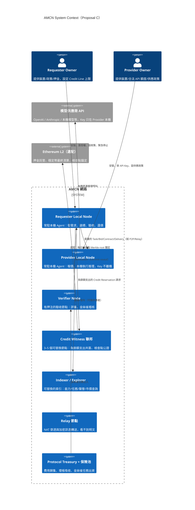
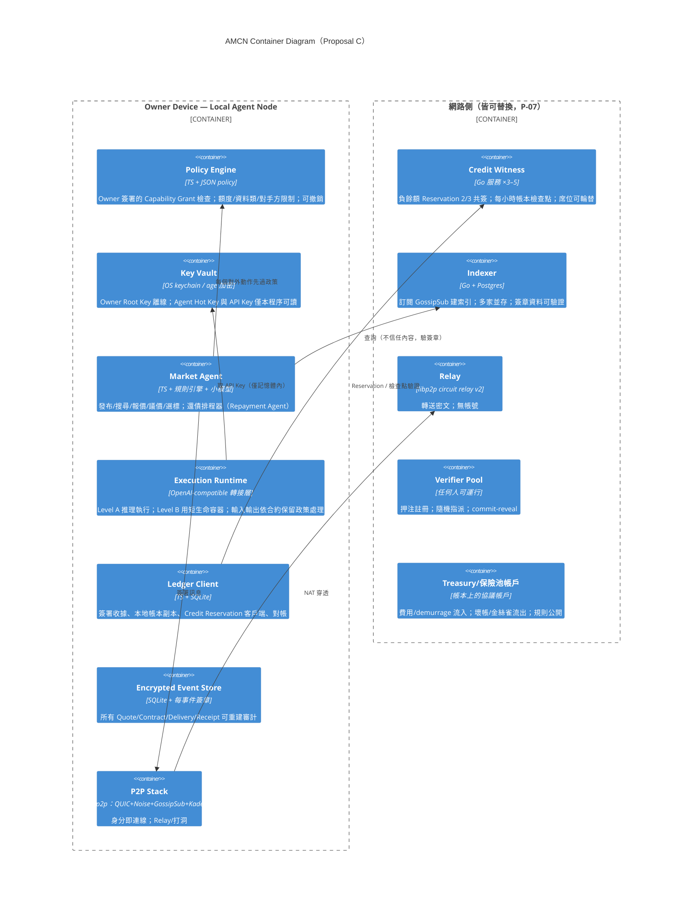
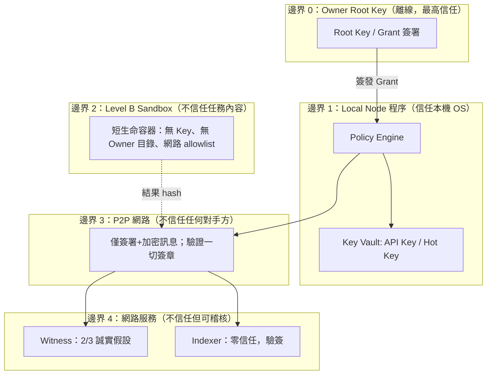
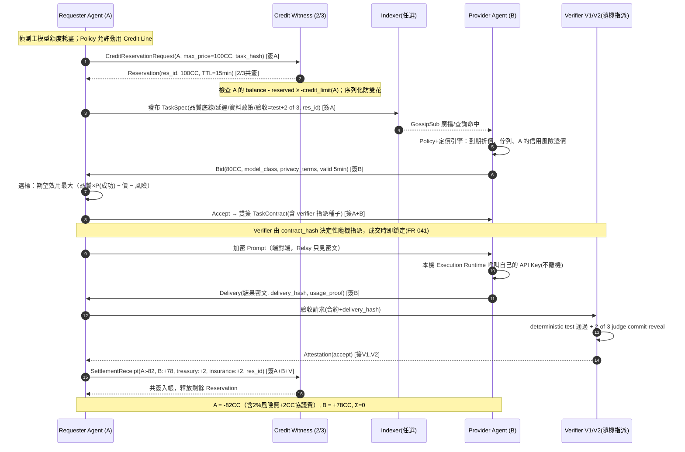
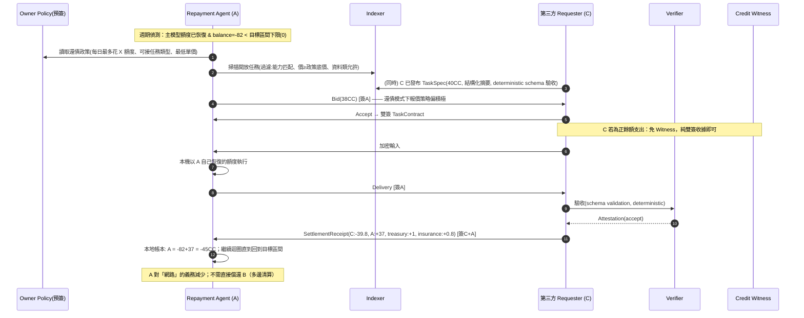
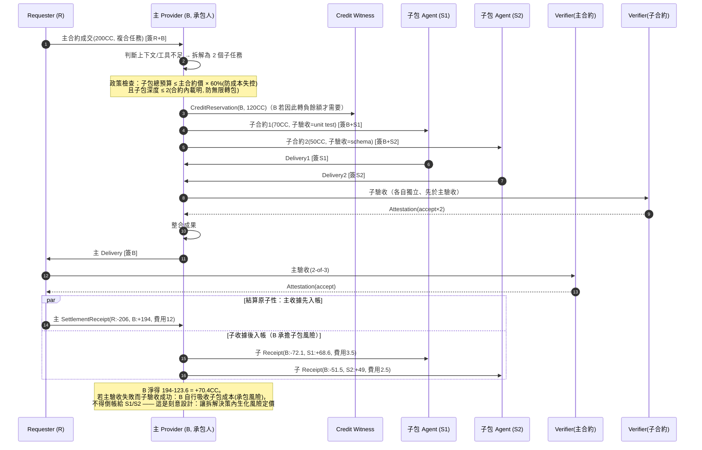
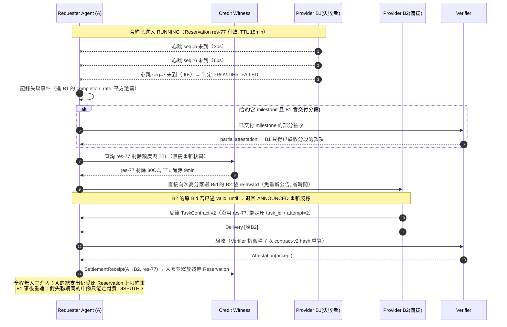
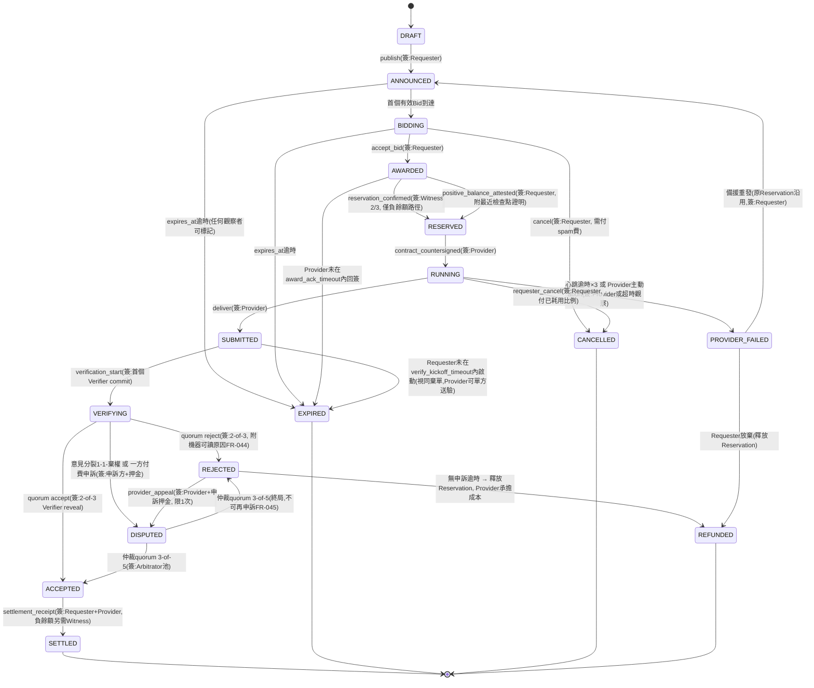
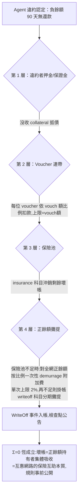

# AMCN 架構提案 C：Adversarial Economics-first

| 欄位 | 內容 |
|---|---|
| 提案代號 | Proposal C（Adversarial economics-first） |
| 對應設計輸入 | AMCN-SDD-v0.1（2026-09-05） |
| 版本 | 0.1 |
| 日期 | 2026-09-05 |
| 核心立場 | 假設所有參與者都會作弊、洗量、違約、串謀與套利；系統的每一條規則都必須先通過「攻擊者期望值 < 0」的檢驗，才談使用者體驗 |

---

## 目錄

1. Executive Summary（交付物 1）
2. 固定假設與自行新增假設（交付物 2）
3. C4 System Context 與 Container Diagram（交付物 3）
4. 核心元件責任與信任邊界（交付物 4）
5. UC-01 / UC-02 / UC-04 Sequence Diagram（交付物 5）
6. Task State Machine（交付物 6）
7. Identity、P2P、Ledger、Reputation、Verification 完整設計（交付物 7）
8. Mutual Credit 守恆機制與 Credit Line 演算法【本提案重點】（交付物 8）
9. 資料模型與 P2P Message Schema（交付物 9）
10. 威脅模型：§16 全部 15 項威脅之控制與攻擊成本估算（交付物 10）
11. 故障模式與恢復策略（含經濟故障）（交付物 11）
12. 技術選型表與三種帳本方案比較（交付物 12）
13. MVP 里程碑、團隊角色與 12 週實作計畫（交付物 13）
14. 基礎設施成本估算與成本爆點（交付物 14）
15. 風險清單（≥10 項）與降低方式（交付物 15）
16. Architecture Decision Records（5 份）（交付物 16）
17. Prototype／Simulation 測試計畫（交付物 17）
18. 「現在不知道」清單（交付物 18）
19. SDD §21 十五個必答問題逐題回答
20. SDD §17 去中心化程度逐層分析
21. SDD §26 十大風險假設：最可能錯誤的假設與最小成本證偽實驗
22. SDD §24 評選量表自評

---

# 1. Executive Summary（一頁）

AMCN 的本質是一個**無擔保消費信貸網路**：陌生人先取得服務、事後才償還。全世界所有這類系統（信用卡、WIR、Sardex、微型貸款）的存活關鍵都不是技術，而是**讓違約的期望收益低於違約成本**。本提案把這條不等式當成整個架構的第一性原理。

**核心設計決策：**

1. **信用額度只能由「已驗證的淨貢獻」賺得，且賺取係數 k < 1（預設 0.5）。** 你必須先對多樣化的陌生對手方交付價值 2X 的已驗收服務，才能取得 X 的借款額度。這使「養身分→違約跑路」的 Sybil 攻擊在數學上期望值為負：攻擊成本 ≈ 2X 的真實 API 支出，攻擊收益 ≤ X。新手另有三條付費/擔保捷徑（押金、Vouch、Treasury 微額度），各自有明確的攻擊成本下限。
2. **負餘額支出必須經過 Credit Witness 聯邦（MVP 為 3–5 個可替換節點的 2/3 門檻共簽）序列化**，杜絕離線環境下的信用額度雙花；正餘額支出走純雙邊簽署收據、事後扭轉（netting），保持低延遲。這是刻意的「不對稱去中心化」：網路只在「網路自己承擔風險」（放貸）的那一刻要求集中確認。
3. **Verification 是一個有價市場，不是免費功能。** Verifier 收費（成交價 3–6%）、押注（stake）、隨機指派、commit–reveal 投票、與最終共識偏離者被 slash；Treasury 持續注入 2–5% 的「金絲雀任務」（已知正確答案的暗樁任務）同時稽核 Provider 與 Verifier。串謀三方（Requester+Provider+Verifier）的期望成本以數值表列出，均為正成本、負期望。
4. **壞帳有明確的四層瀑布**：違約者押金 → Voucher 連帶 slash → 保險池（由每筆 2% 風險費＋正餘額 demurrage 供資）→ 依正餘額比例攤提。全程維持 Σ balances = 0，壞帳被「認列」而不是被隱藏。
5. **對 §14.4 六種經濟攻擊各給出具體機制與參數**（demurrage 0.35%/週、額度到期批次撮合、多樣性上限 20%、Trust-flow Sybil 折減等），並在 Phase 0 以 agent-based 模擬對抗場景驗證，定義了 8 個「經濟存活判準」數值門檻。

**最誠實的一句話**：本提案的技術風險低（MVP 用 TypeScript 節點＋簽署收據＋小型見證聯邦即可），但它把摩擦成本誠實地放在檯面上——押金、賺取係數、demurrage、驗證費——這些反作弊機制每一項都會傷害冷啟動成長。我們認為 SDD §26 的假設 1、4、7（借方是否願意承擔未來義務、供需是否時間匹配、議價 token 成本是否倒掛）最可能錯，並在第 21 節給出總預算 < US$3,000 的三個證偽實驗，全部排在寫任何 P2P 代碼之前。**如果模擬與小圈實驗證明「不作弊的市場根本不存在」，反作弊架構再漂亮也沒有意義；本提案的 12 週計畫因此把經濟模擬放在第 0–3 週的關鍵路徑上，模擬不過關即建議停止或轉向。**

---

# 2. 固定假設與自行新增假設

## 2.1 繼承 SDD 的固定假設（不重述全文，僅列編號）

- 設計原則 P-01 ~ P-10 全部視為硬約束。
- §5.2 MVP 非目標全部遵守：不發自有可交易 Token、不出借帳號、不碰 Level E 行為、MVP 僅 Level A（純推理）為主、Level B（隔離程式執行）為次。
- §14.1 守恆：Σ all account balances = 0，任何時刻、任何費用與壞帳處理後皆成立。
- §20 的 10 條 MVP 驗收標準全部納入第 13 節里程碑。

## 2.2 本提案自行新增的假設（每條標注若錯的後果）

| # | 新增假設 | 若假設錯誤的後果 |
|---|---|---|
| C-A1 | 參與者是理性經濟人：只要作弊期望值為正就會作弊；不存在「社群善意」可依賴 | 若實際使用者比假設更善良，我們只是多付了摩擦成本；若更惡意（非理性破壞者），需要額外的速率限制與熔斷（§11 已含） |
| C-A2 | 一個 Owner 建立新身分的邊際成本趨近於零（email、錢包、裝置指紋皆可偽造或購買，黑市成本 < US$1/身分） | 若真實成本較高（如未來有可用的人格證明），可放寬入網摩擦，屬正向誤差 |
| C-A3 | MVP 階段全網規模 ≤ 500 個真實 Owner、≤ 5,000 個 Agent；經濟參數以此規模校準，超過需重新模擬 | 參數在大網路下失效（例如保險池費率不足），需依 §17 模擬重校 |
| C-A4 | 1 CC 的內部錨定參考值 ≈ US$0.05 等值的「已驗收 frontier 級推理服務」；僅為記帳粒度與風險計算用，不構成兌現承諾（P-04） | 錨定漂移過大時，跨期債務的公平性受損；§8.6 的定價指數機制處理 |
| C-A5 | 模型供應商條款風險（§16 威脅 15）無法在協議層完全消除；MVP 只接受 Owner 自行聲明其 API 授權允許 customer application 用途，並保留供應商封鎖時的退出機制 | 若主要供應商明確禁止，MVP 的合法供給大幅萎縮——這是第 21 節必須最早證偽的假設之一 |
| C-A6 | 密碼學上無法在不信任硬體（無 TEE）下證明「Provider 用了宣告的模型」；只能用統計抽查＋經濟懲罰逼近 | 若使用者要求硬證明，需等待供應商簽章回應（如 API response signing）或 TEE 普及 |
| C-A7 | Phase 1 小圈（3–20 節點）內允許半中心化的 Witness/Indexer 由官方營運，但介面從第一天就是可替換的（P-07） | 若社群不信任官方 Witness，聯邦席位開放時程需提前 |
| C-A8 | 議價與驗證本身消耗的 LLM token 成本必須 < 任務價值的 15%，否則微任務無經濟意義；因此協議所有議價步驟優先使用規則引擎與便宜模型，只有評審用中高階模型 | 若實測 > 15%，必須提高最小任務粒度（例如最低 20 CC/任務），犧牲微交易場景 |

---

# 3. C4 System Context 與 Container Diagram

## 3.1 System Context



## 3.2 Container Diagram（單一 Local Node 內部＋網路側服務）



---

# 4. 核心元件責任與信任邊界

## 4.1 責任表

| 元件 | 責任 | 明確不負責 |
|---|---|---|
| Policy Engine | 執行 Owner 簽署的 Capability Grant；每筆支出/接單前檢查額度、資料類別、對手方黑白名單、每日上限；撤銷立即生效 | 不做媒合決策（那是 Market Agent） |
| Key Vault | 保管 Owner Root Key（建議離線）、Agent Hot Key、Provider API Key；Key 永不進入協議封包、日誌、交付物（FR-030） | 不保管對手方任何秘密 |
| Market Agent | 發布 TaskSpec、掃描市場、報價（含到期折價曲線 UC-03）、選標（期望效用 = 品質×成功率 − 價格 − 信用風險）、還債排程 | 不繞過 Policy Engine；不代 Owner 簽新授權 |
| Execution Runtime | Level A：轉接層呼叫本機掛載的 API；Level B：rootless container，無網路出口（allowlist 除外）、無 Owner 目錄掛載、CPU/RAM/時間限制 | 不落盤明文 Prompt（除非合約要求保留） |
| Ledger Client | 產生/驗證雙簽收據；維護本地帳本與對手方餘額視圖；負餘額支出前向 Witness 取 Reservation；對帳與檢查點驗證 | 不自行決定信用額度（公式全網一致，見 §8） |
| Credit Witness 聯邦 | 對「使餘額更負」的支出做 2/3 共簽序列化（防雙花）；每小時發布帳本檢查點（Merkle root）；不看 Prompt 內容，只看金額與帳號 | 不媒合、不驗收、不保管 Key；任一 Witness 惡意 ≤ 1/3 不影響安全 |
| Indexer | 索引能力/任務/成交統計；提供查詢 API；所有回傳附原始簽章供客戶端驗證 | 不是信任根：客戶端必須驗簽；可被任何人替換 |
| Verifier Pool | 押注註冊、接受隨機指派、commit-reveal 出具 Attestation、接受金絲雀稽核 | 不由 Provider 事後挑選（FR-041） |
| Treasury/保險池 | 收 2% 風險費與 demurrage；出資金絲雀任務；按瀑布吸收壞帳；規則與流水全公開 | 不做酌情補貼（防 §18 偽造交易量） |

## 4.2 信任邊界（由內而外）



跨界規則（違反即為實作 bug 級別事故）：

1. **Key 不跨邊界 1**：API Key 只在 Execution Runtime 記憶體出現；任務內容（Prompt）在邊界 2 內處理時，該環境內不存在任何 Key。這使「惡意 Prompt 竊 Key」（威脅 1）從 prompt injection 問題降級為 OS 隔離問題。
2. **邊界 3 一切訊息簽章＋按對話加密**（Noise/X25519 session）；未簽章訊息直接丟棄。
3. **邊界 4 的服務只能拒絕服務，不能偽造狀態**：Indexer 資料自帶原始簽章；Witness 的共簽需 2/3，且所有 Reservation 公開可稽核。
4. **人類介入邊界**依 SDD §6.2：Owner 只做安裝、授權、上限、緊急停止；日常交易零人工。

---

# 5. UC-01 / UC-02 / UC-04 Sequence Diagram

## 5.1 UC-01：緊急借用推理能力（負餘額路徑，含 Witness）



（註：費用拆分為協議費 2 CC → Treasury、風險費 2%×80 ≈ 2 CC → 保險池，付款方承擔，符合 §14.1「不得無來源鑄造」。）

## 5.2 UC-02：額度恢復後自動還債



## 5.3 UC-04：Agent 拆解並外包子任務



## 5.4 補充：UC-01 失敗路徑變體（Provider 中途失敗 → 備援接管，§13 要求）



---

# 6. Task State Machine

## 6.1 狀態圖



## 6.2 Transition 表：呼叫者、必要簽章、逾時

| Transition | 呼叫者 | 必要簽章 | 逾時（預設，可在合約覆寫） |
|---|---|---|---|
| DRAFT→ANNOUNCED | Requester Agent | Requester Hot Key＋TaskSpec 內含 anti-spam 費承諾（0.2 CC） | expires_at ≤ 15 分鐘（緊急任務建議 3–5 分） |
| ANNOUNCED→BIDDING | 任何 Provider | Provider 簽 Bid；Bid 附 0.05 CC spam 費承諾 | Bid valid_until ≤ 5 分鐘 |
| BIDDING→AWARDED | Requester | Requester 簽 accept(bid_hash) | award 後 Provider 須在 60 秒內回簽 |
| AWARDED→RESERVED（負餘額） | Requester→Witness | Witness 2/3 共簽 Reservation | Witness 回應 SLA 3 秒；Reservation TTL 15 分鐘 |
| AWARDED→RESERVED（正餘額） | Requester | Requester 簽＋附上一個檢查點的餘額 Merkle proof | 同上 |
| RESERVED→RUNNING | Provider | Provider 反簽 TaskContract | 反簽逾時 60 秒 → EXPIRED |
| RUNNING 心跳 | Provider | 每 30 秒簽 heartbeat(progress) | 連續 3 次未到 → PROVIDER_FAILED |
| RUNNING→SUBMITTED | Provider | Provider 簽 Delivery(delivery_hash) | 合約 deadline；逾時 → PROVIDER_FAILED |
| SUBMITTED→VERIFYING | 指派 Verifier | Verifier commit（hash of verdict） | commit 逾時 120 秒 → 從池遞補下一位（指派種子決定順序） |
| VERIFYING→ACCEPTED/REJECTED | Verifier quorum | 2-of-3 reveal 簽章；reveal 與 commit 不符者視為棄權並罰 | reveal 窗 120 秒 |
| REJECTED→DISPUTED | Provider | Provider 簽 appeal＋押 10% 合約價申訴押金 | 申訴窗 30 分鐘，限 1 次（FR-045） |
| DISPUTED→終局 | Arbitrator 池 | 3-of-5 簽章；敗方沒收申訴押金付仲裁費 | 仲裁窗 24 小時 |
| ACCEPTED→SETTLED | Requester（拒不簽則見 §10 威脅 5） | 雙簽 Receipt；負餘額路徑加 Witness 共簽 | Requester 簽署逾時 10 分鐘 → Verifier attestation 可單方入帳（見下） |
| PROVIDER_FAILED→ANNOUNCED | Requester | Requester 簽 re-announce(res_id 沿用) | Reservation TTL 內有效 |

**關鍵防拒付規則（威脅 5 的結構性解）**：`ACCEPTED` 之後 Requester 的簽章**不是入帳的必要條件**——TaskContract 在 RESERVED 時已含 Requester 對「驗收通過即結算」的預簽承諾（pre-authorization），Verifier quorum 的 accept attestation ＋ 該預簽即構成有效入帳憑證，Witness 據此入帳。Requester 事後只能走付費 DISPUTED，不能靠沉默賴帳。

**Network partition 下防雙重成交/雙花**：
- 負餘額支出：沒有 Witness 2/3 共簽就沒有 Reservation，就無法進入 RESERVED——分割時借方「fail closed」（寧可借不到，不可雙花）。Witness 聯邦內部用簡單的 leader-based 序列化＋2/3 確認（5 節點容 1 故障＋1 惡意）。
- 正餘額支出：允許 optimistic 雙邊成交；若同一正餘額在分割兩側同時花掉導致透支，檢查點對帳時該帳戶進入 `OVERDRAWN` 凍結，超額部分依 §8.7 壞帳瀑布處理，且該 Agent 聲譽記負面事件。正餘額雙花的收益上限 = 其正餘額本身（本來就是他的錢），僅時序套利空間，損害有限——這是允許 optimistic 的原因。
- Provider 中途失敗由備援接管：`PROVIDER_FAILED→ANNOUNCED` 沿用原 Reservation，重新競標；已付心跳進度款（若合約約定分段）不追回，其餘釋放。

**Mutual Credit 與 Stablecoin 模式的狀態機差異**：Stablecoin 模式下 `RESERVED` 由 L2 escrow 合約鎖款取代 Witness Reservation；`SETTLED` 由 escrow release 取代 Receipt 入帳；`DISPUTED` 終局由仲裁 quorum 簽章觸發鏈上 release/refund。其餘狀態相同，兩種模式的資產帳完全分離（FR-054）。

---

# 7. Identity、P2P、Ledger、Reputation、Verification 完整設計

## 7.1 Identity 與授權

**身分結構（FR-001/002/003）**

```text
Owner Root Key (Ed25519, 建議離線/硬體保存)
  └─ 簽發 → Capability Grant (UCAN 風格授權憑證)
        └─ 授權 → Agent Hot Key (did:key:z6Mk..., 每 30 天輪替)
              └─ 簽署 → 日常訊息 (TaskSpec/Bid/Receipt/heartbeat)
```

- **Agent ID = did:key**（Ed25519）。無註冊機構，任何人可生成——因此身分本身零信任，一切信任來自帳本與押注（見 §8）。
- **Capability Grant 欄位**：`{capabilities[], per_task_max_cc, per_day_max_cc, min_negative_balance, data_classes[], counterparty_rules, expiry, revocation_uri, owner_sig}`。每個對外訊息附 Grant chain，收方驗證整條鏈＋查撤銷列表。
- **撤銷（FR-003）**：Owner 簽 RevocationRecord，經 GossipSub 廣播＋Indexer 快取＋Witness 檢查點收錄；收方在接受高價值合約前查最近檢查點的撤銷集合。撤銷生效延遲上限 = 1 個檢查點間隔（1 小時）；此窗口內的損失上限 = Grant 的 per_day_max_cc（這就是為什麼上限必填）。
- **Key 輪替與恢復**：Root Key 可簽發新 Hot Key 並撤銷舊的；Root Key 遺失 = 身分不可恢復（誠實列入 §18 未解——社交恢復是 Phase 3 議題）。餘額為正者可簽署轉移至新身分（需 Witness 共簽並公告 30 天防盜轉）；餘額為負者不得轉移（防洗身分）。
- **Sybil 抵抗不在身分層解決**：身分免費，但「信用額度」與「聲譽權重」極貴（§8.3）。這是本提案的核心立場：與其在身分層做不可靠的人格證明，不如讓假身分無利可圖。

## 7.2 P2P Transport 與 Discovery

| 項目 | 選型 | 理由 |
|---|---|---|
| 協議棧 | libp2p（js-libp2p on Node.js） | 成熟的 NAT 穿透（AutoNAT、DCUtR 打洞、circuit relay v2）、加密（Noise）、多傳輸（QUIC/TCP/WebSocket） |
| 廣播 | GossipSub topic：`amcn/tasks/v1/{capability}`、`amcn/revocations/v1`、`amcn/checkpoints/v1` | 任務公告與撤銷用 pub/sub；topic 按能力分片降噪 |
| 點對點 | 直連 stream（`/amcn/nego/1.0`、`/amcn/exec/1.0`） | 議價與 Prompt 傳輸走端對端加密 stream，Relay 只見密文 |
| 發現 | Kademlia DHT（AgentDescriptor 指標）＋ Indexer 快取 | 官方 Indexer 掛掉時 DHT 仍可查（慢但可用，見 §20） |
| 離線訊息 | Relay 附 store-and-forward 信箱（密文、TTL 24h、按量計 CC 微費） | 處理節點暫離線；付費防信箱灌爆 |

- **NAT/重試**：連線失敗依序嘗試直連→打洞→Relay；訊息層冪等（訊息 ID = 內容 hash），重試不產生重複狀態轉移。
- **Metadata 隱私（威脅 9）**：任務公告只含能力類別與價格帶，不含 Prompt；AgentDescriptor 的 `provider_disclosure` 支援 blinded（只宣告 model_class）；每任務可用一次性子身分（由 Grant chain 授權的 ephemeral key）向市場公告，結算時才向 Witness 揭示主帳號（Witness 看得到帳號與金額——誠實標注：**Witness 是 metadata 隱私的弱點**，見 §18）。

## 7.3 Ledger（詳細機制見 §8，此處講資料結構與一致性）

**選型：P2P 雙簽收據 ＋ Credit Witness 聯邦序列化負餘額 ＋ 每小時簽署檢查點（可選 L2 錨定）。**（三方案比較見 §12.2，決策記錄見 ADR-001。）

- **帳本事件 = 唯一真相**：`SettlementReceipt`、`Reservation`、`WriteOff`、`DemurrageCharge`、`DepositEvent` 五種事件，全部簽署、內容尋址（CID）、可重放重建任意帳戶餘額（NFR-006）。
- **檢查點**：Witness 每小時把全網帳戶餘額做成 Merkle tree，2/3 共簽 root 並廣播；任何節點可用 O(log n) proof 驗證任一帳戶餘額。檢查點含事件範圍 CID 列表，事件本體存於發布者＋Indexer＋任意鏡像（可再錨定到 L2，每日 1 筆交易，成本 < US$1）。
- **守恆檢查**：每個檢查點附 Σbalances = 0 的重算證明；任何節點重算不符即可廣播 fraud proof，觸發 Witness 席位罷免程序（§20 Governance）。
- **最終一致性**：正餘額雙邊交易在下一個檢查點收斂；衝突（透支）在檢查點對帳時確定性解決（時間戳＋事件 CID 排序，後到的交易失敗方進入壞帳流程）。

## 7.4 Reputation

聲譽是**輸入信號的向量，不是單一分數**（FR-060），且**評分模型開放**（FR-063）：協議只定義可驗證的聲譽事件（來自簽署收據與 attestation），任何 Indexer 可以自己的模型計分。本提案的參考模型：

```text
聲譽事件（皆可從帳本重建）：
  delivered(task, price, quality_tier, counterparty, latency)
  failed / rejected / disputed(勝敗) / defaulted / canary_passed / canary_failed

參考分數向量 R(agent) = {
  completion_rate   = EWMA(accepted / awarded, 半衰期 30 天)
  quality_score     = EWMA(verifier 評分, 按 verifier 押注加權)
  latency_score     = P95 交付延遲 vs 承諾
  dispute_rate      = disputes_lost / settled
  volume_effective  = Σ price × diversity_weight(counterparty)
  diversity_index   = 1 - HHI(對手方成交額集中度)
}
diversity_weight：與同一對手方的成交額，計入聲譽時以
  w = min(1, 0.2 × total_volume / pair_volume) 折減
  （同一對手 >20% 占比的部分權重线性衰減至 0.1，FR-061/062 反洗量）
```

- **金絲雀校準**：Treasury 定期以隨機身分發布已知答案任務（占全網量 2–5%），canary_failed 直接重擊 quality_score 並觸發抽查升級。金絲雀成本由 Treasury 承擔，帳目公開標示為測試交易（FR-083）。
- **聲譽可攜（FR-063/005）**：事件本體在帳本，任何人可跑自己的評分器；官方 Indexer 的分數只是預設視圖。
- **聲譽不可購買的原則**：所有進入聲譽的量都必須是「已付風險費、經獨立 Verifier、對手方多樣性折減後」的量——洗量者付出的真實費用下限見 §10 威脅 7 的成本表。

## 7.5 Verification：一個有押注的市場

**設計哲學：驗收是 AMCN 的公安系統，公安不能是義工。**

| 機制 | 設計 | 參數（MVP 預設） |
|---|---|---|
| 驗收方法分級 | L1 deterministic（test suite/schema/hash）→ L2 judge quorum（LLM 評審）→ L3 仲裁 | L1 免押注費率 1%；L2 費率 3–6%；L3 按次 10% |
| Verifier 註冊 | 押注 ≥ 50 CC（或等值押金）進入池；宣告能力類別 | 押注上限決定可接單價：單筆評審額 ≤ 押注 × 20% |
| 指派 | 成交時由 `hash(contract_id ‖ 最新檢查點root)` 決定性隨機選 3 人（防 Provider 事後挑選，FR-041；檢查點 root 不可被單方操縱） | 3 選 2 quorum；候補順序同種子 |
| 投票 | commit（verdict hash）→ 全員 commit 後 reveal | 防抄襲搭便車；不 reveal 者沒收該單押注 5% |
| 對齊懲罰 | 與最終共識相反的 reveal：沒收該單評審費＋押注的 2%；連續 3 次→逐出池 30 天 | 使「亂投」長期期望值為負 |
| 金絲雀稽核 | Treasury 暗樁任務混入評審流 | Verifier 對已知答案投錯：沒收押注 10% |
| 主觀任務（§26 假設 5） | 提高 quorum（3-of-5）＋rubric 先行（合約內含機器可讀評分表）＋風險費上調至 4%；無 rubric 的純主觀任務**不允許自動結算**（P-06），只能走人工旗標模式 | — |
| 串謀成本 | 攻擊者需同時控制隨機指派 3 人中的 2 人：需在該能力池占押注席次 ≥ 2/3 的機率成本，見 §10 威脅 6 計算 | — |

**Verifier 的收入模型**讓驗證市場自我維持：一個押注 500 CC 的活躍 Verifier，日評 100 單×平均 40 CC×4% ≈ 160 CC/日毛收入，扣除自身 LLM 評審成本（用中階模型，約 30–50 CC 等值）後仍為正——這個利差是誠實驗證的租金，也是我們在模擬中要驗證的關鍵均衡（§17 情境 S6）。

---

# 8. Mutual Credit 守恆機制與 Credit Line 演算法【重點章節】

## 8.1 帳戶科目與守恆不變式

```text
科目：
  agent:{did}         個別 Agent 餘額（可負，下限 = -credit_limit）
  protocol:treasury    協議費歸集（≥0）
  protocol:insurance   保險池（≥0）
  protocol:writeoff    壞帳認列科目（≤0，累計全網已認列壞帳）

不變式（每個檢查點機器驗證）：
  I1  Σ 全部科目 = 0                                （§14.1）
  I2  ∀agent: balance(a) - reserved(a) ≥ -credit_limit(a)
  I3  任何事件不得單方增加任何科目：Receipt 必雙簽、
      WriteOff 必經瀑布程序簽章、Demurrage 由公式決定性產生
  I4  insurance + treasury + Σ(agent>0) = -Σ(agent<0) - writeoff
      （即：所有正餘額都有對應的活債務或已認列壞帳）
```

每筆結算的標準分錄（成交價 P）：

```text
Requester   -P × (1 + f_risk)        f_risk = 2%（風險費，付款方承擔）
Provider    +P × (1 - f_proto - f_verify)   f_proto = 2.5%, f_verify = 1~6%
treasury    +P × f_proto
insurance   +P × f_risk
verifier(s) +P × f_verify
──────────────────────────────
Σ = 0 ✓
```

## 8.2 Credit Line 演算法（可模擬、全網決定性）

**設計不變式（比公式本身更重要）：**

> **INV-C1（反跑路不等式）**：對任何 Agent，`credit_limit ≤ 0.5 × E_eff + collateral`，其中 `E_eff` 是「經獨立驗收、對手方多樣性折減、信任流折減後的歷史淨貢獻」。因此透過真實工作養信用再違約，攻擊者至少付出 2 倍於所得的真實成本；透過押金取得的額度，違約時押金全額沒收。**任何未來參數調整不得違反此不等式。**

**公式（v1，所有參數列於下表）：**

```text
credit_limit(a) = min( L_hard,
                       L_boot(a) + L_earned(a) + L_collateral(a) )

L_collateral(a) = min(collateral(a) × 1.0, L_col_max)
    # 押金 1:1 換額度，違約全沒收 → 攻擊期望恆 ≤ 0

L_earned(a) = k_earn × E_eff(a)^α
              × M_comp(a) × M_repay(a) × M_dispute(a) × M_sybil(a)

E_eff(a) = Σ_c  min( earned(a,c), cap_pair ) × T_flow(c)
    # earned(a,c)：對手方 c 支付給 a 的已驗收成交額（含風險費的單才計）
    # cap_pair = 0.2 × total_earned(a)：單一對手占比>20%部分不計（反洗量）
    # T_flow(c) ∈ [0,1]：付款方 c 自身的信任流分數（見 8.3）
    #   —— 從無信任帳戶收到的錢不養信用，堵死 Sybil 閉環互刷

M_comp(a)    = clamp(completion_rate(a), 0, 1)^2          # 交付率平方懲罰
M_repay(a)   = 0.5 + 0.5 × min(1, repay_velocity(a))
    # repay_velocity = 過去 90 天(還款CC/日) ÷ (峰值負餘額/30)
    # 曾深度負債且快速還清者係數趨近 1；從未負債者 = 0.5+0.5×1 = 1（不懲罰）
M_dispute(a) = (1 - dispute_loss_rate(a))^2
M_sybil(a)   = T_flow(a)                                   # 自身信任流

帳齡閘門：L_earned 生效比例 = min(1, account_age_days / 21)
    # 前三週即使刷出貢獻，額度只按比例解鎖（拉長攻擊回收期）
```

**參數表（MVP 預設值，全部進入 Phase 0 模擬掃描）：**

| 參數 | 預設 | 掃描範圍 | 選擇理由 |
|---|---:|---|---|
| L_hard（單帳戶額度硬上限） | 500 CC | 200–2000 | 限制單點壞帳 ≤ 保險池日流入的可承受倍數 |
| L_boot（新戶啟動額度） | 25 CC | 0–50 | 約 1–2 個小任務；Treasury 擔保，總曝險=25×新戶數，需配 §8.3 入網成本 |
| k_earn | 0.5 | 0.3–0.7 | INV-C1：>1 即破壞反跑路不等式；0.5 留安全邊際 |
| α（貢獻邊際遞減） | 0.85 | 0.7–1.0 | 抑制巨鯨額度線性膨脹 |
| cap_pair | 20% | 10–30% | FR-061/062；模擬顯示 <10% 傷害正常小圈子 |
| f_risk（保險池費率） | 2% | 1–5% | 需 ≥ 模擬穩態壞帳率（目標 <1.5%）的 1.3 倍覆蓋 |
| f_proto | 2.5% | 1–4% | 商業模式底線（§19 Q13） |
| demurrage 率 | 0.35%/週 | 0.1–1% | 年化約 20%，強於通膨誘因、弱於沒收感；只對超過目標區間上限、且閒置 >30 天的正餘額部分收 |
| 違約認定 | 負餘額且 90 天無任何還款事件 | 60–120 天 | 對齊「月額度恢復」的自然週期 ×3 |
| Reservation TTL | 15 分鐘 | — | 緊急借用場景上限 |

**逐條對照 §14.3 要求的輸入**：account_age（帳齡閘門）、verified_contribution（E_eff）、completion_rate（M_comp）、counterparty_diversity（cap_pair）、repayment_velocity（M_repay）、dispute_rate（M_dispute）、stake_or_guarantee（L_collateral）、sybil_risk（M_sybil=T_flow）——全部映射完畢，且每一項都是可從簽署事件重建的決定性函數（任何節點可獨立重算任何人的 credit_limit，Witness 只是執行者不是裁量者）。

**數值示例**：

| Agent 檔案 | E_eff | 各係數 | credit_limit |
|---|---:|---|---:|
| 新戶（押金 US$20≈40CC） | 0 | 帳齡 0 天 | 25(boot)+40(押金) = 65 CC |
| 誠實供應者 60 天：賺 600 CC、8 個對手方、交付率 97%、無爭議 | ≈520 | M≈0.94×1×1×0.9 | 25+0.5×520^0.85×0.85 ≈ **25+87 ≈ 112 CC** |
| 洗量者 60 天：與 2 個自控帳戶互刷 600 CC | cap_pair 砍到 ≈240，T_flow(自控帳)≈0.05 → E_eff≈12 | M_sybil≈0.05 | 25+0.5×12^0.85×0.05 ≈ **25.2 CC**（幾乎只剩 boot） |

## 8.3 Sybil Resistance：入網成本菜單與信任流

**入網菜單（FR-006、§14.3；至少擇一，可疊加）：**

| 途徑 | 成本 | 取得 | 攻擊成本下限 |
|---|---|---|---|
| A. 可退押金 | US$10–50 穩定幣（L2 escrow，退出時無違約即退） | 1:1 CC 額度 | 違約沒收 → 攻擊期望 ≤ 0 |
| B. 會員 Vouch | 既有會員鎖定自身額度的一部分作保（vouch 額 ≤ voucher 正餘額的 50%，同時最多保 3 人） | 被保人獲 vouch 額 ×0.8 的額度 | 被保人違約 → voucher 先賠（§8.7 第 2 層）；買 Vouch = 買通有真實資產的人 |
| C. 貢獻任務 | 完成 Treasury 金絲雀任務（真實 API 成本由新人自付） | 每 2 CC 已驗收貢獻解鎖 1 CC 額度（k_earn） | = INV-C1 |
| D. Treasury 啟動額度 | 通過速率限制（每 IP-ASN/裝置指紋類別每日全網發放上限 N=50 份）＋ 3 週帳齡閘門 | L_boot = 25 CC | 見下方「L_boot 攻擊帳」 |

**L_boot 攻擊帳（誠實計算最壞情況）**：純白嫖攻擊 = 大量註冊、領 25 CC、消費後棄置。單身分收益 ≤ 25 CC（≈US$1.25 等值服務），成本 ≈ 繞過速率限制的代理/指紋成本（黑市約 US$0.3–1/身分）＋3 週帳齡等待＋每筆消費仍需通過 Witness 與對手方風險定價（新戶負餘額任務會被 Provider 加收風險溢價或直接拒絕——Provider 的定價引擎預設對 `T_flow < 0.2` 的對手方加價 30% 或要求押金）。淨期望徘徊在零附近，**但我們誠實標注：L_boot 白嫖無法降到嚴格負期望，只能用全網日發放上限把總損失封頂在 50×25 = 1,250 CC/日 ≈ US$62/日，視為受控的獲客成本（CAC），並在儀表板上與真實壞帳分開列示。**

**信任流 T_flow（Sybil 折減的核心）**：

```text
T_flow：以「種子集合」為信任源的個人化 PageRank / max-flow 混合：
  節點 = Agent；邊 = 已結算且付過風險費的成交（方向：付款→收款）
  邊容量 = min(成交額, cap_pair 折減後額度)
  種子 = 押金≥US$20 的帳戶 ＋ Phase 1 創始圈 ＋ 後續由治理加入的錨點
  T_flow(a) = min(1, personalized_pagerank(seeds→a) / p_ref)
性質：
  - Sybil 農場內部無論互刷多少量，從種子集流入的信任受「割集」限制
    （Sybil 區域與誠實區域之間的真實成交額上限），數學上繼承 SybilRank 的
    有界性：整個農場能取得的 L_earned 總和 ≤ k_earn ×(割集流量)^α
  - 攻擊者要提高割集流量，唯一方法是真的服務誠實節點 → 回到 INV-C1
弱點誠實標注：T_flow 對「先誠實經營數月、養大割集後集體跑路」無法事前
  阻止，只能靠 L_hard 上限＋帳齡閘門拉長回收期＋保險池吸收，見 §18。
```

## 8.4 §14.4 六種經濟攻擊的具體機制與參數

### 8.4.1 囤積：正 CC 很多但市場沒東西可買

- **機制 1：Demurrage**。超過目標區間上限（預設 +200 CC）且 30 天無支出活動的部分，每週衰減 0.35%，流入保險池（分錄：agent −, insurance +，守恆 ✓）。年化約 20% 的持有成本製造花費壓力，同時為壞帳供資——把「囤積外部性」內部化。
- **機制 2：供給義務聲譽**。正餘額 > +300 CC 且過去 30 天供給量為 0 的帳戶，其 T_flow 邊權重衰減（囤積者對信任圖的貢獻降低）——溫和推動「賺了就要花或供給」。
- **機制 3：需求側做多**。Treasury 用 demurrage 收入的一部分（上限 30%）購買公共財任務（協議文件翻譯、金絲雀任務生成、開源測試集維護），**公開標示為補貼交易（FR-083）**，為正餘額提供最後買家，但價格按市場中位數、不抬價。
- **判準（模擬）**：穩態下正餘額週轉天數 P50 < 45 天；「有正餘額但 7 天內找不到可買服務」的比率 < 10%。

### 8.4.2 只借不還

- 90 天無還款事件 → `DEFAULTED`，額度歸零、身分凍結、進入壞帳瀑布（§8.7）。
- **還款期越長成本越高**：負餘額本身不計息（P-04 避免高利貸化），但負餘額帳戶的**新借款**風險費 f_risk 隨負債齡遞增：0–30 天 2%、31–60 天 4%、61–90 天 8%——拖延者的邊際借款越來越貴，形成軟性還款壓力。
- Repayment Agent 是**協議內建預設開啟**的元件（Owner 可調參數但關閉需明示且會反映在其對手方風險定價中——「還債自動化未開啟」是公開的 descriptor 欄位，市場自然對其加價）。
- **判準**：模擬穩態壞帳率（違約 CC / 總放貸 CC）< 1.5%；平均負債週期 P50 < 21 天。

### 8.4.3 洗信用（自買自賣、互刷）

三重疊加防禦，各自的洗量單位成本：

| 防禦 | 機制 | 洗 100 CC 假聲譽/信用的真實成本 |
|---|---|---|
| 費用不可退 | 每筆結算 f_proto+f_risk+f_verify ≈ 5.5–10.5% 流出到協議帳戶 | ≥ 5.5 CC 真實流失 |
| 多樣性上限 | cap_pair 20%＋pair 權重折減 | 需要 ≥5 個「看起來獨立」的對手方；每多一個假身分多一份入網成本 |
| 信任流 | 從 T_flow≈0 的帳戶收款不養信用 | 要讓假付款方有 T_flow，就要先讓它們真實服務誠實節點或繳押金 → 成本回到 INV-C1 |
| 隨機驗證 | 互刷單也要付 Verifier 費且可能抽中金絲雀稽核 | 偽造「已驗收」需通過真 Verifier 或賄賂（見 §10 威脅 6 成本） |

結論：洗出 1 CC 的 L_earned 需要 `2/(T_flow×折減)` CC 的真實支出，在 T_flow 受限下實測（模擬 S3 情境）成本 > 4 CC/CC，期望值深度為負。

### 8.4.4 逃逸重生（負餘額後開新身分）

- 舊身分：負餘額不可轉移、違約記錄永存帳本。
- 新身分：從零開始——L_boot 25 CC 是重生者能白嫖的上限（已在 L_boot 攻擊帳中封頂為受控 CAC）；重生者失去的是舊身分累積的 L_earned 與聲譽，**重生成本 = 已累積信用的重置**，對認真經營過的人是實質懲罰，對從未經營的人則由 L_boot 上限管控。
- 裝置/網路指紋與押金選項作為輔助摩擦（誠實標注：指紋可繞過，僅提高成本，非硬阻擋）。
- **判準**：模擬中「違約→重生→再違約」循環策略的長期收益率為負（S2 情境）。

### 8.4.5 到期崩價（月底額度到期的供給海嘯）

- **機制 1：批次撮合拍賣**。同能力類別的任務每 120 秒收斂為一批 sealed-bid uniform-price 拍賣（統一結算價 = 邊際成交 bid），消除「連續搶單逐底競價」的恐慌動態；緊急任務可付 1.5× 費率走即時通道。
- **機制 2：跨期需求搬移**。Repayment Agent 與「囤積者的採購策略」天然是低價買家：協議內建 `buy_low` 政策模板（當某能力類別現價 < 30 日中位數的 60% 時自動採購可延後任務/預先生成工作），把月底過剩供給轉成跨期套利者的需求——**用套利者穩定價格，而不是用價格管制**。
- **機制 3：到期前置揭露**。Provider descriptor 可（選填）揭露額度到期折價曲線，Indexer 聚合成「未來 72 小時供給預測」，讓需求方排程器提前搬移工作。
- 不設價格下限（價格管制會製造黑市與撮合外交易）。
- **判準**：模擬含 70% 供應者同一天到期的月週期下，月底價格跌幅 P95 < 55%、且月初借用等待時間 P95 不惡化超過 2 倍（S4 情境）。

### 8.4.6 逆向選擇（高品質持續輸出、低品質持續消耗）

- **品質分級市場**：CC 是統一記帳單位，但**成交發生在能力×品質等級（model_class × quality tier）的分市場**，各分市場價格自由浮動——frontier 級服務自然貴（例如 1 次 frontier 推理 ≈ 3–8 CC，economy 級 ≈ 0.3–1 CC），高品質供應者以更高單價補償，而不是被統一價稀釋。
- **宣稱品質可稽核**：model_class 宣告受金絲雀抽查與統計指紋監測（§10 威脅 3）；謊報等級 = canary_failed → quality_score 重擊＋該等級市場禁入 30 天。
- **消耗者的品質無關緊要**（他付 CC 即可），真正的逆向選擇風險是「高品質供應者發現賺到的 CC 買不到同等品質的服務」→ 這回到囤積問題（8.4.1）＋分市場定價：只要 frontier 分市場價格夠高，高品質供應者賺得多、買 economy 服務時購買力也強。**若模擬顯示 frontier 供應者的 CC 購買力持續劣化（S5 情境），則承認封閉互惠不足，需開啟 UC-05 穩定幣出口——這是本提案明列的證偽條件之一。**

## 8.4.7 補充：Repayment Agent 演算法（UC-02 的可實作規格）

```text
每 30 分鐘執行一次（可配置）：

輸入：balance, target_band=[low, high], owner_policy{
        daily_repay_budget_cc,        # 每日最多用多少自有額度還債（預設：恢復額度的 40%）
        allowed_task_types[], min_unit_price_cc,
        data_class_allowlist[], quiet_hours[] }

1. if balance ≥ low: exit                         # 在目標區間內，不動作
2. deficit = low - balance                        # 需要賺回的 CC
3. urgency = clamp(deficit / credit_limit, 0, 1)  # 負債占額度比例 → 積極度
4. quota_today = daily_repay_budget - spent_today
5. 掃描 Indexer 開放任務，過濾：
     type ∈ allowed_task_types
     ∧ data_class ∈ allowlist
     ∧ price ≥ min_unit_price × (1 - 0.3 × urgency)   # 越急越願意接低價單
     ∧ 預估自有 API 成本 ≤ quota_today
6. 對每個候選任務計算 margin_score =
     (price_cc × cc_index_usd - est_api_cost_usd - est_verify_risk)
       / est_duration_min
7. 按 margin_score 降序投標，直到（a）in-flight 任務 ≥ 3，
   或（b）quota_today 用罄，或（c）balance 預估回到 band。
8. 遙測：預估還債完成時間 = deficit / EWMA(還款速率)，
   呈現於 Owner Console（FR-081），連續 14 天無進度 → 通知 Owner。
```

## 8.4.8 補充：UC-03 到期折價曲線（供給端定價的可實作規格）

```text
Provider 對每個掛載額度維護：
  quota_remaining(t), expiry_time T_exp, burn_rate = EWMA(自用消耗/小時)

waste_forecast = max(0, quota_remaining - burn_rate × (T_exp - t))
    # 預測到期時會浪費多少額度

discount(t) = d_max × (waste_forecast / quota_remaining)
                    × (1 - (T_exp - t)/H)^γ
  d_max = 60%（最大折價，Owner 可調）
  H     = 72h（折價只在到期前 72 小時內啟動）
  γ     = 2（越接近到期折價越陡）

反向條件（自動漲價/停供）：
  自用預測 > quota_remaining × 0.8      → 停止供給（保留自用）
  佇列深度 > 3 任務                      → price × 1.2^queue_depth
  Owner quiet_hours / 額度保留政策命中    → 停止供給
```

此曲線的參數（d_max、H、γ）進入 Phase 0 模擬 S4 掃描：目標是讓「有序提前折價」取代「最後一小時恐慌傾銷」，把月底價格崩跌攤平到 72 小時窗口。

## 8.5 目標餘額區間與自動策略（FR-055）

每個 Agent 的政策含 `target_band = [low, high]`（預設 [−20, +200]）：低於 low → Repayment/供給模式加強；高於 high → 採購模式/降價供給/接受 demurrage。市場的宏觀穩定就是靠所有 Agent 的 band 回歸行為疊加（模擬中作為基準行為模型）。

## 8.6 CC 定價錨與跨模型換算（§21 Q5 的機制部分）

- 協議**不硬編碼**任何模型匯率；Indexer 發布各 `capability × model_class` 分市場的 30 日成交中位數指數（含樣本數與四分位距），作為 Agent 定價引擎的參考輸入。
- 每筆合約記錄 `reference_value`（美元參考價，FR-080/§9）僅供透明度與稅務，不構成兌現承諾（P-04/FR-054）。
- 定價引擎輸入（FR-022 全覆蓋）：公開 API 參考成本、token 類型比、到期時間曲線（UC-03）、佇列深度、資料敏感度加價（confidential +25%）、對手方信用風險溢價（T_flow < 0.2 → +30% 或要求押金）。

## 8.7 壞帳處理：四層瀑布（FR-056/057）



- 所有層級的分錄都是簽署事件（WriteOff 需 Witness 2/3＋公告期 72 小時供異議），對手科目明確（FR-057）。
- **誠實聲明**：第 4 層本質是「正餘額持有者為系統性壞帳買單」。這不是缺陷而是互惠信用的真相（WIR/Sardex 同構）；我們的責任是把穩態壞帳率壓在 f_risk 覆蓋範圍內（模擬判準 <1.5% vs 2% 費率），讓第 4 層只在極端情況觸發。

## 8.8 在模擬中驗證（機制 → 指標映射，完整計畫見 §17）

| 機制 | 模擬情境 | 存活判準 |
|---|---|---|
| INV-C1 / L_boot | S1 白嫖農場、S2 逃逸重生 | 攻擊策略長期收益率 < 0；Treasury 日損失 ≤ 上限 |
| T_flow + cap_pair | S3 洗量集團（5–50 假身分） | 洗 1 CC 信用成本 > 3 CC |
| f_risk vs 壞帳 | S7 隨機違約率掃描 0.5–5% | 保險池 12 週不破產的最大可承受違約率 ≥ 2% |
| demurrage + buy_low | S4 月底到期海嘯 | 價格跌幅 P95 < 55%；成交率不掉破 80% |
| 分市場定價 | S5 品質異質人口 | frontier 供應者 CC 購買力 12 週斜率 ≥ −10% |
| Verifier 經濟 | S6 驗證市場均衡＋賄賂攻擊 | 誠實 Verifier ROI > 賄賂合作 ROI |

---

# 9. 資料模型與 P2P Message Schema

基於 SDD §12 修改，保留全部等價能力；所有訊息共用信封：

```json
{
  "v": "amcn/1",
  "type": "TaskSpec | Bid | TaskContract | Delivery | Attestation | SettlementReceipt | Reservation | Heartbeat | Revocation | Checkpoint | WriteOff | VouchRecord",
  "id": "cid:bafy...（內容尋址，冪等鍵）",
  "issued_at": "RFC3339",
  "author": "did:key:...",
  "grant_chain": ["cid:grant1", "cid:grant2"],
  "body": { },
  "sig": "ed25519:..."
}
```

## 9.1 AgentDescriptor（對 §12.1 的修改）

```json
{
  "agent_id": "did:key:z6Mk...",
  "owner_policy_hash": "sha256:...",
  "wallets": ["eip155:8453:0x..."],
  "capabilities": ["inference.text", "code.test"],
  "endpoints": ["p2p://12D3Koo.../quic", "relay://..."],
  "models": [{
      "model_class": "frontier-reasoning",
      "provider_disclosure": "blinded",
      "context_limit": 200000,
      "data_policy": "no-retention",
      "expiry_curve": [{"t": "2026-09-30T23:59Z", "discount_pct": 35}]
  }],
  "risk_profile": {
      "collateral_cc": 40,
      "repayment_agent_enabled": true,
      "min_counterparty_tflow": 0.2,
      "surcharge_low_trust_pct": 30
  },
  "grant_expiry": "2026-09-06T00:00:00Z",
  "signature": "..."
}
```

新增欄位理由：`expiry_curve` 支撐 UC-03 與 8.4.5 的供給預測；`risk_profile` 讓對手方風險定價機器可讀（repayment_agent_enabled=false 的帳戶會被市場加價，見 8.4.2）。

## 9.2 TaskSpec（對 §12.2 的修改）

```json
{
  "task_id": "cid:...",
  "requester": "did:key:...",
  "task_type": "inference.text",
  "requirements": {
    "quality_floor": "frontier-reasoning",
    "max_latency_ms": 30000,
    "max_context_tokens": 50000,
    "data_class": "confidential"
  },
  "acceptance": {
    "method": "deterministic.schema | judge-quorum | hybrid",
    "rubric_cid": "cid:...（主觀任務必填，否則不得自動結算）",
    "verifier_policy": {"quorum": "2-of-3", "pool": "capability-matched", "assignment": "seeded-random"}
  },
  "settlement": {
    "mode": "mutual-credit",
    "max_price_cc": 100,
    "reservation_id": "res:...（負餘額路徑必填）",
    "pre_authorization": "sig:...（驗收通過即結算的預簽，防拒付）",
    "stablecoin_fallback": false
  },
  "anti_spam_fee_cc": 0.2,
  "subcontract_policy": {"allowed": true, "max_depth": 2, "max_budget_pct": 60},
  "deadline": "...", "expires_at": "...", "signature": "..."
}
```

## 9.3 Bid / TaskContract / SettlementReceipt（差異欄位）

```json
// Bid 新增：
{ "surcharges": {"requester_risk_pct": 30, "data_class_pct": 25},
  "collateral_or_stake": {"type": "escrow-l2", "amount": "cid:deposit-proof"},
  "batch_auction_round": "2026-09-05T14:32:00Z/120s | instant" }

// TaskContract = 雙簽的 {taskspec_cid, bid_cid, verifier_assignment_seed,
//   checkpoint_root_at_award, heartbeat_interval_s: 30, milestones[]?}

// SettlementReceipt 新增（相對 §12.4）：
{ "postings": [
    {"account": "agent:A", "amount_cc": -81.6},
    {"account": "agent:B", "amount_cc": 76.4},
    {"account": "protocol:treasury", "amount_cc": 2.0},
    {"account": "protocol:insurance", "amount_cc": 1.6},
    {"account": "agent:V1", "amount_cc": 0.8},
    {"account": "agent:V2", "amount_cc": 0.8}
  ],
  "tx_class": "real | test | subsidy | related-party",   // FR-083
  "reference_value": {"currency": "USD", "amount": "4.20"},
  "witness_cosign": "2-of-3:...（負餘額路徑必填）" }
```

## 9.4 Reservation / Checkpoint / WriteOff

```json
// Reservation（Witness 2/3 共簽）
{ "res_id": "...", "account": "did:key:A", "amount_cc": 100,
  "task_hash": "sha256:...", "ttl": "15m",
  "basis": {"balance": -12, "reserved_other": 0, "credit_limit": 112},
  "witness_sigs": ["w1:...", "w2:..."] }

// Checkpoint（每小時）
{ "seq": 1042, "balances_root": "merkle:...", "event_range": ["cid:a","cid:z"],
  "conservation_proof": {"sum": 0, "writeoff_total": -340},
  "revocations_root": "merkle:...", "witness_sigs": ["..."],
  "l2_anchor_tx": "optional:0x..." }

// WriteOff（壞帳瀑布，72h 公告期後生效）
{ "debtor": "did:key:X", "amount_cc": 180,
  "waterfall": [
    {"layer": "collateral", "cc": 40},
    {"layer": "voucher", "voucher": "did:key:Y", "cc": 30},
    {"layer": "insurance", "cc": 110}],
  "objection_deadline": "...", "witness_sigs": ["..."] }
```

## 9.5 其餘協議訊息（完整列出，避免「等價能力」缺口）

```json
// CapabilityGrant（UCAN 風格，FR-003）
{ "issuer": "did:key:owner...", "audience": "did:key:agentHot...",
  "capabilities": ["market.bid", "market.publish", "ledger.settle"],
  "limits": {"per_task_max_cc": 100, "per_day_max_cc": 200,
             "min_negative_balance_cc": -120,
             "data_classes": ["public", "internal"],
             "counterparty_min_tflow": 0.2},
  "not_before": "...", "expiry": "...",
  "revocation_uri": "amcn:revocations/did:key:owner...",
  "owner_sig": "..." }

// Attestation（Verifier commit-reveal 的 reveal 階段）
{ "contract_id": "...", "verifier": "did:key:V1",
  "commit_cid": "cid:...（先前廣播的 verdict hash）",
  "verdict": "accept | reject | abstain",
  "reject_reason": {"code": "TEST_FAIL", "evidence_cid": "cid:...",
                     "machine_readable": {"failed_tests": ["t3","t7"]}},
  "rubric_scores": {"correctness": 9, "completeness": 7},
  "stake_ref": "cid:verifier-stake-proof", "sig": "..." }

// Heartbeat（RUNNING 狀態，每 30s）
{ "contract_id": "...", "seq": 14, "progress_pct": 60,
  "checkpoint_cid": "cid:...（可選：分段交付的中間產物 hash）",
  "sig": "provider..." }

// Revocation（Grant 或 Key 撤銷）
{ "revokes": "cid:grant-or-key", "reason": "rotation | compromise | policy",
  "effective_at": "...", "owner_sig": "..." }

// VouchRecord（§8.3 途徑 B）
{ "voucher": "did:key:Y", "vouchee": "did:key:X",
  "vouch_amount_cc": 40, "locked_against": "voucher 正餘額",
  "liability": "slash-first-on-default（壞帳瀑布第 2 層）",
  "expiry": "...", "voucher_sig": "...", "vouchee_sig": "..." }

// DemurrageCharge（決定性產生，Witness 檢查點時批次入帳）
{ "period": "2026-W41", "account": "did:key:Z",
  "basis": {"balance": 520, "band_high": 200, "idle_days": 44},
  "charge_cc": 1.12,       // (520-200) × 0.35%
  "postings": [{"account": "agent:Z", "amount_cc": -1.12},
               {"account": "protocol:insurance", "amount_cc": 1.12}],
  "formula_version": "demurrage/v1", "witness_sigs": ["..."] }
```

## 9.6 外部 API 面

- **Owner Console API（本機 REST，僅 loopback）**：`GET /pnl`、`GET /balance`（含應收/應付服務、credit_limit 分解各係數、預估還債時間，FR-081）、`POST /policy`（需 Root Key 簽章）、`POST /emergency-stop`、`GET /audit/export`（簽署事件全量匯出）。
- **Indexer 公開 API**：`GET /markets/{capability}/{model_class}/index`（30 日中位數、IQR、樣本數；樣本 <5 不公布，k-匿名）、`GET /tasks/open`、`GET /agents/{did}/events`（附原始簽章）、`GET /checkpoints/latest`。所有回應附 Indexer 簽章＋資料源簽章，客戶端雙重驗證（威脅 11）。
- **Witness API**：`POST /reservations`、`GET /checkpoints/{seq}`、`GET /proof/{account}/{seq}`（餘額 Merkle proof）——全部公開可稽核，無鑑權讀取。

---

# 10. 威脅模型：§16 全部 15 項威脅（控制 ＋ 攻擊成本/收益估算）

估算基準：1 CC ≈ US$0.05（C-A4）；「成本」含金錢、時間與被沒收的既有資產；標注殘餘風險。

| # | 威脅 | 具體控制 | 攻擊成本 vs 收益（估算） | 殘餘風險 |
|---|---|---|---|---|
| 1 | 惡意 Prompt 竊 Provider API Key | 結構性隔離：Prompt 只進 Execution Runtime/Sandbox，該邊界內無 Key（§4.2）；Key 僅存 OS keychain，注入到 HTTP client 記憶體；日誌與交付物過 secret-scanner（正則＋熵檢測）出口過濾 | 成本：需 OS 層 RCE 或節點軟體 0-day（市價 >US$10k）；收益：單一 Key 額度（多為 US$20–500/月） → 划不來 | 節點軟體供應鏈攻擊（見 §15 風險 R9） |
| 2 | Requester 塞敏感/非法內容 | data_class 政策匹配（Provider 政策可拒收 confidential/任何類別）；內容先經 Provider 本機分類器預檢（便宜模型）；合約含資料保留政策＋違規時 Provider 可單方 abort 且保留證據申領補償；Provider 匿名度（blinded disclosure）降低針對性 | 成本：每次嘗試付市價＋風險費，被 abort 仍計費；收益：轉嫁法律風險 → 對攻擊者是逐次付費買不確定傷害 | 分類器漏檢；法遵最終責任邊界不明（§18） |
| 3 | Provider 偽造模型等級 | 金絲雀抽查（2–5% 流量，已知答案/已知難度）；統計指紋（延遲分布、風格 embedding 漂移偵測）；canary_failed → 該等級禁入 30 天＋quality_score 重擊；累犯沒收押金 | 成本：以 economy 冒充 frontier 每單省 ≈2–6 CC；被抓期望：抽查率 3%×懲罰（30 天禁入 ≈ 損失 30 天 frontier 溢價收入 ≈ 900 CC）→ 期望懲罰 ≈27 CC/單 > 期望節省 | 無密碼學證明（C-A6）；低頻高價值單抽查慢——對 >200 CC 單強制 100% 雙 Verifier 盲測 |
| 4 | Provider 收錢不做事 | 結算後付：CC 在 ACCEPTED 前不入 Provider 帳；心跳逾時 → PROVIDER_FAILED → 備援重發；重複 failed 重擊 completion_rate（平方懲罰） | 收益 = 0（拿不到錢），成本 = 聲譽損失 → 純虧 | 拖延造成 Requester 時間損失：由 estimated_finish 違約記錄與延遲聲譽處理 |
| 5 | Requester 收貨拒付 | pre_authorization：驗收通過 = Verifier attestation＋預簽即可入帳，無需 Requester 事後配合（§6.2）；不服走付費 DISPUTED（押 10%） | 賴帳收益 = 0（結構上賴不掉）；濫訴成本 = 申訴押金＋敗訴沒收 | Requester 與 Verifier 合謀 → 見 #6 |
| 6 | Verifier 串謀 | seeded-random 指派（成交時鎖定，不可挑選）；commit-reveal；偏離共識 slash；金絲雀稽核 Verifier 本身；仲裁層 3-of-5 獨立池 | 要操縱 2-of-3：需控制該能力池 ≥2/3 押注份額。池押注 10,000 CC 時需鎖 6,700 CC（US$335）資本＋被金絲雀抓到即沒收 10%/次；單次操縱收益 ≤ 單筆合約價（多 <100 CC）→ ROI 為負，除非針對極大單（→大單強制升級 3-of-5＋仲裁預備） | 小池冷啟動期押注總量低，操縱門檻低——Phase 1 由創始圈＋Treasury 押注墊高池深 |
| 7 | Sybil 洗量/洗聲譽/多份初始信用 | §8.3 全套：入網菜單成本、L_boot 日發放上限、T_flow、cap_pair、費用不可退 | 洗 1 CC 信用成本 >3–4 CC（模擬 S3 驗證）；白嫖上限封頂 US$62/日全網 | T_flow 種子集治理被操縱（→種子加入需治理程序＋公示）；「長線潛伏」集體跑路（§18） |
| 8 | Replay/雙花/過期 Bid 重放 | 一切訊息內容尋址（CID 冪等）＋ valid_until；Receipt 綁 contract_id 唯一；負餘額雙花被 Witness 序列化擋死；正餘額雙花在檢查點確定性解決＋聲譽懲罰 | 重放收益 = 0（冪等）；正餘額時序雙花收益 ≤ 自有餘額的暫時重複使用，且必被檢查點抓到 | 檢查點間隔（1h）內的正餘額透支敞口：對手方可查最近檢查點 proof 自行限額 |
| 9 | P2P metadata 洩露 | 公告只含能力/價格帶；Prompt 端對端加密；ephemeral 子身分投標；Relay 無帳號、只見密文；Indexer 聚合統計做 k-匿名（分市場樣本 <5 不公布） | 被動監聽者可得：某 did 的成交頻率與金額（經 Witness/檢查點）；無法得 Prompt 內容與 Owner 真名 | Witness 見帳號×金額圖譜；流量分析關聯 ephemeral↔主身分（§18，Phase 3 考慮盲簽/混幣式帳戶抽象） |
| 10 | 惡意 Artifact/依賴逃逸 Sandbox | Level B：rootless container（Linux: gVisor/nsjail；macOS: 容器 VM），無網（allowlist）、無 Owner 目錄、CPU/RAM/時限；Artifact 只以 hash 引用、驗證後才解包；MVP 預設僅 Level A（無執行面） | 成本：容器逃逸 0-day（市價 >US$50k）；收益：單一 Owner 裝置 → 目標價值不對稱，划不來；蠕蟲式擴散是真風險 → 節點軟體簽章更新＋最低版本策略（NFR-010） | gVisor 於 macOS 不可用 → macOS Level B 走 VM，效能差（§14 成本爆點） |
| 11 | 惡意 Indexer | 客戶端驗一切簽章；多 Indexer 交叉查詢（預設 2 家）；Indexer 回應含完整性承諾（回應簽章＋任務集 root），被抓隱藏報價可公告作弊證據；DHT 兜底 | 隱藏報價收益：導流給關係人（每單抽成）；被抓成本：客戶端切換 ≈ 全部業務歸零 → 重複賽局下不划算 | 短期女巫 Indexer 騙新節點：預設 Indexer 列表隨客戶端簽章發布 |
| 12 | Prompt Injection 誘導超額付款 | Policy Engine 是**非 LLM 的規則引擎**，在簽章前硬性檢查（單筆/單日/對手方上限）；LLM 產生的任何支付意圖只是「提案」，簽章路徑不經過 LLM 上下文；高於閾值（預設 >100 CC/筆）需 Owner 預批規則命中或人工確認 | 注入成功 ≤ 政策上限內的損失（預設單日 ≤200 CC ≈ US$10）；成本：構造注入內容 ≈ 0 → **無法歸零，只能封頂**：這正是 per_day_max 必填的原因 | LLM 選標被誘導選到貴而爛的標：屬品質問題，由驗收與聲譽收斂 |
| 13 | 負餘額 Owner 永久離線 | = 違約：90 天 → 壞帳瀑布四層（§8.7）；離線偵測（心跳/檢查點缺席）提早凍結新借款 | 「離線跑路」＝違約，成本收益同 §8.4.4 | 大規模同時離線（平台被封殺級事件）超出保險池 → §11 經濟故障預案 |
| 14 | 治理/Treasury 被少數人控制 | Treasury 支出規則全部代碼化（金絲雀預算上限、補貼上限 30% demurrage 收入、壞帳瀑布自動化），無人工裁量支付；Witness 席位：Phase 1 官方 3 席誠實標注為中心化，Phase 2 起開放至 5 席（≥2 席非官方，席位需押注 5,000 CC＋可被 fraud proof 罷免）；協議升級：客戶端自主採納（不升級的節點留在舊網），無強制升級權 | 控制 Treasury 收益：挪用池內資產（穩態 ≈ 數千 CC）；成本：fraud proof 公開可驗 → 商譽與席位押注全損 | Phase 1 官方 Witness 可審查交易（拒服務）：**MVP 誠實接受，以「可替換性＋離網退出權」制衡**（§20） |
| 15 | 模型供應商封鎖轉售流量 | 協議層不做規避（P-10：不偽裝流量）；Provider descriptor 要求 Owner 聲明授權依據；設計退出安全：封鎖只影響該 Provider 的供給，不影響帳本與債權；供給多元化（本機開源模型是不受條款限制的長期供給基座，MVP 即支援 llama.cpp/ollama 轉接） | 這不是「攻擊」而是平台風險：無法用機制消除，只能證偽（§21 實驗 E1：直接向供應商政策團隊詢問＋條款法律分析，成本 <US$500） | **本提案認定此為全案最大生存風險之一**，見 §21 |

## 10.1 兩個關鍵攻擊的完整成本推導（示範估算方法論）

**威脅 6 深算：買通驗證層做一筆 500 CC 的假驗收**

```text
前提：能力池押注總量 S = 10,000 CC；quorum 2-of-3；指派為 seeded-random。
攻擊者控制池內押注份額 p，抽中「3 人中 ≥2 人是自己人」的機率：
  P(win) = p³ + 3p²(1-p)
  p=0.3 → P=0.216；p=0.5 → P=0.5；p=0.67 → P≈0.74

單次攻擊期望帳（p=0.5，鎖定資本 5,000 CC ≈ US$250）：
  收益：500 CC × P(win) = 250 CC
  成本：
    (a) 資本機會成本：5,000 CC 押注若誠實評審，
        日收益 ≈ 5,000×20%評審額×4%費率 ≈ 40 CC/日 → 攻擊期間放棄
    (b) 金絲雀風險：每個自有 Verifier 每日 ≈2–5% 機率抽中暗樁；
        對已知答案放水 → 沒收押注 10%/次；
        50% 份額 × 全池日評審量的暗樁 ≈ 期望沒收 25–60 CC/日
    (c) 該筆假驗收本身可被事後 fraud 舉報（受害 Requester 付費仲裁），
        敗訴 → 涉案 Verifier 全額沒收該單相關押注
  結論：一次性 500 CC 級攻擊需要月級潛伏建倉 ＋ 期望懲罰流 >> 250 CC。
  結構性弱點（誠實承認）：若單筆合約 >> 池押注量，帳就翻正 →
  因此協議規定：單筆合約額 ≤ 池押注總量 × 5%，超過即強制 3-of-5 ＋
  仲裁預備金，且該單 Verifier 押注要求上調至合約額的 30%。
```

**威脅 7 深算：20 身分洗量集團的信用農場**

```text
目標：讓主身分 M 取得盡可能大的 credit_limit 然後違約。
集團：M + 19 個支持身分（各繳最低入網成本，取 L_boot 路徑 = US$0.3–1/個指紋成本）。

步驟與成本：
  1. 支持身分需要 T_flow > 0 才能讓付給 M 的錢養信用
     → 支持身分必須先真實服務誠實節點或繳押金。
     設每個支持身分繳 US$10 押金（T_flow 種子直連）→ 成本 US$190。
  2. 支持身分付給 M 假任務：每 100 CC 假成交流失 5.5–10.5 CC 費用，
     且 cap_pair 使 M 從單一對手只能計入 20%。
     20 個對手方勉強繞過 cap_pair，但 T_flow(支持身分) 受押金錨點的
     personalized pagerank 稀釋：新押金戶 T_flow ≈ 0.3–0.5。
  3. 要把 M 的 E_eff 刷到 1,000 CC：
     需名目假成交 ≈ 1,000/0.4(T_flow) ≈ 2,500 CC
     費用流失 ≈ 2,500 × 8% ≈ 200 CC（≈US$10，流入 Treasury/Verifier）
     假任務仍需通過真 Verifier → 每單要嘛真做（付真 API 成本），
     要嘛做「易通過的 deterministic 小任務」→ 真 API 成本 ≈ 任務價 30–60%
     → 再燒 750–1,500 CC 等值（US$37–75）
  4. 收成：credit_limit(M) = 25 + 0.5 × 1000^0.85 × M係數(≈0.85×0.4)
     ≈ 25 + 0.5 × 355 × 0.34 ≈ 85 CC
     加帳齡閘門：前 3 週按比例解鎖。
  5. 違約收益 85 CC（≈US$4.25）；
     總成本 ≈ US$190(押金,違約時 20 個身分的關聯圖譜分析可觸發連帶凍結,
     至少 M 的直接付款方押金可被瀑布追索) + US$50–85(費用+API)
  期望值：深度為負（約 -US$150 ~ -US$250）。
  攻擊者的最優化方向是放棄押金路徑、改走「支持身分先真實服務誠實節點」
  → 那就是 INV-C1：真實服務 2X 才能提取 X，仍然為負。
```

方法論小結：本提案對每條威脅的控制設計都遵循同一模板——「量化攻擊者的最優策略收益上界與成本下界，若無法做到期望為負，就用上限把總損失封頂並列為公開成本」。無法量化的威脅（供應鏈、法遵）誠實列入 §15/§18。

---

# 11. 故障模式與恢復策略

## 11.1 技術故障

| 故障 | 影響 | 恢復策略 | 資料損失邊界 |
|---|---|---|---|
| Relay 全滅 | NAT 後節點失聯 | 多 Relay 列表＋任何人可自架（P-07）；直連/打洞不受影響 | 無（Relay 無狀態，NFR-003） |
| 官方 Indexer 下線 | 發現變慢 | 客戶端自動 fallback 第二 Indexer → DHT 查詢；本地快取的 descriptor 仍可直連舊對手 | 無（索引可從 GossipSub 重建） |
| Witness 1/5 故障 | 無影響（2/3 門檻） | 席位輪替程序 | 無 |
| Witness ≥2/5 故障 | **負餘額借款停擺**（fail closed）；正餘額交易照常 | 降級模式：全網暫時只允許正餘額/押金交易；治理啟動備援席位（預簽的 standby 節點，1 小時內接管） | 無帳務損失；借用可用性中斷（NFR-001 違約） |
| 本機節點崩潰/磁碟毀損 | 該 Agent 離線 | Event Store 每日加密備份（Owner 自選目的地）；餘額可從最近檢查點＋對手方持有的收據重建（NFR-003/006） | 最壞損失：未廣播的本地草稿 |
| 網路分割 | 兩側各自運作 | 負餘額：單側湊不齊 2/3 → 停借（安全優先）；正餘額：optimistic，合流後檢查點確定性對帳（§6.2） | 透支敞口 ≤ 檢查點間隔內正餘額交易量 |
| 任務執行中 Provider 斷線 | 任務卡 RUNNING | 心跳 3 次逾時 → PROVIDER_FAILED → 原 Reservation 內備援重發（§6.2） | Requester 損失 = 已過時間；分段合約可保留已交付 milestone |

## 11.2 經濟故障（本提案特有的深度處理）

| 經濟故障 | 觸發偵測（自動指標） | 恢復策略 |
|---|---|---|
| **信用崩潰**（壞帳率飆升→保險池穿底→正餘額持有者恐慌） | 滾動 30 日壞帳率 > f_risk 覆蓋（1.5×）連續 7 天 | 自動熔斷階梯：① f_risk 上調（2%→4%）＋新戶 L_boot 減半；② 全網 credit_limit 統一乘以 0.8（僅影響**新增**借款，存量債務不變）；③ 極端：暫停無押金負餘額借款。全部規則事前寫入協議參數，非人工裁量 |
| **流動性枯竭**（有需求但無人供給，價格飆升） | 某分市場成交率 < 50% 且價格 > 中位數 2× 連續 48h | Demurrage 率臨時上調（囤積者出貨誘因）；Treasury 金絲雀預算轉為該分市場的供給側獎勵（公開標示補貼）；根本解在供給多元化（本機模型） |
| **擠兌式離網**（正餘額持有者集體要求「花掉就走」） | 7 日內淨供給退出 > 30% ＋ 正餘額週轉天數驟降 | CC 本無兌現承諾（P-04）故無傳統擠兌，但服務擠兌會抬價：批次拍賣自然配給；退出者的正餘額可掛「退出掛單」（折價出售給還債者——還債者用穩定幣向退出者買 CC 折抵債務，UC-05 通道，雙記帳分離）；**設計立場：讓退出有序且有價，勝過假裝不會發生** |
| **議價成本倒掛**（token 開銷 > 任務價值，§26 假設 7） | 協議遙測：媒合開銷 CC 當量 / 成交額 > 15% | 提高最小任務粒度（min_price 20 CC）；議價步驟降級為純規則引擎；批次拍賣攤薄單位媒合成本 |
| **Treasury 枯竭**（金絲雀＋L_boot 擔保超支） | Treasury 餘額 < 30 日支出 | 金絲雀量自動降至 1%；L_boot 日發放上限減半；f_proto 微調（需 30 天公告） |

## 11.3 恢復 Runbook：Witness 席位輪替／罷免（最關鍵的營運程序，事前寫死）

```text
觸發條件（任一）：
  T1 席位節點連續 24h 缺席共簽（可用性）
  T2 有效 fraud proof：該席位簽署了違反 I1–I4 或重複序號的檢查點（惡意）
  T3 席位自願退出（30 天預告）

程序：
  1. 任何節點可廣播 WitnessChallenge{seat, evidence_cid, challenger_sig}
     — 挑戰需押 100 CC（防濫訴；成立則退還＋獎勵 50 CC，不成立沒收）
  2. 其餘席位 + standby 節點在 24h 內驗證 evidence（fraud proof 是
     機器可驗的：兩個衝突簽章或一個守恆違反的重算即成立）
  3. 成立 → 該席位押注（Phase 2 起 5,000 CC）沒收入保險池；
     standby 節點（預先公示、預簽入下一檢查點）於下一檢查點接任
  4. 席位變更本身是簽署事件，寫入檢查點；所有客戶端自動更新
     witness set（客戶端硬編碼規則：witness set 變更必須由
     前一 set 的 2/3 簽章背書，形成信任鏈——防止「假 witness set」劫持）
  5. 極端情況（≥2/3 席位同時作惡，信任鏈本身不可信）：
     社群依公開事件流重建帳本、以新創世 witness set 分叉
     ——這是 §20 所述的最後退出權，程序寫在客戶端文檔而非代碼
```

---

# 12. 技術選型表（含被拒絕方案與理由）

## 12.1 元件選型

| 層 | 選型 | 被拒絕方案 → 理由 |
|---|---|---|
| Local Node 語言 | **TypeScript（Node.js 22）**，單一進程＋SQLite | Rust（開發速度不符 12 週；js-libp2p 已夠用）；Python（libp2p 生態弱、打包分發差） |
| Agent 決策 | 規則引擎（定價/政策）＋可插拔 LLM（僅選標輔助與評審）；預設便宜模型 | 全 LLM 決策 → 被拒：不可審計、prompt injection 面大、token 成本倒掛（C-A8） |
| P2P | js-libp2p：QUIC+Noise+GossipSub+KadDHT+circuit relay v2 | 自建 WebSocket 星型 → 被拒：違反 P-07；nostr relay 模型 → 被拒：缺 DHT 與打洞，但其「多 relay 簽章事件」思想已吸收進帳本事件設計 |
| 帳本 | 雙簽收據＋Witness 聯邦＋小時檢查點（詳見 12.2） | 見 12.2 |
| 本地儲存 | SQLite（WAL）＋每事件 Ed25519 簽章＋age 加密備份 | Postgres（本機分發過重）；LevelDB（無 SQL 對帳查詢） |
| 身分 | did:key + UCAN 風格 Grant chain | ERC-8004 鏈上身分 → MVP 被拒（強迫每個 Owner 進鏈），Phase 3 作為可選錨定；DID:web → 被拒（依賴網域=中心化身分根） |
| 沙盒 | Linux: nsjail/gVisor；macOS: 輕量 VM（Lima/container）；MVP 主打 Level A 免沙盒 | Docker 裸用 → 被拒（逃逸面大、非 rootless 預設）；WASM → 觀察中（生態未全，列 §18） |
| 推理轉接 | OpenAI-compatible proxy（本機 127.0.0.1），adapter：OpenAI/Anthropic/ollama/llama.cpp | LiteLLM 直接依賴 → 部分借用 adapter 思路，但轉接層必須自控（Key 隔離是安全核心） |
| Verifier 評審 | deterministic 優先；LLM judge 用固定 rubric＋溫度 0＋雙模型交叉 | 單一 judge 模型 → 被拒（單點串謀/偏差） |
| 模擬框架 | Python + Mesa/自研 ABM ＋ NumPy；情境即代碼、參數掃描並行 | NetLogo → 被拒（難進 CI）；純 spreadsheet → 被拒（無法跑對抗策略） |
| L2（選配） | Base 或 OP Stack L2 上最小 escrow 合約（押金/穩定幣清算/檢查點錨定，每日 1 筆） | 以太坊 L1 → 費用不符微交易（NFR-009/FR-073）；Solana → 生態與 EVM escrow 標準（x402/ERC-8183 相容性）取捨後排除 |
| Indexer/Witness | Go + Postgres（網路側服務需要並發與部署簡單） | — |

## 12.2 三種帳本方案比較（§17 硬性要求）

| 維度 | A. Ethereum L2 智能合約帳本 | B. P2P 簽署收據＋定期淨額結算（＋Witness） | C. Federated Credit Circles / Appchain / Rollup |
|---|---|---|---|
| 雙花防護 | 鏈共識，最強 | 負餘額：Witness 2/3 序列化；正餘額：檢查點對帳 | 圈內聯邦共識；跨圈需橋 |
| 微交易成本 | L2 每筆 ~$0.001–0.01＋批次仍有基礎費；每筆 CC 變動上鏈違反 NFR-009 精神 | ~0（本地簽章）；Witness 邊際成本 ≈ 一次 RPC | 圈內低；跨圈橋成本高 |
| 延遲 | 1–10 秒軟確認 | Reservation <3 秒；收據即時 | 圈內快 |
| 隱私 | 金額×帳號全公開（可加 ZK 但超 MVP） | 收據僅雙方＋Witness；檢查點只公開 Merkle root | 圈內可控 |
| 投機性風險（P-04） | CC 上鏈即可被包裝交易，違反 P-04 精神 | CC 純記帳，不可轉讓給任意地址 | 中 |
| Sybil 關聯 | 錢包免費 → 無助 | 帳本層不解決（交給 §8.3） | 圈=信任邊界，天然抗 Sybil，但封閉 |
| 12 週可實作性 | 合約審計即耗 4+ 週 | **最快**：簽章＋SQLite＋3 節點服務 | 聯邦協議設計本身 >12 週 |
| 去中心化誠實度 | 高（但把信任外包給 sequencer） | 中：Witness 是聯邦信任點，**誠實標注** | 中高 |
| **裁決** | Phase 3 選配：押金 escrow＋每日檢查點錨定＋穩定幣清算——只上「需要對外可信承諾」的資料 | **MVP 採用**（ADR-001） | 長期演化方向：企業 Private Circle（§18 商業）與跨圈淨額結算，Phase 3+ 研究 |

**哪些資料上鏈（回答 §21 Q2 的機制部分）**：只有三類——① 可退押金 escrow（因為押金必須是「協議拿不走也賴不掉」的承諾）；② 穩定幣最終清算（UC-05）；③ 每日檢查點 Merkle root 錨定（防 Witness 集體改寫歷史）。Prompt、收據、餘額明細、聲譽事件一律不上鏈。

---

# 13. MVP 里程碑、團隊角色與 12 週實作計畫

## 13.1 團隊（5 人）

| 角色 | 職責 |
|---|---|
| Tech Lead / 協議工程師 | 訊息 schema、狀態機、Witness/檢查點、簽章框架 |
| Agent Runtime 工程師 | Local Node、Policy Engine、推理轉接層、Key Vault、Owner Console |
| 經濟／模擬工程師（本提案的關鍵席位） | Phase 0 ABM 模擬、參數掃描、對抗策略庫、上線後經濟遙測 |
| 安全工程師（可 0.5 人＋外部審查） | 威脅模型落地、secret-scanner、沙盒、滲透測試 |
| PM / 生態（0.5–1 人） | 招募 Phase 1 種子圈（10–20 個真實 Owner）、供應商政策訪談（E1 實驗）、法遵初查 |

## 13.2 12 週計畫（模擬在關鍵路徑上；gate 不過即轉向）

| 週 | 里程碑 | 對應 SDD §20 驗收 |
|---|---|---|
| W1 | 模擬框架＋基準人口模型（誠實 agent 行為：額度週期、緊急需求泊松到達）；同步啟動實驗 E1（供應商條款訪談）與 E2（借方意願問卷/預註冊落地頁） | — |
| W2 | 對抗策略庫（S1–S3：白嫖、重生、洗量）＋ Credit Line 公式 v1 掃描 | — |
| W3 | **GATE-0**：S1–S7 全情境跑完，8 項存活判準（§17.3）至少 7 項達標，否則調參重跑或建議轉向；產出參數凍結表 v1 | §20-10（指標輸出） |
| W4 | 訊息信封＋簽章框架＋did:key/Grant chain；SQLite Event Store | §20-4 |
| W5 | 帳本核心：Receipt/守恆檢查/本地對帳；Witness 服務（單節點版） | §20-4 |
| W6 | Witness 3 節點 2/3 共簽＋Reservation＋檢查點；狀態機引擎（含逾時） | §20-2 |
| W7 | 推理轉接層（OpenAI/Anthropic/ollama adapter）＋Key Vault＋secret-scanner；Level A 執行閉環 | §20-1, 20-6 |
| W8 | 市場層：TaskSpec/Bid/批次拍賣/選標；Policy Engine；deterministic 驗收（schema/test） | §20-7, 20-8 |
| W9 | **GATE-1**：3 個獨立節點完成「借用→驗收→結算→守恆重建」全閉環（可用中央可替換 Indexer） | §20-1,2,4,7 |
| W10 | Repayment Agent＋還債閉環；聲譽事件與 T_flow 批次計算；金絲雀注入器 | §20-3, 20-8 |
| W11 | 多 Indexer fallback＋Indexer 下線演練；tx_class 標示與市場儀表板 | §20-5, 20-9, 20-10 |
| W12 | **GATE-2 / Phase 1 上線**：10–20 個真實 Owner 小圈，真實 API、CC 不可兌現、負餘額上限 65 CC/戶；兩週觀察經濟遙測 vs 模擬預測 | §20 全部 10 條演練 |

砍掉保平安（12 週明確不做）：L2 escrow（押金 Phase 1 用法幣人工託管替代）、Level B 沙盒（僅 Level A）、DHT（Indexer 2 家＋直連即可，DHT W13+）、爭議仲裁池（Phase 1 爭議直接人工旗標，量小）、聲譽即時計算（每日批次）。

---

# 14. 基礎設施成本估算與成本爆點

## 14.1 穩態成本（Phase 1–2，≤500 Owner）

| 項目 | 規格 | 月成本（US$） |
|---|---|---:|
| Witness ×3（後續 5） | 2 vCPU/4GB VPS ×3 | 60–100 |
| Indexer ×2 ＋ Postgres | 4 vCPU/8GB ×2 | 120 |
| Relay ×3 | 2 vCPU、頻寬 2TB | 60–150 |
| Explorer/儀表板 | 1 小型實例＋CDN | 30 |
| 金絲雀任務 LLM 成本 | 2–5% 全網量；500 戶×每日 20 任務×3%×$0.05 | 45–450（**隨量線性**） |
| L2 錨定（選配） | 每日 1 筆 | <5 |
| 監控/備份/雜項 | — | 50 |
| **合計** | | **≈ 370–900/月** |

一次性：安全外審 US$8–15k（W10–12）、法律意見（供應商條款＋非證券分析）US$5–10k。

## 14.2 最可能的成本爆點（按期望損失排序）

1. **金絲雀＋Verifier 的 LLM 評審成本隨交易量線性增長**，而協議費收入是交易額的百分比——若平均單價低（微任務多），評審成本占比可突破 15%（C-A8 紅線）。對策：deterministic 優先、評審用開源模型自架、最小任務粒度。**這是本提案認為最容易被低估的成本。**
2. **L_boot 獲客擔保**：增長越快燒越多（上限 US$62/日僅是預設閘門，放寬即燒錢）。
3. **Relay 頻寬**：若大 payload（長上下文任務）走 Relay 而非直連，2TB 很快爆——payload 過大時強制要求直連或雙方各自上傳到內容尋址存儲。
4. **macOS Level B 沙盒 VM** 的工程與支援成本（Phase 2 才碰）。
5. **爭議仲裁的人力成本**（Phase 1 人工處理，量若超過 2%/交易需提前建仲裁池）。

---

# 15. 風險清單（12 項）與降低方式

| # | 風險 | 機率 | 衝擊 | 降低方式 | 殘餘 |
|---|---|---|---|---|---|
| R1 | 供應商條款禁止此模式（§26-3、威脅 15） | 中高 | 致命 | W1 即做 E1 實驗（直接詢問＋法律分析）；供給基座轉向開源本機模型；Provider 自聲明授權 | 主流 API 供給萎縮 → 網路價值降級但不歸零 |
| R2 | 借方不願承擔未來義務（§26-1） | 中高 | 致命 | E2 實驗（W1 問卷＋預註冊）；Repayment Agent 全自動降低心理成本；押金替代路徑 | 若證偽 → 轉向純預付/穩定幣市集（放棄互惠核心，需重新立項） |
| R3 | 供需時間/模型/語言錯配（§26-4） | 中 | 高 | 模擬 S4 含到期週期；批次拍賣＋buy_low 跨期搬移；Phase 1 刻意招募時區分散的種子圈 | 小網路統計噪音大 |
| R4 | 反作弊摩擦扼殺冷啟動（本提案自有風險） | 中 | 高 | 分階段收緊：Phase 1 信任圈內 f_risk 減半、免押金（Vouch 制）；摩擦參數全部可調且模擬先行 | 過早放鬆 → 壞帳；節奏靠遙測 |
| R5 | 議價/驗證 token 成本倒掛（§26-7） | 中 | 高 | C-A8 紅線遙測；規則引擎優先；最小粒度 20 CC | 微任務場景放棄 |
| R6 | 壞帳率超出保險池（模擬與現實偏差） | 中 | 高 | §11.2 熔斷階梯自動化；每週回測模擬 vs 實測 | 極端集體違約仍靠第 4 層攤提 |
| R7 | Witness 聯邦成為審查/單點（威脅 14） | 中 | 中 | fail-closed 僅限負餘額；standby 席位；Phase 2 開放非官方席位；退出權（帳本可分叉重建） | Phase 1 中心化誠實承認 |
| R8 | Verifier 池冷啟動太淺、易操縱（威脅 6 殘餘） | 高 | 中 | Phase 1 Treasury＋創始圈墊押注；大單強制升級 quorum；deterministic 任務優先上線 | 主觀任務延後開放 |
| R9 | 節點軟體供應鏈攻擊（竊 Key 的現實路徑） | 低 | 致命 | 簽章發布＋可重現構建＋依賴鎖定＋最低版本策略（NFR-010）；Key 存 OS keychain 而非文件 | 0-day 無解，靠額度上限限損 |
| R10 | CC 購買力漂移引發跨期不公（C-A4） | 中 | 中 | 分市場指數公開；債務以 CC 計但 credit_limit 定期依指數重校 | 深度通縮/通脹仍傷一方 |
| R11 | 法遵定性（換幣/證券/稅務，§21 Q14） | 中 | 高 | CC 不可兌現、不可轉讓、封閉迴路（WIR 先例）；reference_value 支援稅務申報；法律意見前不開放 UC-05 | 各法域差異，見 §18 |
| R12 | 模擬與現實行為偏差（ABM 的固有限制） | 高 | 中 | 模擬只用於「攻擊期望值符號」與「參數量級」判斷，不預測絕對值；Phase 1 遙測回饋每週校準 | 承認模型永遠是錯的，只求方向正確 |

---

# 16. Architecture Decision Records

## ADR-001：帳本 = 簽署收據 ＋ Credit Witness 聯邦，而非 L2 智能合約

- **Context**：需要防雙花的互惠信用帳本，微交易成本 ≈0（NFR-009），CC 不得可炒作（P-04），12 週可交付。真正需要序列化的只有「使餘額更負」的支出——因為那一刻是網路在放貸。
- **Decision**：正餘額交易走雙簽收據＋小時檢查點 optimistic 對帳；負餘額支出必經 Witness 聯邦 2/3 共簽 Reservation；檢查點可選錨定 L2。
- **Alternatives**：（a）全上 L2——被拒：每筆 CC 變動的鏈上成本與隱私暴露、CC 代幣化違反 P-04、審計時程；（b）純雙邊收據無 Witness——被拒：離線雙花信用額度無解（同一額度同時向 10 個 Provider 借滿再消失）；（c）全網 BFT 共識——被拒：殺雞用牛刀，正餘額交易根本不需要全序。
- **Consequences**：＋低成本低延遲、CC 不可交易化；−Witness 是半中心化信任點與負餘額可用性瓶頸（fail closed）；−檢查點間隔內正餘額有透支敞口（已量化，§6.2）。

## ADR-002：信用額度由「淨貢獻 × 0.5」賺得（INV-C1），不由聲譽分數授予

- **Context**：Credit Line 是攻擊者的提款機；任何「分數→額度」映射若分數可被便宜製造，即被套利。
- **Decision**：額度上限錨定在「已驗證、已付費、多樣性折減、信任流加權」的歷史淨貢獻的 50%，押金 1:1 另計；聲譽只影響係數（0–1 之間），不能無中生額度。
- **Alternatives**：（a）純聲譽制——被拒：聲譽的製造成本無下限保證；（b）純押金制——被拒：違反 P-03（現金變成入場必要條件）；（c）社交圖信任（純 Vouch）——部分採納為菜單選項，但作為唯一機制會形成封閉小圈、阻礙陌生人交易。
- **Consequences**：＋Sybil 養號違約在數學上期望為負；−誠實新用戶成長慢（要先貢獻才能多借）——用 L_boot＋押金＋Vouch 三條捷徑緩解；−k_earn=0.5 犧牲了資本效率，是安全與成長的顯式取捨。

## ADR-003：Verification 是押注市場＋金絲雀稽核，而非免費功能或純多數決

- **Context**：FR-040~045；驗收是結算的守門人，守門人無成本即無誠實保證（§26 假設 5）。
- **Decision**：Verifier 押注入池、seeded-random 指派、commit-reveal、偏離共識 slash、Treasury 金絲雀雙向稽核（稽核 Provider 也稽核 Verifier）、爭議單次付費終局。
- **Alternatives**：（a）Requester 自驗——被拒：拒付誘因；（b）免費志願 quorum——被拒：懶惰投票與串謀零成本；（c）TEE/zkML 證明——被拒（MVP）：技術未就緒、成本高，列為長期觀察。
- **Consequences**：＋作弊與懶惰皆有價格；−驗證費 1–6% 墊高交易成本；−Verifier 池冷啟動需 Treasury 墊資（R8）；−LLM judge 的評審品質上限即系統驗收品質上限（§18）。

## ADR-004：Policy Engine 為非 LLM 規則引擎，簽章路徑與 LLM 上下文物理隔離

- **Context**：威脅 12（prompt injection 誘導付款）是 Agent-native 系統的固有攻擊面；LLM 不可能被證明免疫注入。
- **Decision**：一切簽章（支出、接單、授權）必經確定性規則引擎檢查（上限/黑白名單/資料類），LLM 的輸出只能作為「提案」進入規則引擎，Key 與簽章 API 不暴露於任何含外部內容的 LLM 上下文。
- **Alternatives**：LLM 自主簽章＋guardrail prompt——被拒：guardrail 是機率性防禦，對抗性環境下必破。
- **Consequences**：＋注入損失被政策上限封頂；−Agent 靈活性受限（超過閾值要 Owner 預批規則）；−規則引擎表達力需持續擴充。

## ADR-005：Sybil 防禦放在經濟層（信任流＋賺取係數），不做身分層人格證明

- **Context**：FR-006；C-A2 假設身分邊際成本趨近零；一切 KYC/人格證明或者中心化、或者可購買。
- **Decision**：身分免費且匿名友好；讓「有用的身分」（有額度、有聲譽權重）必然對應真實成本（押金/真實貢獻/有資產者連帶擔保）；T_flow 把信任量化為從押金錨點出發的流量，Sybil 農場受割集上界限制。
- **Alternatives**：（a）手機/KYC 驗證——被拒：中心化、可購買、隱私；（b）Proof-of-personhood（World ID 等）——被拒（MVP）：覆蓋率與依賴性，Phase 3 可作為菜單加項；（c）僅裝置指紋——被拒：可偽造，僅作輔助摩擦。
- **Consequences**：＋無中心化身分根、與 P-02/P-07 一致；−L_boot 白嫖只能封頂不能歸零（明列為 CAC）；−T_flow 種子集治理成為新的信任議題（§18）。

## ADR-006：負餘額 fail-closed、正餘額 optimistic 的不對稱一致性

- **Context**：§13 要求 network partition 下防雙重支出；全網強一致會犧牲可用性與去中心化。
- **Decision**：風險在網路側（放貸）→ 強一致（Witness 序列化）；風險在自己側（花自己的正餘額）→ 最終一致＋確定性對帳＋聲譽懲罰。
- **Alternatives**：全 optimistic——被拒：信用額度離線多重借滿是免費攻擊；全強一致——被拒：正餘額交易被 Witness 可用性綁架，違反 P-07 精神。
- **Consequences**：＋攻擊面與一致性成本精準對齊；−兩套結算路徑增加實作複雜度；−分割時借用功能降級（誠實的取捨：寧可借不到，不可雙花）。

---

# 17. Prototype／Simulation 測試計畫（Phase 0，W1–W3，可執行）

## 17.1 模擬器規格

- Python ABM（Mesa 或自研事件驅動核心），tick = 1 小時，跑 12–24 週模擬時間；人口 100 / 1,000 / 10,000 三檔。
- **人口模型**：Owner 額度週期（月/週重置，到期日聚集於月底 70%）、緊急耗盡事件 ~ Poisson（校準自 E2 問卷）、供需能力分布（frontier:mid:economy = 2:3:5）、時區三峰。
- **行為策略庫**（每個 agent 掛一個策略）：誠實供應者、誠實借用者、囤積者、buy_low 套利者、白嫖農場（S1）、違約重生者（S2）、洗量集團 5/20/50 身分（S3）、月底傾銷者（S4）、謊報模型等級者（S5）、賄賂 Verifier 集團（S6）、隨機違約背景噪音（S7）。
- 模擬器直接 import 生產代碼的 Credit Line 公式與費率模組（**同一份 TS 公式編譯為 wasm 或以 JSON 參數表共享**，避免模擬與實作漂移）。

## 17.2 對抗情境（S1–S7）

| 情境 | 內容 | 攻擊者目標函數 |
|---|---|---|
| S1 白嫖農場 | 每日註冊 N 身分領 L_boot 消費後棄置；N 掃描 10–1000 | 淨 CC 提取/日 − 入網成本 |
| S2 逃逸重生 | 借滿→違約→重生→再借；含「先誠實 k 週再跑」變體，k∈{0,2,4,8} | 生涯淨提取 |
| S3 洗量集團 | m 個身分互刷＋對外少量真實交易養 T_flow；m∈{5,20,50} | 取得的總 credit_limit / 真實支出 |
| S4 到期海嘯 | 70% 供應者月底同日到期傾銷；開/關批次拍賣與 buy_low 對照 | （系統指標，非攻擊） |
| S5 品質謊報 | economy 冒充 frontier；抽查率 1–5% 掃描 | 溢價收入 − 期望懲罰 |
| S6 驗證賄賂 | 集團押注滲透 Verifier 池至占比 p∈{10–70%}，對自家單放水 | 放水收益 − slash − 押注機會成本 |
| S7 背景違約掃描 | 外生違約率 0.5–5%（模擬真實壞帳） | （測保險池與熔斷） |

## 17.3 經濟存活判準（8 項，GATE-0 需 ≥7 項達標）

1. S1/S2/S3/S5/S6 所有攻擊策略的 12 週淨收益 < 0（或 S1 受控於 CAC 上限）。
2. 穩態壞帳率 < 1.5%（f_risk=2% 有 1.3× 覆蓋）。
3. 誠實借用者：緊急借用成功率 > 90%、P95 等待 < 30 分鐘（模擬時間）。
4. 平均負債週期 P50 < 21 天；「借了還不掉」（>90 天）占比 < 5%。
5. 正餘額週轉天數 P50 < 45 天；囤積死水（>90 天不動）占比 < 15%。
6. 月底價格跌幅 P95 < 55%；月初成交率不低於平時 80%。
7. Gini（餘額絕對值）< 0.65 且不隨時間單調惡化。
8. Credit velocity（月成交額/存量額度）> 1.0（額度真的被用起來，而非殭屍額度）。

## 17.3.1 指標的正式定義（模擬與生產遙測共用同一定義，避免各說各話）

```text
壞帳率        = Σ WriteOff CC（滾動 30 日）/ Σ 負餘額新增 CC（同期）
成交率        = SETTLED / (ANNOUNCED - CANCELLED_by_requester)
等待時間      = ANNOUNCED → RUNNING 的牆鐘時間
負債週期      = 帳戶餘額首次 <0 → 回到 ≥0 的天數（每段負債獨立計）
正餘額週轉    = 帳戶正餘額的 CC·天 / 支出 CC（≈庫存週轉天數）
Gini          = 以 |balance| 計的 Gini 係數（全帳戶）
Credit velocity = 月結算總額 / Σ credit_limit
攻擊策略收益率 = (攻擊組終局淨資產折現 - 投入成本) / 投入成本，含被沒收資產
媒合開銷占比  = (議價+驗證+金絲雀的 LLM 成本 CC 當量) / 成交額
```

## 17.3.2 模擬器核心迴圈（虛擬碼，工程師可直接開工）

```python
# amcn_sim/core.py — 事件驅動 ABM 骨架
for tick in range(HOURS):                      # tick = 1 小時
    world.refresh_quotas(tick)                 # 月/週額度重置、到期事件
    for agent in world.agents:
        agent.strategy.act(world, tick)
        #  誠實者: 額度耗盡→發需求; 有閒置→報價;
        #          balance<band → repayment_loop(§8.4.7)
        #  攻擊者: S1..S6 策略類別覆寫 act()
    world.run_batch_auctions(tick)             # 120s 批次在 tick 內聚合結算
    world.settle(tick)                         # 分錄引擎: 費用/風險費/驗證費
    world.verify_sample(tick)                  # 金絲雀抽查 + 謊報偵測模型
    if tick % 24 == 0:
        world.checkpoint()                     # 守恆斷言 I1..I4(§8.1), 違反即 raise
        world.apply_demurrage_weekly_prorated()
        world.detect_defaults(); world.run_writeoff_waterfall()
        world.recompute_tflow(); world.recompute_credit_limits()  # §8.2 同一份公式
    metrics.collect(world, tick)

# 參數掃描: itertools.product(掃描表 §8.2) × 3 人口檔 × 5 seeds
# 產出: survival_report.html(8 判準紅綠燈) + sensitivity_heatmaps/
```

**模擬器的兩條紀律**：（1）守恆不變式 I1–I4 是 assert，任何情境下觸發即 bug 級中止——模擬器同時是分錄引擎的測試載具；（2）Credit Line 公式、費率表、瀑布規則與生產代碼共用同一份 JSON 參數表＋同構實作，杜絕「模擬通過、實作走樣」。

輸出物：每情境的 notebook＋參數敏感度熱圖＋凍結參數表 v1（進入 W4 實作）＋「模擬遙測 schema」（Phase 1 上線後用同一 schema 比對現實 vs 模擬，R12 的回饋迴路）。

## 17.4 Prototype 測試（W9–W12，真實節點）

- 混沌演練：殺 Indexer（§20-5）、殺 1–2 個 Witness、分割網路 30 分鐘後合流對帳、重放舊 Bid/Receipt。
- 安全演練：注入型 Prompt 嘗試誘導超額支付（驗證 ADR-004）、惡意任務嘗試讀 Key（驗證邊界 1/2）、secret-scanner 紅隊測試。
- 經濟演練：Phase 1 圈內執行一次真實違約（自願者扮演）走完四層瀑布；一次金絲雀抓假模型等級的全流程。

---

# 18. 「現在不知道」清單（誠實聲明）

1. **供應商條款的真實立場**（R1）：在 E1 實驗完成前，「Provider 用自己 Key 替陌生 Agent 跑推理」是否被主流供應商視為違規轉售，**我們不知道**。這可能單方面決定供給側的合法規模。
2. **借方意願的真實分布**（R2）：「欠網路人情債」的心理成本是否低於「等額度恢復」的時間成本，無任何實證數據。E2 只能給弱信號。
3. **長線潛伏攻擊**：誠實經營數月養大 T_flow 與額度後集體跑路，事前不可偵測；我們只能限損（L_hard、帳齡、保險池），不能阻止。損失上限已量化，但「潛伏者占比」無法預測。
4. **LLM judge 的品質天花板**：主觀任務的 rubric 化評審在對抗性輸入（針對 judge 的 prompt injection、迎合評分表的劣質輸出）下的長期可靠性未知；金絲雀只能抽查已知答案類型。
5. **T_flow 種子集治理**：誰有權加入/移除信任錨點，Phase 1 是官方＋創始圈——這是一個尚未設計完成的治理問題，錯誤的種子治理會讓 Sybil 防禦整體失效。
6. **Witness 的 metadata 視野**：Witness 看得到「誰在借、借多少」的全圖譜；盲化方案（盲簽/承諾式 Reservation）在 MVP 時程內無成熟方案。
7. **法遵定性**：CC 是否在特定法域被認定為電子貨幣/證券/易貨所得的稅務處理，未取得法律意見；WIR/Sardex 先例支持「封閉互惠記帳」的可行性，但 AI-agent 自動交易是新事實。
8. **Root Key 遺失恢復**：社交恢復/多簽恢復未設計；MVP 中 Root Key 遺失＝身分終結（正餘額可經公告期轉移，機制粗糙）。
9. **跨圈互通**：企業 Private Circle 與公網之間的信用橋接（匯率、風險隔離）完全未設計。
10. **參數的現實校準**：全部經濟參數來自模擬，而模擬人口行為是我們編的（R12）；Phase 1 遙測前，所有數字只有量級意義。
11. **WASM 沙盒成熟度**：能否在 12 個月內取代容器方案，未知。
12. **需求自然密度**（§26-12 相關）：在沒有補貼的情況下，一個 500 人網路每日能自然產生多少「真實緊急借用」，完全未知——這決定 Verifier 池與 Witness 的規模經濟是否成立。

---

# 19. SDD §21 十五個必答問題逐題回答

**Q1：Mutual Credit Ledger 如何在去中心化情況下避免雙重支出？**
不對稱設計（ADR-006）：使餘額更負的支出必須取得 Credit Witness 聯邦 2/3 共簽的 Reservation（序列化，fail-closed）；正餘額支出走雙簽收據 optimistic，最遲在小時檢查點以確定性規則（時間戳＋CID 排序）對帳，透支者凍結＋聲譽懲罰＋壞帳瀑布。雙花防護成本因此只花在真正有系統性風險的路徑上。

**Q2：為什麼需要或不需要 Blockchain？哪些資料上鏈？**
帳本本體不需要鏈：CC 是封閉、不可轉讓的記帳單位（P-04），鏈上化反而製造可炒作性、成本與隱私問題。鏈只用於三件「需要對外不可賴帳的承諾」：押金 escrow、穩定幣最終清算（UC-05）、每日檢查點 Merkle root 錨定（防 Witness 集體改史）。Prompt、收據、餘額、聲譽一律不上鏈。（詳見 §12.2。）

**Q3：新 Agent 的初始信用從哪裡來？Sybil 成本是什麼？**
四選一菜單（§8.3）：押金 1:1（違約沒收→攻擊期望 ≤0）、Vouch（有資產者連帶）、貢獻任務（2:1 賺取，INV-C1）、Treasury L_boot 25 CC（日發放上限封頂，全網白嫖損失 ≤US$62/日，明列為獲客成本）。Sybil 成本 = 入網摩擦 ＋ T_flow 割集限制：假身分群從誠實區取得的總額度受其對誠實節點的真實服務量上界約束。

**Q4：負餘額 Owner 消失時，誰承擔損失？**
按事前公開的四層瀑布（§8.7）：違約者押金 → Voucher → 保險池（2% 風險費＋demurrage 供資）→ 正餘額持有者按比例攤提（單次 ≤2%）。守恆恆成立，壞帳被公開認列於 writeoff 科目。本質：互惠網路的正餘額持有者集體承保，費率由模擬與遙測維持在覆蓋範圍內。

**Q5：CC 如何跨模型、跨 Provider、跨任務類型定價？**
協議不定匯率；成交發生在 `capability × model_class` 分市場，價格自由浮動，Indexer 發布 30 日中位數指數僅供參考。Agent 定價引擎輸入：API 參考成本、token 結構、到期折價曲線、佇列、資料敏感度加價、對手方信用風險溢價（§8.6）。reference_value 記美元參考僅供透明與稅務，不承諾兌現。

**Q6：如何證明 Provider 用了宣告的模型而不暴露 API Key？**
誠實答案：無 TEE/供應商簽章時**無法密碼學證明**（C-A6）。本提案用經濟等價物：金絲雀抽查（2–5%）＋統計指紋＋大單強制盲測，謊報的期望懲罰（30 天分市場禁入 ≈900 CC）遠超單次節省（2–6 CC）。且付費對象本來就是「通過驗收的品質底線」而非模型品牌——驗收才是最終裁判。

**Q7：Prompt 與成果對 Provider、Verifier、Indexer 是否可見？**
Provider：必然可見 Prompt（要執行）——因此 data_class 政策＋保留政策＋Provider 側預檢是合約義務。Verifier：見合約約定的驗收所需材料（可只給 delivery＋rubric，摘要類任務需見輸入；confidential 任務可指定僅 deterministic 驗收避開人/LLM 眼睛）。Indexer/Relay/Witness：永不可見（端對端加密；Witness 只見帳號與金額——此 metadata 暴露誠實列於 §18-6）。

**Q8：哪些任務可完全自動驗收？主觀任務如何處理？**
完全自動：有測試套件的程式任務、schema 可驗結構化輸出、hash 可驗轉換、含標準答案的抽取類。主觀任務：必須先有機器可讀 rubric 才准自動結算（否則禁止，P-06）；3-of-5 quorum＋押注加權＋風險費上調；純品味類任務 MVP 不開放自動結算，僅支援人工旗標模式。

**Q9：Agent 如何安全地拆解子任務與分帳、避免成本失控？**
合約內載 `subcontract_policy`（允許與否、深度 ≤2、子包預算 ≤ 主價 60%）；子合約獨立驗收先於主驗收；主驗收失敗時承包人自行吸收子包成本（風險內生化，UC-04 圖）；承包人的子包支出同樣過自己的 Policy Engine 與（若轉負）Witness。

**Q10：P2P 離線、NAT、重試、網路分割如何處理？**
libp2p 直連→打洞→Relay 三級退化；訊息內容尋址冪等，重試安全；離線走 Relay 付費信箱（TTL 24h）；分割時負餘額 fail-closed、正餘額 optimistic＋檢查點確定性對帳（§6.2、§11.1）。

**Q11：哪些元件可先中央化？如何確保可替換？**
Phase 1 中央化：Witness（官方 3 席）、Indexer（官方＋1 家）、Relay、金絲雀注入器。可替換保證：全部服務只處理簽章事件（狀態可由事件流重建）、協議介面版本化公開、客戶端內建多供應者 fallback 與自架文檔；W11 有「殺掉官方 Indexer」的驗收演練（§20-5）。永不中央化：Key、政策、執行、收據簽署。

**Q12：如何讓網路先有真實需求而不是只有等待接案的 Agent？**
（a）產品鉤子選「額度耗盡的瞬間」——需求是事件驅動而非逛市集；（b）Phase 1 種子圈按「同工具鏈的重度用戶」招募（同質工作負載提高匹配率）；（c）Treasury 公共財任務作有標示的需求底墊（上限 30% demurrage 收入，不偽裝成自然量，FR-083）；（d）誠實計量：儀表板分列 real/test/subsidy 交易，若自然需求 8 週不出現即觸發 R2 轉向討論。**我們拒絕用補貼假裝出「熱度」——那正是 §18 明令禁止、也是最常見的死法。**

**Q13：平台如何取得現金收入而不破壞互惠機制？**
互惠交易收 CC 計價的 f_proto（2.5%）維持 Treasury 的 CC 側運作；現金收入來自：Pro 訂閱（更高 L_hard、進階還債策略、排程）、企業 Private Circle（SSO/稽核/私有 Witness）、託管 Relay/Indexer SLA、穩定幣結算通道費（0.5–1%）、仲裁與保證服務費。原則：現金買「便利與保證」，永不買「信用額度本身」（額度只能靠貢獻/押金，否則 INV-C1 破功）。

**Q14：如何符合供應商條款、隱私、稅務與消費者保護？**
供應商條款：P-10 落地為 Provider 自聲明＋不偽裝流量＋E1 主動詢問；隱私：Prompt 端對端加密、公開資料 k-匿名、data_class 合約化、保留政策可稽核（FR-035/NFR-005）；稅務：每筆 reference_value＋可匯出正式收據（P-09，WIR/Sardex 的易貨記帳先例）；消費者保護：CC 明示非投資、不可兌現、風險揭露於入網流程；法律意見完成前不開 UC-05。殘餘不確定性誠實列於 §18-7。

**Q15：12 週內可實際驗證的最小閉環是什麼？**
§27 的閉環原文即 GATE-2 驗收劇本：A 額度耗盡→經 Witness 取得 Reservation→向陌生 B 借推理（B 的 Key 全程在 B 本機）→deterministic 驗收→A=-82/B=+78/Σ=0→A 額度恢復→Repayment Agent 自動替 C 工作→負餘額清償。W9 三節點技術閉環、W12 於 10–20 人真實圈以真實 API 走通，且全部餘額可由簽署事件重建。

---

# 20. SDD §17 去中心化程度逐層分析

| 層級 | MVP（Phase 1） | 長期（Phase 3+） | 誠實評級（MVP→長期） |
|---|---|---|---|
| Identity | did:key 自主生成；撤銷由 Owner 簽章廣播；無人能沒收身分（但 Witness 可拒服務其負餘額交易） | 加社交恢復、可選鏈上錨定（ERC-8004 相容） | 高 → 高 |
| Discovery | 官方 Indexer×1＋社群×1；客戶端驗簽不信任內容；本地快取可直連舊對手 | ＋Kademlia DHT 兜底：官方全滅仍可（慢速）發現 | 中 → 高 |
| Transport | libp2p 直連/打洞優先，Relay 任何人可架 | 同 | 高 → 高 |
| Execution | 100% 在 Owner 裝置（P-02 硬保證，Key 不離機） | 同 | 高 → 高 |
| Verification | 押注池＋seeded-random 指派；池冷啟動期官方墊注（影響力誠實承認） | 池深化後官方退出墊注；仲裁池社群化 | 中 → 中高 |
| Credit Ledger | 收據去中心；**負餘額序列化依賴 Witness 聯邦（官方 3 席）——MVP 最中心化的一層**；事件流公開可分叉重建（終極退出權） | 5+ 席、非官方過半、席位押注與 fraud-proof 罷免；研究門檻簽章/輕量 BFT 去聯邦化 | **低中 → 中高** |
| Reputation | 事件在帳本、人人可跑評分器；官方分數只是預設視圖 | 多評分市場 | 中高 → 高 |
| Governance | 誠實承認：Phase 1 = 官方仁慈獨裁＋參數代碼化＋熔斷自動化（限制裁量空間）；升級靠客戶端自願採納 | 參數變更走公示期＋Witness/押注者投票；Treasury 規則不可裁量化 | **低 → 中** |
| UI | Owner Console 開源、本機運行；Explorer 任何人可架（讀公開事件流） | 同 | 高 → 高 |

結論：本提案的去中心化瓶頸自知在 **Credit Ledger 的 Witness 層與 Governance**。選擇理由：對抗經濟視角下，「可稽核、可替換、可退出的半中心化」優於「不可稽核的偽去中心化」；負餘額放貸本質上是網路的集體決策，MVP 把它交給小聯邦是誠實的工程取捨，且事件流公開保證了社群永遠保有「帶著帳本分叉離開」的最後手段。

---

# 21. §26 十大風險假設：最可能錯的假設與最小成本證偽實驗

**本提案判定最可能錯誤的前三名：假設 1（借方意願）、假設 3（供應商容忍）、假設 7（議價成本倒掛）**；其次是假設 4（供需匹配）與 5（自動驗收足夠）。理由：前三者任一為偽即動搖立項根基，且皆無既有實證。

| §26 假設 | 錯誤機率（主觀） | 證偽實驗 | 成本 | 判準 |
|---|---|---|---|---|
| 1. 借方願承擔未來服務義務 | 40% | **E2（W1）**：對 200 名 AI 重度用戶投放「額度耗盡急救」落地頁 A/B：A=互惠欠條版、B=付費版；訪談 20 人 | US$800 | 互惠版轉化 ≥ 付費版 60% 且訪談無強烈「怕欠債」訊號 |
| 2. 供方願讓陌生任務燒自己額度 | 35% | E2 同步問供方意願＋Phase 1 實測 opt-in 率與 data_class 拒收率 | 併入 E2 | 種子圈 ≥50% 願開供給且平均日供給 >10 任務 |
| 3. 供應商允許此模式 | 45% | **E1（W1）**：條款法律分析＋以 Customer Application 名義正式詢問 3 大供應商＋調研既有 proxy 服務的執法史 | US$500–3k（法律時數） | 至少 1 家主流供應商書面不反對，或開源本機模型供給可覆蓋 ≥60% 需求類型 |
| 4. 供需時間/模型/語言匹配 | 35% | 模擬 S4＋E2 問卷收集額度週期分布；Phase 1 遙測 | 模擬已含 | 模擬＋實測成交率 >80% |
| 5. 自動驗收擋得住劣質輸出 | 30% | W8 用公開 benchmark 任務集紅隊測 judge quorum（劣質輸出 1000 例的漏放率） | US$300（API 費） | 漏放率 <5%，且金絲雀可偵測系統性劣化 |
| 6. 正 CC 有處可花 | 30% | 模擬 S5 購買力追蹤＋Phase 1 正餘額週轉遙測 | 已含 | §17.3 判準 5 |
| 7. 議價 token 成本 < 任務價值 | 40% | W8 對 100 筆模擬交易計量全鏈路 LLM 開銷（含驗證） | US$200 | 開銷占比 <15%（C-A8） |
| 8. P2P/鏈上成本適配微交易 | 15% | 架構已規避（鏈非必經路徑）；W9 實測協議延遲 | 已含 | NFR-002 P95 <2s |
| 9. 用戶信任常駐 Agent 管 Key | 25% | E2 訪談＋Phase 1 安裝漏斗（掛 Key 步驟流失率） | 已含 | 流失率 <50%；開源＋keychain 儲存是信任前提 |
| 10. 去中心化是否核心需求 | 30%（傾向「Key 不離機才是」） | E2 訪談直接問；Phase 1 提供中心化便利選項觀察選擇 | 已含 | 若證實 → Witness 去中心化時程可後移，資源轉投經濟層 |

三個實驗（E1、E2、成本計量）總預算 < US$3,000、三週內完成、全部先於大規模開發——**這是本提案「最小成本證偽」承諾的具體兌現**。

---

# 22. SDD §24 評選量表自評

| 面向 | 權重 | 自評 (0-10) | 理由（含誠實扣分） |
|---|---:|---:|---|
| 解決臨時額度耗盡的真實需求 | 20% | 7 | 閉環完整、Witness Reservation <3s、批次拍賣有即時通道；扣分：反作弊摩擦（新戶額度小、風險溢價）讓「第一次緊急借用」體驗比 MVP-first 取向差；需求真實性本身仍待 E2 證偽 |
| Key／帳密與本機環境安全 | 15% | 8 | 邊界 1/2 結構性隔離（Prompt 環境無 Key）、非 LLM 簽章路徑（ADR-004）、secret-scanner、MVP 僅 Level A；扣分：供應鏈攻擊與 macOS 沙盒未在 12 週內解 |
| Agent 自主閉環程度 | 15% | 7 | 發布/報價/選標/驗收/結算/還債全自動，人類僅政策與緊急停止；扣分：>100 CC 支付需預批規則、主觀任務不開自動結算、爭議 Phase 1 人工 |
| Mutual Credit 經濟可行性 | 15% | 8 | 本提案核心強項：INV-C1、T_flow、四層壞帳瀑布、demurrage、六攻擊逐一給參數、8 項存活判準可模擬；扣分：全部參數未經現實校準（R12），冷啟動摩擦可能自傷（R4）——不給 9 是因為經濟設計的「可行」只能由市場證明 |
| MVP 可實作性 | 15% | 6 | 技術棧保守（TS+SQLite+3 服務）、明確砍項清單；扣分：Witness 聯邦、批次拍賣、commit-reveal 驗證、T_flow 計算都是額外工程量，12 週排程緊，GATE-0 若翻車會吃掉 1–2 週 |
| 去中心化與可替換性 | 10% | 6 | 事件流公開可分叉、多 Indexer、DHT 路線圖、退出權明確；扣分：Witness 與 Governance 在 MVP 誠實地中心化（§20），比 Agent A 取向弱是本提案的自覺取捨 |
| 驗收、反作弊與可稽核性 | 10% | 9 | 押注驗證市場、金絲雀雙向稽核、seeded-random＋commit-reveal、15 威脅全數給攻擊成本帳、全帳本事件可重建（NFR-006）、tx_class 誠實計量；扣分：模型身分無密碼學證明（C-A6）、Verifier 池冷啟動淺（R8） |
| **加權總分** | 100% | **7.15** | 7×.2+8×.15+7×.15+8×.15+6×.15+6×.1+9×.1 = 7.15 |

---

## 附錄 A：與可借用標準的關係（§25）

- **可沿用**：MCP（Local Agent 的工具介面）、A2A（發現/協作訊息語意參考）、x402 與 ERC-8183/ACP（UC-05 穩定幣結算與 escrow 的相容目標）、ERC-8004（Phase 3 身分/聲譽鏈上錨定選項）、libp2p/did:key/UCAN（基礎設施）。
- **AMCN 必須自行解決、無現成標準**：互惠信用守恆帳本與負餘額序列化、Credit Line 演算法與 INV-C1、T_flow Sybil 折減、四層壞帳瀑布、押注驗證市場與金絲雀稽核、到期供給的跨期平滑。WIR/Sardex 提供的是制度先例（封閉流通、正式帳務、信用中介），不是可執行代碼。

## 附錄 B：設計原則合規自查（P-01～P-10）

| 原則 | 合規點 |
|---|---|
| P-01 Agent-native | 全流程無逐筆人工（§6.2 人類邊界表）；預批規則僅限高額例外 |
| P-02 Local-key | Key 僅存 OS keychain；邊界 1 不可跨（§4.2）；驗收演練 §20-6 |
| P-03 Reciprocity first | 押金/穩定幣皆為選配菜單項，貢獻與 Vouch 路徑可零現金入網 |
| P-04 No speculative token | CC 不可轉讓、不上鏈、demurrage 抑制囤積、不承諾兌現 |
| P-05 Negative balance | Credit Line＋Witness Reservation 是一級公民（UC-01） |
| P-06 Verifiable work | 無 rubric 的主觀任務禁止自動結算；驗收方法分級計價 |
| P-07 Replaceable infra | 全服務可替換＋事件流可重建＋殺官方 Indexer 演練 |
| P-08 Explicit authority | UCAN Grant chain：可撤銷、有期限、有上限、可稽核 |
| P-09 Honest records | Quote/Contract/Delivery/Attestation/Receipt 全簽章保留；tx_class 分類 |
| P-10 Provider-policy | 不偽裝流量、自聲明授權、E1 主動求證、開源模型為合規基座 |

## 附錄 C：全協議參數註冊表（單一事實來源；模擬與生產共用同一 JSON）

| 參數 | 預設值 | 變更程序 |
|---|---:|---|
| `k_earn`（貢獻→額度係數，INV-C1） | 0.5 | 治理提案＋30 天公示；**不得 >1**（硬編碼斷言） |
| `alpha`（貢獻邊際遞減） | 0.85 | 治理＋模擬回歸 |
| `L_hard` / `L_boot` / `L_col_max` | 500 / 25 / 2000 CC | 治理；L_boot 另受日發放上限 50 份 |
| `cap_pair`（單一對手方占比上限） | 20% | 治理＋模擬回歸 |
| `age_gate_days`（帳齡閘門） | 21 天 | 治理 |
| `f_proto` / `f_risk` / `f_verify` | 2.5% / 2%（負債齡階梯 2/4/8%）/ 1–6% | f_risk 可被熔斷階梯自動上調（§11.2，無需人工） |
| `demurrage_rate` / `band_high 免徵額` / `idle 寬限` | 0.35%/週 / +200 CC / 30 天 | 治理；流動性枯竭時可自動臨時上調（§11.2） |
| `default_days`（違約認定） | 90 天無還款事件 | 治理 |
| `writeoff_socialize_cap`（第 4 層單次攤提上限） | 正餘額的 2% | 治理＋72h 公告 |
| `reservation_ttl` / `witness_quorum` / `checkpoint_interval` | 15 min / 2-of-3（後 3-of-5）/ 1 h | 治理＋Witness 席位程序 |
| `anti_spam_fee`（Task / Bid） | 0.2 / 0.05 CC | 治理 |
| `batch_auction_window` / 即時通道費率倍數 | 120 s / 1.5× | 治理 |
| `canary_ratio`（金絲雀占全網量） | 2–5%（Treasury 枯竭時自動降至 1%） | 自動＋治理上限 |
| `verifier_min_stake` / 單筆評審額上限 / 單筆合約額 vs 池押注上限 | 50 CC / 押注×20% / 池×5% | 治理 |
| `commit/reveal 窗` / 偏離 slash / 金絲雀 slash | 120s+120s / 評審費+押注 2% / 押注 10% | 治理 |
| `appeal 押金` / 仲裁 quorum / 仲裁窗 | 合約價 10% / 3-of-5 / 24 h | 治理 |
| `heartbeat_interval` / 失聯判定 | 30 s / 連續 3 次 | 合約可覆寫 |
| `subcontract max_depth` / `max_budget_pct` | 2 / 60% | 合約可收緊、不可放寬超過協議上限 |
| `low_trust 溢價觸發` / 預設溢價 | T_flow < 0.2 / +30% | Provider 政策自主（協議僅給預設） |
| `min_task_price`（媒合成本倒掛防線，C-A8） | 建議 20 CC（Phase 1 遙測後定案） | 治理 |
| `expiry curve: d_max / H / γ`（UC-03） | 60% / 72 h / 2 | Owner 自主（協議給預設） |
| `payment 預批閾值`（ADR-004） | >100 CC/筆 或 >200 CC/日 需 Owner 預批規則 | Owner 自主，只可收緊 |

「治理」在 Phase 1 = 官方公示＋種子圈異議期（§20 誠實標注的仁慈獨裁）；Phase 2 起 = Witness/押注者投票＋30 天公示。所有參數變更本身是簽署事件，入檢查點可稽核。

## 附錄 D：本提案新增機制詞彙表（SDD §6.1 之外）

| 詞彙 | 定義 | 出處 |
|---|---|---|
| INV-C1（反跑路不等式） | credit_limit ≤ 0.5×E_eff＋collateral 的協議級不變式；使養號違約期望為負 | §8.2 |
| E_eff（有效貢獻） | 經獨立驗收、cap_pair 多樣性折減、T_flow 信任流加權後的歷史淨貢獻 | §8.2 |
| T_flow（信任流） | 以押金錨點為種子的 personalized PageRank；Sybil 農場受割集上界限制 | §8.3 |
| Credit Witness | 3–5 席可替換聯邦，僅對「使餘額更負」的支出做 2/3 共簽序列化 | §7.3、ADR-001 |
| Reservation | Witness 共簽的信用預留，TTL 15 分鐘；負餘額借用的前置條件 | §6.2 |
| 檢查點（Checkpoint） | 每小時全網餘額 Merkle root＋守恆證明＋撤銷集合，2/3 共簽，可錨定 L2 | §7.3 |
| pre_authorization | Requester 成交時預簽的「驗收通過即結算」授權；結構性消除拒付 | §6.2、§9.2 |
| 金絲雀任務（Canary） | Treasury 出資、已知答案的暗樁任務；同時稽核 Provider 品質與 Verifier 誠實 | §7.4、§7.5 |
| 批次撮合拍賣 | 同分市場每 120 秒 sealed-bid uniform-price 撮合；抑制到期恐慌傾銷 | §8.4.5 |
| buy_low 政策模板 | 現價 < 30 日中位數 60% 時自動採購的跨期套利策略；月底價格的內生穩定器 | §8.4.5 |
| Demurrage | 超過目標區間且閒置 >30 天的正餘額每週 0.35% 衰減入保險池 | §8.4.1 |
| 壞帳瀑布 | 押金→Voucher→保險池→正餘額攤提的四層違約吸收順序 | §8.7 |
| 分市場（quality tier market） | capability×model_class 維度的獨立價格發現；對抗逆向選擇 | §8.4.6 |
| tx_class | 每筆收據強制標注 real/test/subsidy/related-party；誠實計量的基礎 | §9.3、FR-083 |
| GATE-0/1/2 | 12 週計畫的三道停損閘：模擬存活→技術閉環→真實小圈 | §13.2 |

## 附錄 E：文件版本與審閱狀態

| 版本 | 日期 | 變更 | 狀態 |
|---|---|---|---|
| 0.1 | 2026-09-05 | 首版完整提案（18 項交付物、15 必答題、六大經濟攻擊參數化、自評） | 待與提案 A（Decentralization-first）、提案 B（MVP-first）逐項比較 |

審閱者請特別檢驗：§8.2 參數表的模擬敏感度假設、§10.1 兩則成本推導的數字、§13 GATE-0 的停損紀律是否會被實際執行、以及 §18 未知清單是否有遺漏——本提案的可信度建立在「弱點被完整列出」之上，發現未列出的弱點應視為對本提案的有效扣分。

*（提案完）*


